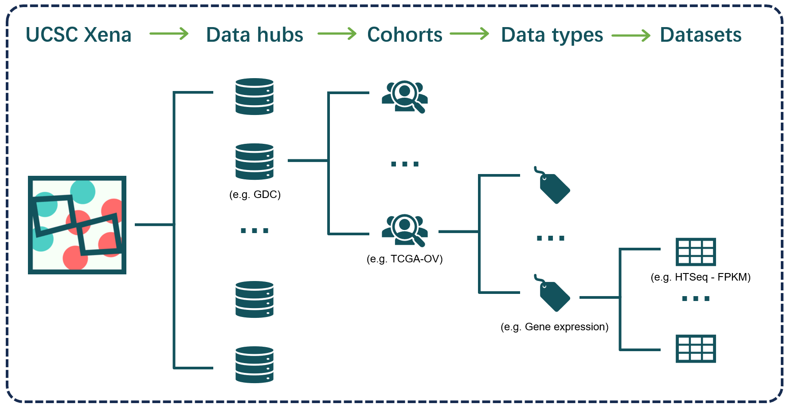
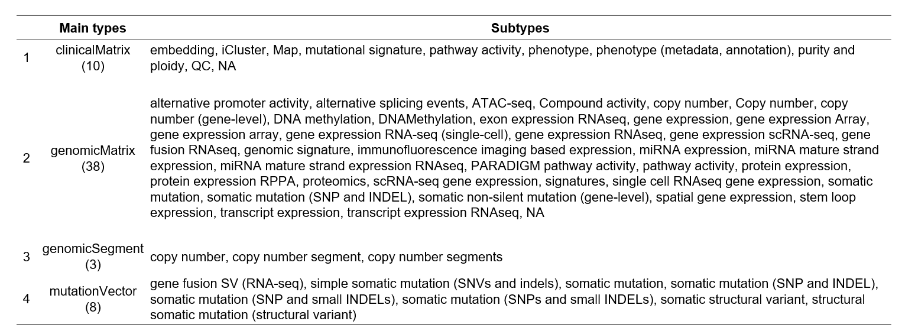
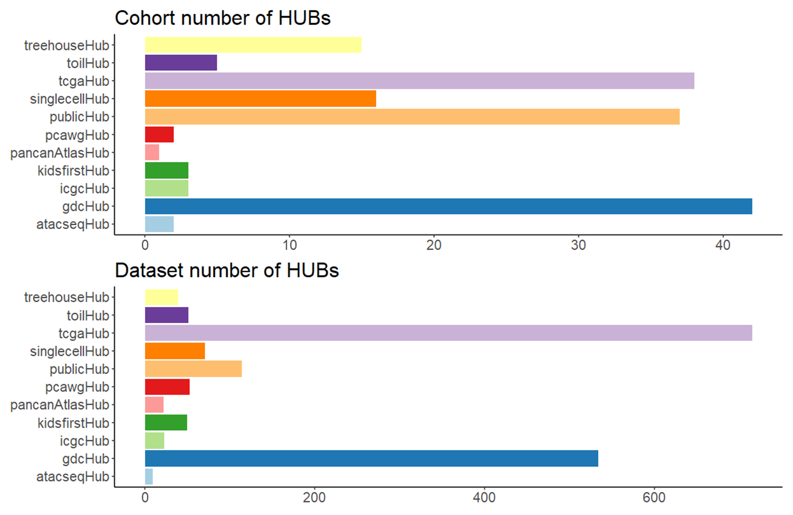

# Introduction {#intro}


## UCSC Xena Datasets

[UCSC Xena platform](https://xenabrowser.net/datapages/) is developed by the UC Santa Cruz Genomics Institute and serves as a comprehensive repository to provide thousands of processed omics datasets from large cancer research projects (e.g. TCGA, PCAWG and CCLE) or individual research groups and enable unprecedented research opportunities. 

The hierarchy for storing and querying datasets is as follows:

- The UCSC Xena repository is generally comprised of **11** data hubs from various portals;
- Each data hub could include many sample cohorts;
- Each sample cohort could involve multiple omics profiling or phenotype data;
- Each omics profiling could have several datasets due to normalization methods or other factors.


```{r p0201, fig.cap='The hierarchy of datasets in UCSC Xena',  fig.align='center', echo = FALSE, out.width="80%"}

```


> Note: In the UCSCXenaShiny, we summarized all the data (sub)types into four main types, referring to *clinicalMatrix*, *genomicsMatrix*, *genomicSegment*, *mutationVector*, where the genomicsMatrix is the key component.


```{r p0202, fig.cap='The main types and subtypes of datasets',  fig.align='center', echo = FALSE, out.width="80%"}

```


The following figure shows the numbers of cohorts and datasets for each datahub of UCSC Xena.  Although some hubs (like toilHub, pancanAtlasHub) have relatively lower numbers of datasets, they mainly focus of pan-cancer integration, which could be more valuable in some research. Here, we will briefly introduce these hubs for better use.

```{r p0203, fig.cap='The statitics for cohorts and datasets of each data hub',  fig.align='center', echo = FALSE, out.width="80%"}

```


#### (1) [tcgaHub (TCGA hub)](https://xenabrowser.net/datapages/?host=https%3A%2F%2Ftcga.xenahubs.net&removeHub=https%3A%2F%2Fxena.treehouse.gi.ucsc.edu%3A443) {-}

- **Statistics**: 38 cohorts, 715 datasets;
- **Source**: TCGA Data Coordinating Center ([DCC](https://www.cancer.gov/ccg/research/genome-sequencing/tcga)), Jan 2016
- **Description**: The hub is specific to the [TCGA project](https://www.cancer.gov/ccg/research/genome-sequencing/tcga) with both individual tumor or integrative pan-cancer cohorts


#### (2) [gdcHub (GDC hub)](https://xenabrowser.net/datapages/?host=https%3A%2F%2Fgdc.xenahubs.net&removeHub=https%3A%2F%2Fxena.treehouse.gi.ucsc.edu%3A443) {-}

- **Statistics**: 42 cohorts, 534 datasets;
- **Source**: GDC Data Portal ([GDC](https://portal.gdc.cancer.gov/)), v18.0, 2019-08-28
- **Description**: The hub incorporates TCGA project with both individual tumor or integrative pan-cancer cohorts, as well as [TARGET project](https://www.cancer.gov/ccg/research/genome-sequencing/target) (childhood cancers).


#### (3) [pancanAtlasHub (Pan-Cancer Atlas Hub)](https://xenabrowser.net/datapages/?host=https%3A%2F%2Fpancanatlas.xenahubs.net&removeHub=https%3A%2F%2Fxena.treehouse.gi.ucsc.edu%3A443) {-}

- **Statistics**: 1 cohort, 22 datasets;
- **Source**: [Pan-Cancer Atlas publications on Cell](http://www.cell.com/pb-assets/consortium/PanCancerAtlas/PanCani3/index.html).
- **Description**: The hub collects the curated pan-cancer TCGA data generated by the PanCan Atlas consortium working groups.


#### (4) [toilHub (UCSC Toil RNA-seq Recompute)](https://xenabrowser.net/datapages/?host=https%3A%2F%2Ftoil.xenahubs.net&removeHub=https%3A%2F%2Fxena.treehouse.gi.ucsc.edu%3A443) {-}

- **Statistics**: 5 cohort, 51 datasets;
- **Source**: [The toil pipleline from UCSC Genomics Institute](https://www.nature.com/articles/nbt.3772).
- **Description**: The hub aims to integrate the pan-cancer RNA-seq data from TCGA, TARGET and [GTEx](https://gtexportal.org/home/) databases.


#### (5) [publicHub (UCSC Public Hub)](https://xenabrowser.net/datapages/?host=https%3A%2F%2Fucscpublic.xenahubs.net&removeHub=https%3A%2F%2Fxena.treehouse.gi.ucsc.edu%3A443) {-}

- **Statistics**: 37 cohort, 114 datasets;
- **Source**: Public resources from extensive collection.
- **Description**: The hub collects various cancer (or cell lines, e.g. CCLE, CMAP) omics data  from other public studies.


#### (6) [icgcHub (ICGC Xena Hub)](https://xenabrowser.net/datapages/?host=https%3A%2F%2Ficgc.xenahubs.net&removeHub=https%3A%2F%2Fxena.treehouse.gi.ucsc.edu%3A443) {-}

- **Statistics**: 3 cohort, 23 datasets;
- **Source**:  [International Cancer Genome Consortium(ICGC)](https://dcc.icgc.org/).
- **Description**: The hub considers the genomics data from ICGC but only included the US(TCGA) related projects for Gene/Protein expression data. 


#### (7) [pcawgHub (PCAWG Hub)](https://xenabrowser.net/datapages/?host=https%3A%2F%2Fpcawg.xenahubs.net&removeHub=https%3A%2F%2Fxena.treehouse.gi.ucsc.edu%3A443) {-}

- **Statistics**: 2 cohort, 53 datasets;
- **Source**: [The Pancancer Analysis of Whole Genomes (PCAWG) study](https://xenabrowser.net/datapages/?host=https%3A%2F%2Fpcawg.xenahubs.net&removeHub=https%3A%2F%2Fxena.treehouse.gi.ucsc.edu%3A443).
- **Description**: The hub focus on multi-omics data of cancer whole genomes across many tumor types from [International Cancer Genome Consortium(ICGC)](https://dcc.icgc.org/).


#### (8) [atacseqHub(ATAC-seq Hub)](https://xenabrowser.net/datapages/?host=https%3A%2F%2Fatacseq.xenahubs.net) {-}
- **Statistics**: 2 cohort, 9 datasets;
- **Source**: [The chromatin accessibility landscape of primary human cancers](https://www.science.org/doi/10.1126/science.aav1898)
- **Description**: The hub describes chromatin accessibility of 410 TCGA tumor samples across 23 cancer types using the ATAC-seq technology.


#### (9) [kidfirstHub(Kids First Xena Hub)](https://xenabrowser.net/datapages/?host=https%3A%2F%2Fkidsfirst.xenahubs.net&removeHub=https%3A%2F%2Fxena.treehouse.gi.ucsc.edu%3A443) {-}

- **Statistics**: 3 cohort, 50 datasets;
- **Source**:  [the Gabriella Miller Kids First Pediatric Research Program](https://portal.kidsfirstdrc.org/)
- **Description**: The hub incorporates Pediatric Brain Tumor Atlas and TARGET project.


#### (10) [treehouseHub](https://xenabrowser.net/datapages/?host=https%3A%2F%2Fxena.treehouse.gi.ucsc.edu%3A443&removeHub=https%3A%2F%2Fxena.treehouse.gi.ucsc.edu%3A443) {-}
- **Statistics**: 16 cohorts, 44 datasets
- **Source**:  [the Treehouse Childhood Cancer Initiative](https://treehousegenomics.soe.ucsc.edu/public-data/)
- **Description**: The hub is also specific to children cancer.


#### (11) [singlecellHub](https://singlecellnew.xenahubs.net) {-}
- **Statistics**: 16 cohorts, 71 datasets
- **Source**:  [Human Cell Atlas (HCA)](https://data.humancellatlas.org/)
- **Description**:  The hub includes several scRNA-seq datasets from HCA, invovling cancer or normal tissues, human or mouse origin.


## TCGA abbreviations

```{r tb04-1, echo = FALSE, echo=FALSE, message=FALSE}
data = readxl::read_excel("images/table_04.xlsx", sheet = 1)
colnames(data)[1]=""
knitr::kable(
  data, caption = 'TCGA abbreviations',
  align = "l",
  booktabs = TRUE
)
```


## PCAWG abbreviations

```{r tb04-2, echo = FALSE, echo=FALSE, message=FALSE}
data = readxl::read_excel("images/table_04.xlsx", sheet = 2)
colnames(data)[1]=""
knitr::kable(
  data, caption = 'PCAWG abbreviations',
  align = "l",
  booktabs = TRUE
)
```


