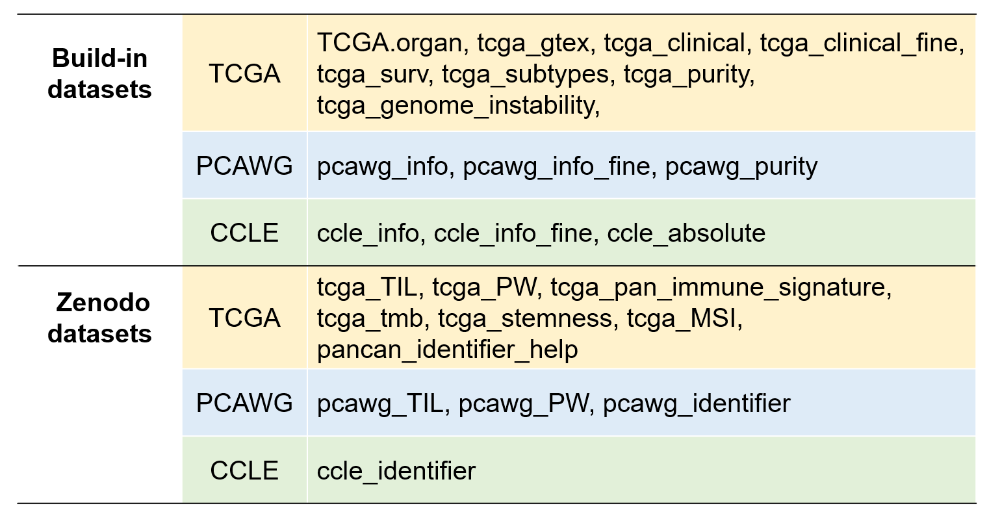
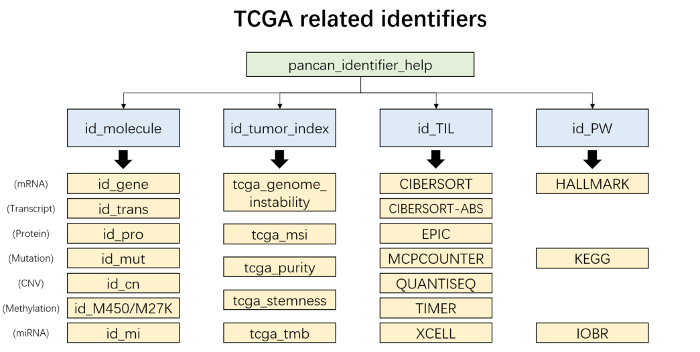
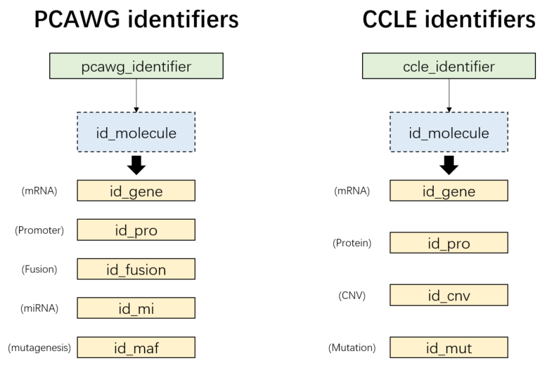

# Built-in Datasets {#build-in}


We also have curated tens of tumor non-omics annotation datasets with supplementary features from UCSC Xena repository or other  resources for extensive analysis. Notably, datasets with large amounts of data are uploaded to Zenodo. They can be loaded via `load_data()` function.
 

```{r builtin-datasets, fig.cap='UCSCXenaShiny built-in datasets', out.width='80%', fig.asp=.75, fig.align='center', echo = FALSE}

```


## TCGA

- `TCGA.organ`: Detailed information of  33 TCGA projects
```{r}
head(TCGA.organ)
```

- `tcga_gtex`: Merged information of TCGA and GTEx samples
```{r}
head(tcga_gtex)
```

- `tcga_clinical`: Common phenotypes of TCGA samples from Table S1 of [the paper](https://www.cell.com/cell/fulltext/S0092-8674(18)30229-0?_returnURL=https%3A%2F%2Flinkinghub.elsevier.com%2Fretrieve%2Fpii%2FS0092867418302290%3Fshowall%3Dtrue#supplementaryMaterial).
- `tcga_clinical_fine`: Basic phenotypes of TCGA samples
```{r}
head(tcga_clinical_fine)
```

- `tcga_surv`: Survival data of TCGA samples  from Table S1 of [the paper](https://www.cell.com/cell/fulltext/S0092-8674(18)30229-0?_returnURL=https%3A%2F%2Flinkinghub.elsevier.com%2Fretrieve%2Fpii%2FS0092867418302290%3Fshowall%3Dtrue#supplementaryMaterial).
```{r}
head(tcga_surv)
```

- `tcga_subtypes`: Subtype information of TCGA samples from [Pan-Cancer Atlas Hub](https://xenabrowser.net/datapages/?host=https%3A%2F%2Fpancanatlas.xenahubs.net&removeHub=https%3A%2F%2Fxena.treehouse.gi.ucsc.edu%3A443)
```{r}
head(tcga_subtypes)
```

- `tcga_purity`: tumor purity related  information of TCGA samples from Supplementary Data 1 of [the paper](https://doi.org/10.1038/ncomms9971).
```{r}
head(tcga_purity)
```

- `tcga_genome_instability`: tumor genome instability related information of TCGA samples from [here](https://gdc.cancer.gov/about-data/publications/PanCanStemness-2018)
```{r}
head(tcga_genome_instability)
```


## PCAWG

- `pcawg_info`: Common phenotypes of TCGA samples from [PCAWG Xena Hub](https://xenabrowser.net/datapages/?cohort=PCAWG%20(specimen%20centric)&removeHub=https%3A%2F%2Fxena.treehouse.gi.ucsc.edu%3A443)
- `pcawg_info_fine`: Basic phenotypes of TCGA samples
```{r}
head(pcawg_info_fine)
```
-  `pcawg_purity`:  tumor purity related  information of PCAWG samples from [PCAWG Xena Hub](https://xenabrowser.net/datapages/?cohort=PCAWG%20(specimen%20centric)&removeHub=https%3A%2F%2Fxena.treehouse.gi.ucsc.edu%3A443)

```{R}
head(pcawg_purity)
```


## CCLE
- `ccle_info`: Common phenotypes of CCLE samples from [Broad Institute](https://data.broadinstitute.org/ccle_legacy_data/cell_line_annotations/)
- `ccle_info_fine`: Basic phenotypes of CCLE samples
```{r}
head(ccle_info_fine)
```
- `ccle_absolute`: supplementary information of CCLE samples from Table S2 of [the paper](https://www.nature.com/articles/s41586-020-03133-3#Sec34)
```{R}
head(ccle_absolute)
```


## Zenodo
(1) The immune infiltrations are estimated by [immunedeconv](https://github.com/omnideconv/immunedeconv) package, where 7 types of algorithms (CIBERSORT, CIBERSORT-ABS, EPIC, MCPCOUNTER, QUANTISEQ, TIMER, XCELL) are adopted. 

(2) The expression scores for 3 type of gene pathway/signature sets ([HALLMARK](https://pubmed.ncbi.nlm.nih.gov/26771021/), KEGG, [IOBR](https://github.com/IOBR/IOBR)) is calculated through ssGSEA method.

### tumor infiltration estimations
```{r, eval = FALSE}
# TCGA samples
dat1 = load_data("tcga_TIL")
# PCAWG samples
dat2 = load_data("pcawg_TIL")

dat1[1:4,1:4]
```
```{r,echo = FALSE}
load_data("tcga_TIL")[1:4,1:4]
```


- In addition, we also collected expression scores of 160 immune gene signatures across  TCGA samples from [here](https://gdc.cancer.gov/about-data/publications/panimmune).
```{r}
dat1 = load_data("tcga_pan_immune_signature")
dat1[1:4,1:4]
```


### ssGSEA pathway activities
```{r, eval = FALSE}
# TCGA samples
dat1 = load_data("tcga_PW")
# PCAWG samples
dat2 = load_data("pcawg_PW")

dat1[1:4,1:4]
```
```{R,echo = FALSE}
load_data("tcga_PW")[1:4,1:4]
```

### other TCGA annotations
- "tcga_stemness": tumor stemness of TCGA samples from [Pan-Cancer Atlas Hub](https://xenabrowser.net/datapages/?host=https%3A%2F%2Fpancanatlas.xenahubs.net&removeHub=https%3A%2F%2Fxena.treehouse.gi.ucsc.edu%3A443)

```{R}
head(load_data("tcga_stemness"))
```

- "tcga_tmb": tumor mutation burden of TCGA samples from Table S1 of [the paper](https://doi.org/10.1016/j.immuni.2018.03.023)

```{R}
head(load_data("tcga_tmb"))
```

- "tcga_MSI": tumor microsatellite instability of TCGA samples from Supplementary Data 1 of [the paper](https://www.nature.com/articles/ncomms15180#Sec22)

```{R}
head(load_data("tcga_MSI"))
```

### identifier repository

Compile available identifiers of data for each of TPC databases.

- "pancan_identifier_help": TCGA samples
```{r tcga-ids, fig.cap='TCGA related identifiers', out.width='80%', fig.asp=.75, fig.align='center', echo = FALSE}

```

```{r, eval = FALSE}
tcga_ids = load_data("pancan_identifier_help")
names(tcga_ids)
# [1] "id_molecule"    "id_tumor_index" "id_TIL"         "id_PW" 
head(tcga_ids$id_molecule$id_gene)
# the key identifier is ususally under "Level3" column
```
```{r, echo = FALSE}
head(load_data("pancan_identifier_help")$id_molecule$id_gene)
```

- "pcawg_identifier": PCAWG samples
- "ccle_identifier": CCLE samples

```{r pc-ids, fig.cap='PCAWG/CCLE molecular identifiers', out.width='80%', fig.asp=.75, fig.align='center', echo = FALSE}

```

```{r, eval = FALSE}
pcawg_ids = load_data("pcawg_identifier")
names(pcawg_ids)
# [1] "id_gene"   "id_pro"    "id_fusion" "id_mi"     "id_maf" 
head(pcawg_ids$id_pro)
# the key identifier is ususally under "Level3" column
```
```{r, echo = FALSE}
head(load_data("pcawg_identifier")$id_pro)
```