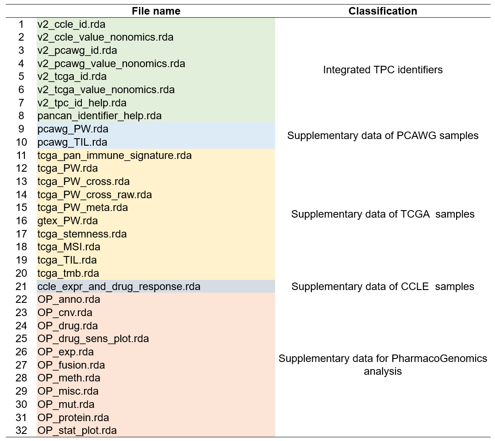

# (PART) Shiny App {-}
# Visit {#visit}


## Server deployments

We have deployed the shiny application in two server machines for users without local installation.

- http://shiny.zhoulab.ac.cn/UCSCXenaShiny
- https://shiny.hiplot.cn/ucsc-xena-shiny


```{r p0701, fig.cap='The welcome page of shiny application',  fig.align='center', echo = FALSE, out.width="100%"}

```


## Local deployment
If the R package has been installed on your computer, it is  easy to run the application in the local environment.

```{r, eval=FALSE}
app_run()
```

Notably, the application is also dependent on some supplementary datasets (not in UCSC Xena) for extensive analysis. Considering the store limitation of R package and GitHub project, parts of them are deposited in [Zenodo repository](https://zenodo.org/record/10778172). When you first initiate the app, it could take some time to fetch these data. If it failed due to network, you can directly download them from Zenodo and then place on the `inst/extdata` directory.

```{r p0702, fig.cap='The supplementary data in the inst/extdata directory',  fig.align='center', echo = FALSE, out.width="100%"}

```
