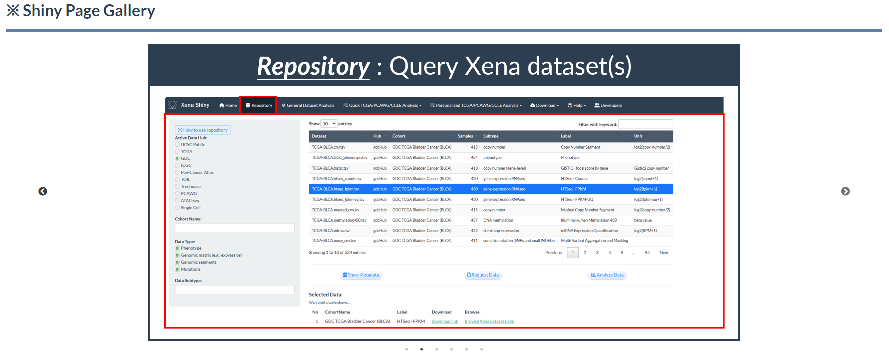
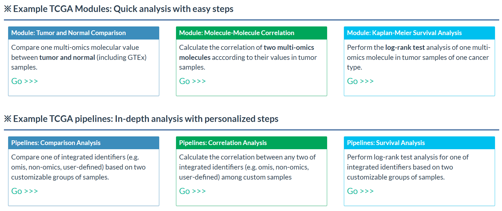
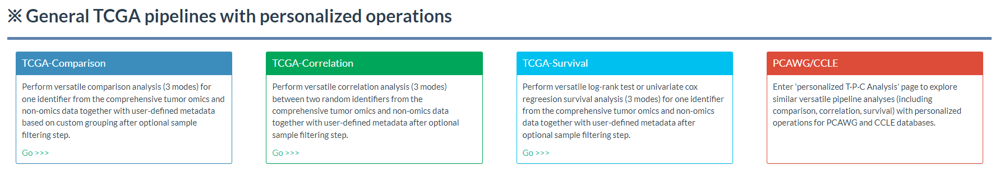
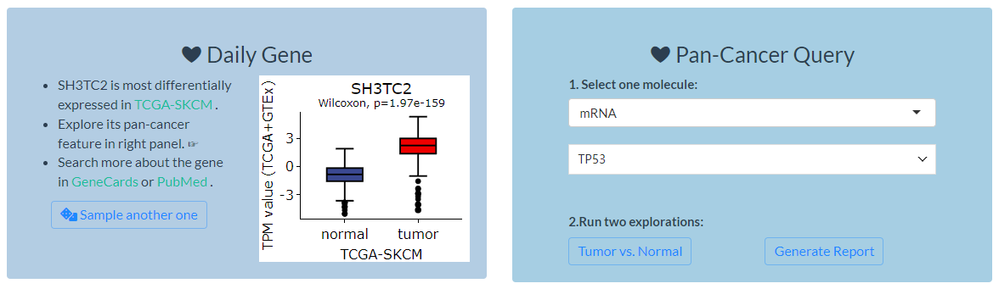
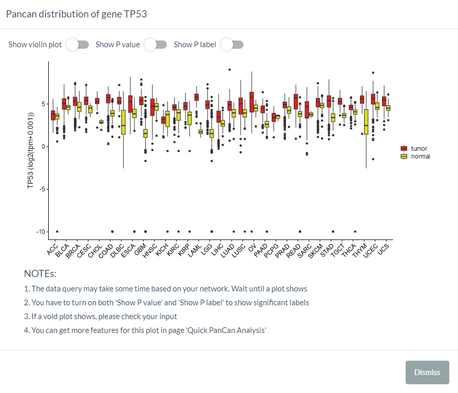

# Homepage

## Slick Gallery

- Dynamically display all application interfaces and their functional descriptions

```{r slick-gallery, fig.cap='Shiny Slick Gallery',  fig.align='center', echo = FALSE}

```


## TCGA Analysis Guide

- Based on UCSC Xena datasets, we have designed versatile analyses for TCGA as well as other databases, like PCAWG and CCLE.
- In the homepage, two series of TCGA analyses, including 12 custom modules (Figure) and 3 personalized pipelines, are displayed for users.

```{r tcga-modules, fig.cap='12 TCGA analytical modules',  fig.align='center', echo = FALSE}

```

```{r tcga-pipelines, fig.cap='3 TCGA analytical pipelines',  fig.align='center', echo = FALSE}

```


## Quick Molecule Exploration 

In the top-right of homepage, two modules are provided for quick exploration of cancer molecules. 

```{r quick-explore, fig.cap='Quick molecular exploration in the homepage', out.width='80%', fig.align='center', echo = FALSE}

```


### Daily Gene
1. In this module, a  gene will be randomly selected each day and analyzed for which type of TCGA cancer is differentially expressed.
2. TPM expression data is obtained from TCGA and GTEx samples. For ease of presentation, the samples with minimum expression value of -9.966 are removed.
3. The wilcoxon test is used, and the cancer with the lowest P value will be displayed via `plotly` package.
4. Two external links to GeneCards and PubMed are also provided for search more information about the gene.
5. Finally, users can sample another gene to perform similar analysis if they want.


### Pan-cancer Query

In this module, two functions can be used to explore the pan-cancer features of multi-omics molecules.


#### Tumor vs. Normal

1. Observe and compare the molecular values in each TCGA project of normal tissue versus tumor tissue.

2. The analysis is based on `vis_toil_TvsN()` function  (Figure 5.1)

```{r tumor-normal, fig.cap='The interface when clicking "Tumor vs. Normal" button', out.width='80%', fig.align='center', echo = FALSE}

```

#### Generate Report

1. For general exploration of pan-cancer feature, a well-organized report report can be automatically generated.
2. As the figure, it firstly run the analyses given the queried molecule, which will take about one minute. Then, you can knit the report in HTML format (figure) or directly download the analyzed results in ZIP format.

```{r generate-report, fig.cap='The interface when clicking "Generate Report" button and result', out.width='80%', fig.align='center', echo = FALSE}
knitr::include_graphics(c('images/p0807.png'))
```


3. The report can be generally divided into five parts to describe molecular pan-cancer features, including (1) clinical phenotypes, (2) survival influence, (3) tumor index (4) immune infiltration, (5) pathway activity.
```{r five-parts, fig.cap='Five main parts of molecular report',  out.width='80%', fig.align='center', echo = FALSE}
knitr::include_graphics(c('images/p0809.png'))
```


4. Here is an example report for mRNA TP53. 


```{r demo-report, fig.cap='Head part of demo report',  fig.align='center', echo = FALSE}
knitr::include_graphics(c('images/p0808.png'))
```


