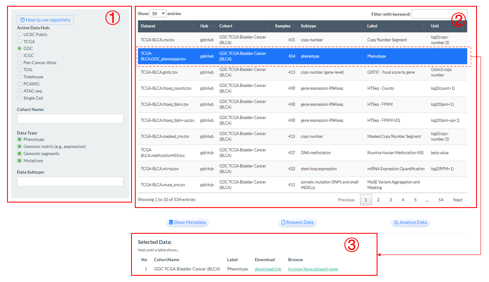
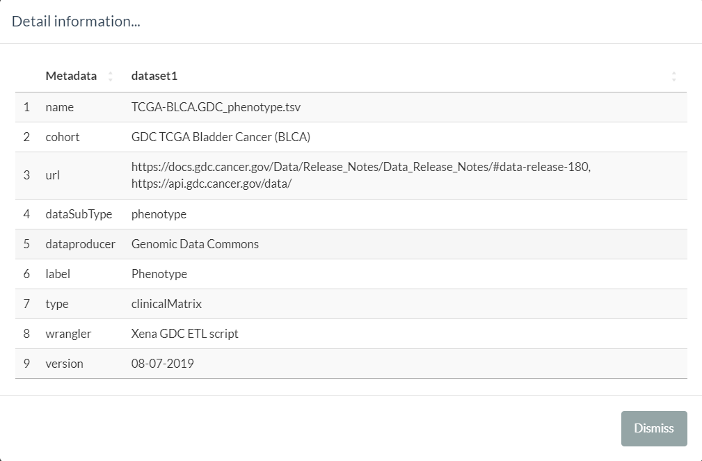
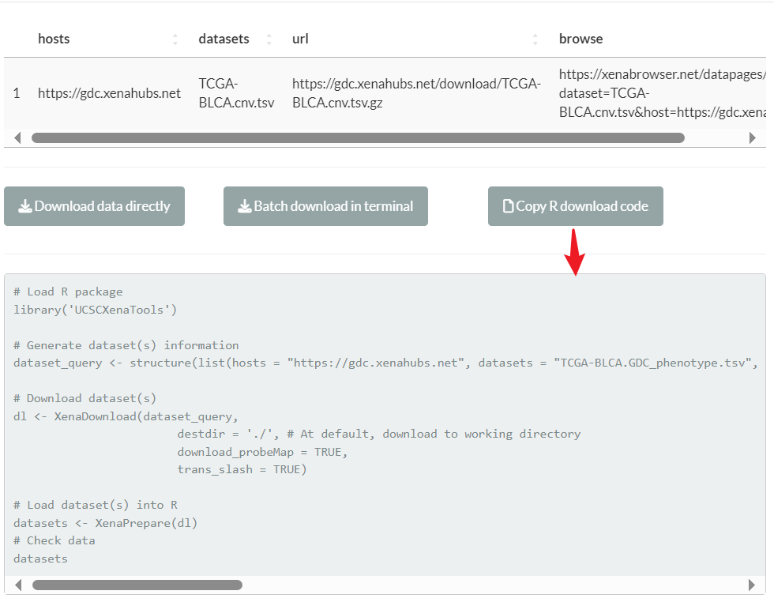
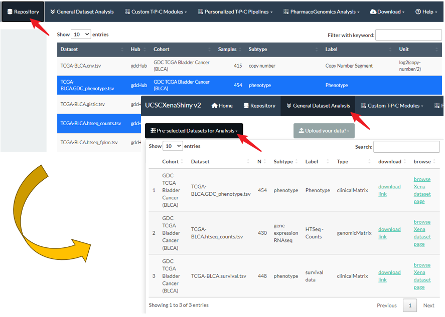

# Repository {#repo}

Explore the metadata information of random UCSC Xena datasets in the repository page. Go to Chapter \@ref(intro) if you have little knowledge about the UCSC Xena datasets.

(1) Firstly, users can query datasets according to the conditions of data hub (or further cohort) and data type (or further data subtype). By default, it will select the GDC hub and all data types.

(2) Then, the basic information of eligible datasets will be display in the right panel. 

(3) Next, users can select one or multiple rows (datasets) and their external links to download or browse original data are available in the bottom. 

```{r repo-page, fig.cap='Repoistory page demonstration',  fig.align='center', echo = FALSE,out.width="100%"}

```

(4) Furtherly, **three buttons** are designed for the selected datasets to offer specific functions as follows: 

## Show Metadata

- The "Show Metadata" button will give more detailed information of selected datasets.

```{r show-meta, fig.cap='The interface when clicking "Show Metadata" button',  fig.align='center', echo = FALSE,out.width="100%"}

```


## Request Data

Through this button, three ways of downloading raw datasets are provided.

- "Download data directly": Enable to directly download the data into your local device.
- "Batch download in terminal": Generate one `.sh` script file to download in Linux environment.
- "Copy R download code": Generate R codes to download especially for R users.

```{r requ-data, fig.cap='The interface when clicking "Request Data" button',  fig.align='center', echo = FALSE,out.width="100%"}

```


## Analyze Data 

This button is the initial step for **General Dataset Analysis**, which will be introduced in Chapter \@ref(general-da).

- As the following figure shows, users need to firstly select one or more datasets in the repository page for the `Pre-selected Datasets for Analysis` panel in General Dataset Analysis page. 
- If one genomics matrix dataset (e.g. RNA-seq) is selected, its related clinical metadata (e.g. phenotype or survival data) will be automatically added.


```{r anal-data, fig.cap='The initial step of General Dataset Analysis', fig.align='center', echo = FALSE,out.width="100%"}

```

