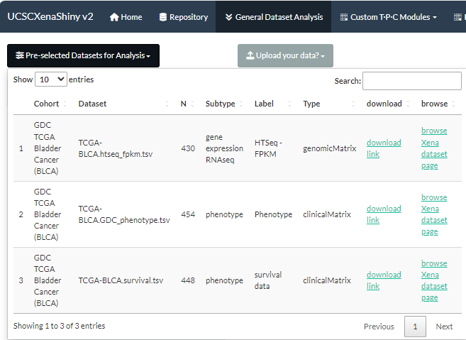
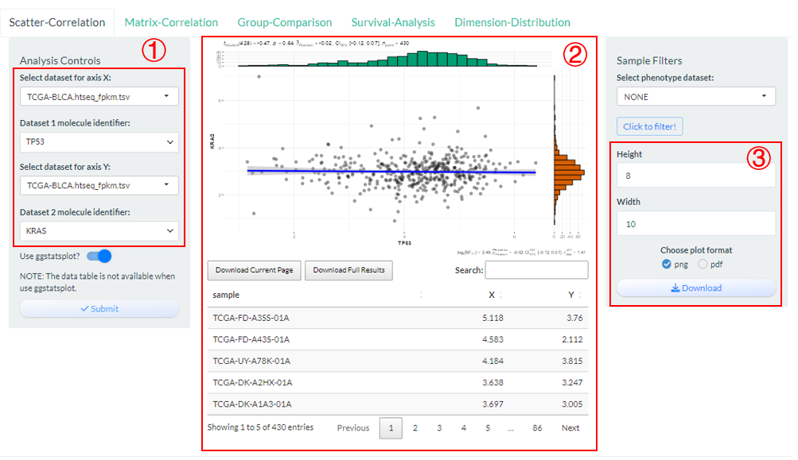
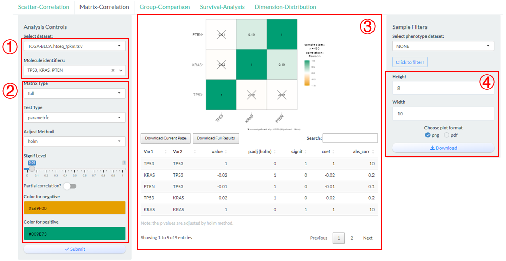
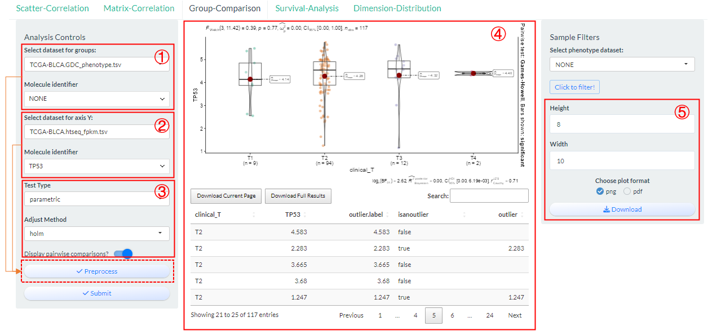
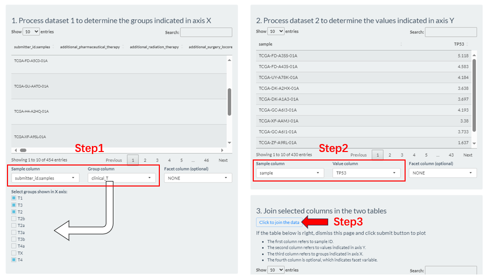
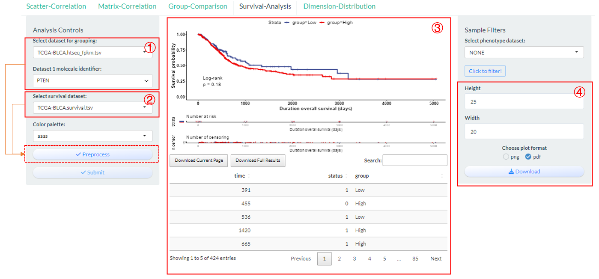
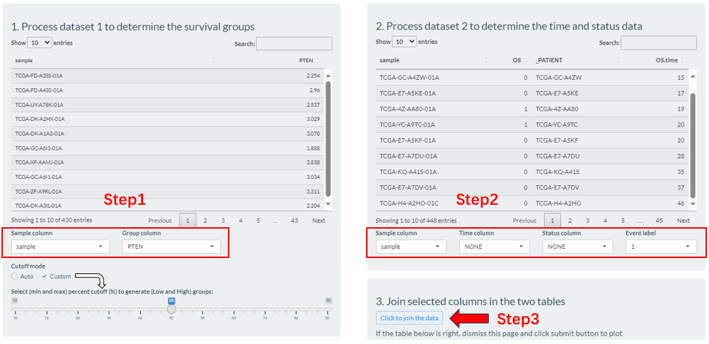
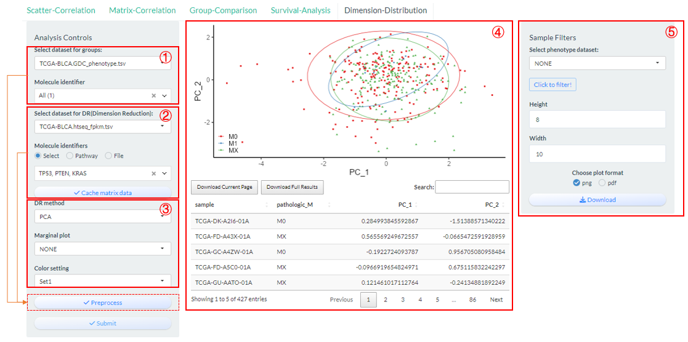
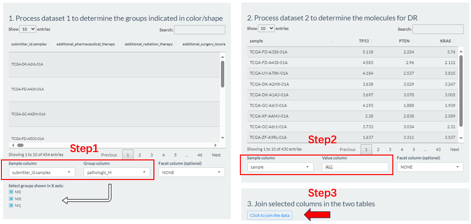

# General Dataset Analysis

1. In this page, users can explore the most Genomics matrix datasets from UCSC Xena repository with common analysis methods.
2. As chapter 8.3 describes, the initial step involves the selection of interesting datasets from **Repository** page. 
3. In the following, we will take the "*TCGA-BLCA.htseq_fpkm.tsv*" dataset as an example to demonstrate how to operate various methods

```{r p1001, fig.cap='The selection of TCGA-BLCA.htseq_fpkm.tsv dataset',  fig.align='center', echo = FALSE, out.width="80%"}

```

## Scatter-Correlation

Compute and visualize the correlation between two molecules based on `vis_identifier_cor()` function.


1. Firstly, select two molecules from candidate dataset;
2. Click the "Submit" button to perform analysis and the visualization result along with raw data will be display in the middle.
3. Finally, the plot can be saved with size and format options.

```{r p1002, fig.cap='The steps of Scatter-Correlation analysis',  fig.align='center', echo = FALSE,out.width="80%"}

```

> Notably, Two molecules can come from different datasets, but there must be intersecting samples.


### Matrix-Correlation

Compute and visualize the pair-wise correlation among multiple molecules based on `vis_identifier_multi_cor()` function.

1. Firstly, select multiple molecules from one candidate dataset;
2. Modify several analysis and visualization parameters;
3. Click the "Submit" button to perform analysis and the visualization result along with analyzed data will be display in the middle.
4. Finally, the plot can be saved with size and format options.

```{r p1003, fig.cap='The steps of Matrix-Correlation analysis',  fig.align='center', echo = FALSE,out.width="80%"}

```


## Group-Comparison

Compare the differences in the distribution of values for one molecule under a specified phenotypic grouping based on `vis_identifier_grp_comparison()` function. 

1. Select a dataset and use one of its columns as the basis for grouping. **(dataset 1)**
2. Select a dataset and use one of its numeric columns as the values to compare. **(dataset 2)**.

```{r p1004, fig.cap='The steps of Group-Comparison analysis',  fig.align='center', echo = FALSE,out.width="80%"}

```


> Based on above two selections, then set sample groups by clicking "Preprocess" button.
>
> - Step1: From the columns  of dataset 1, select the sample id column (`Sample column`), which is usually left as a default. Then, select a column (`Group column`) as the basis for grouping. If it is a numeric column, you can set the percentile cutoffs by  the slider widget.
> - Step2: From the columns  of dataset 2, select the sample id column (`Sample column`) and molecule column (`Value column`).
> - Step3: Click the "Click to joint the data" button to finally generate grouping result. If there are no problems, exit this interface.
>
>

```{r p1005, fig.cap='The Group-Comparison grouping via the Preprocess button',  fig.align='center', echo = FALSE,out.width="80%"}

```


3. Modify several analysis parameters;
4. Click the "Submit" button to perform analysis and the visualization result along with raw data will be display in the middle.
5. Finally, the plot can be saved with size and format options.


## Survival-Analysis

Perform the grouping log-rank survival analysis, especially for TCGA related datasets based on `vis_identifier_grp_surv()` function. 

1. Select a dataset and use one of its columns as the basis for grouping. **(dataset 1)**
2. Select one survival dataset with event time and status columns. **(dataset 2)**.

```{r p1006, fig.cap='The steps of Survival-Analysis',  fig.align='center', echo = FALSE,out.width="80%"}

```

> Based on above two selections, then set sample groups by clicking "Preprocess" button.
>
> - Step1: From the columns  of dataset 1, select the sample id column (`Sample column`), which is usually left as a default. Then, select a column (`Group column`) as the basis for grouping. If it is a numeric column, you can set the percentile cutoffs by  the slider widget or automatically calculate its best cutoff.
> - Step2: From the columns  of dataset 2, select the sample id column (`Sample column`) and two survival related column (`Time column`, `Status column`).
> - Step3: Click the "Click to joint the data" button to finally generate grouping result. If there are no problems, exit this interface.

```{r p1007, fig.cap='The Survival-Analysis grouping via the Preprocess button',  fig.align='center', echo = FALSE,out.width="80%"}

```

3. Click the "Submit" button to perform analysis and the visualization result along with raw data will be display in the middle.
4. Finally, the plot can be saved with size and format options.


## Dimension-Distribution

Perform the dimension reduction analysis based on multiple molecules of one genomics matrix datasets based on `vis_identifier_dim_dist()` function. 

1. Select a dataset and use one of its columns as the basis for grouping. **(dataset 1)**
2. Select a genomics matrix dataset and further multiple molecular columns via three ways. **(dataset 2)**.
   - "Select": One-by-one selection;
   - "Pathway": batch selection under one pathway;
   - "File": Upload of identifier file.

```{r p1008, fig.cap='The steps of Dimension-Distribution',  fig.align='center', echo = FALSE,out.width="80%"}

```


> Based on above two selections, then set sample groups by clicking "Preprocess" button.
>
> - Step1: From the columns  of dataset 1, select the sample id column (`Sample column`), which is usually left as a default. Then, select a column (`Group column`) as the basis for grouping. If it is a numeric column, you can set the percentile cutoffs by  the slider widget.
> - Step2: From the columns  of dataset 2, select the sample id column (`Sample column`) and molecule columns (`Value column`).
> - Step3: Click the "Click to joint the data" button to finally generate grouping result. If there are no problems, exit this interface.

```{r p1009, fig.cap='The Dimension-Distribution grouping via the Preprocess button',  fig.align='center', echo = FALSE,out.width="80%"}

```

3. Modify several analysis and visualization parameters;
   - 3 DR methods (PCA/UMAP/TSNE) are supported.
4. Click the "Submit" button to perform analysis and the visualization result along with analyzed data will be display in the middle.
5. Finally, the plot can be saved with size and format options.
