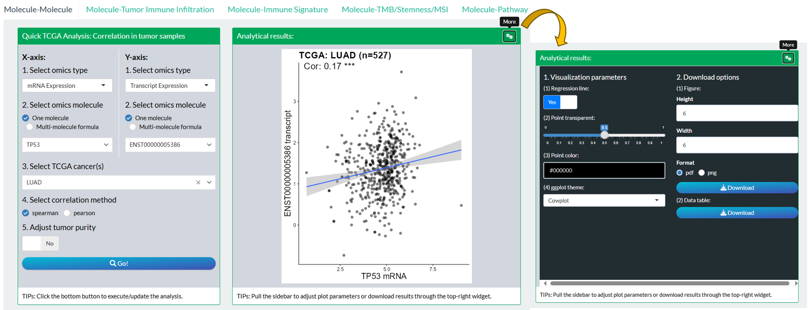
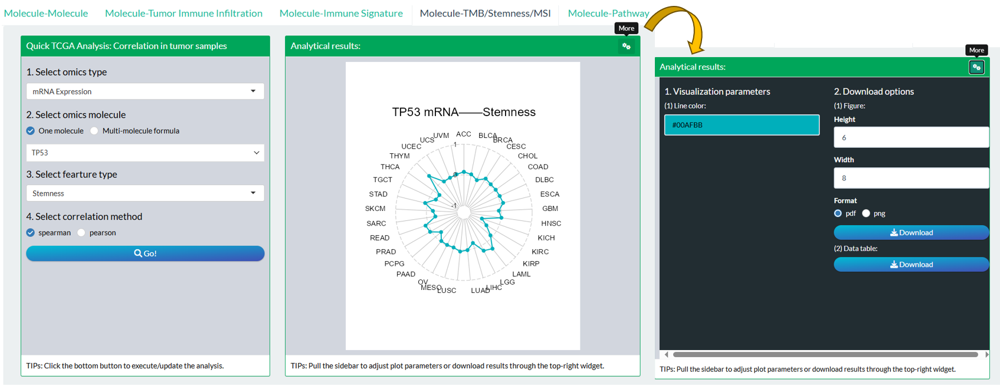
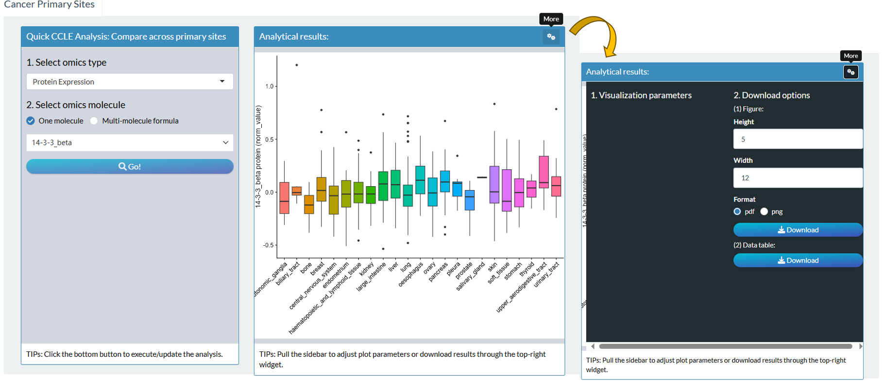

# Custom TPC modules {#custom-tpc}

Here, each custom module can perform one specific TPC (**T**CGA, **P**CAWG, **C**CLE) analysis based on the functions introduced in Chapter \@ref(data-analysis).


```{r p1101, fig.cap='All Custom TPC modules in shiny app',  fig.align='center', echo = FALSE, out.width="80%"}
knitr::include_graphics('images/p1101.png')
```


Usually, the initial step of most modules involves the check and modification of molecular datasets through the `Modify datasets[opt]` widget. For some molecular types of TPC databases, there are alternative datasets for users to select, which greatly enriches the analytical possibilities

- Among the 7 types of TCGA molecules, 4 of them have the alternative datasets.

```{r p1102, fig.cap='Alternative datasets of TCGA molecules',  fig.align='center', echo = FALSE, out.width="100%"}
knitr::include_graphics('images/p1102.png')
```


> Tips: For DNA Methylation, mean value of all CpG sites under one gene will be calculated for the gene by default. In the `Modify datasets[opt]` widget, users can furtherly limit its CpG sites and modify the aggregation method (e.g. median).


- Among the 5 types of PCAWG molecules, 2 of them have the alternative datasets.

- Among the 4 types of CCLE molecules, 1 of them has the alternative datasets.


```{r p1103, fig.cap='Alternative datasets of PCAWG and CCLE molecules',  fig.align='center', echo = FALSE, out.width="100%"}

```

## TCGA


```{r custom-tcga-mod, echo = FALSE}
data = readxl::read_excel("images/table_03.xlsx")
data = subset(data, Database == "TCGA")
data = subset(data, Module !="vis_pancan_anatomy()")
knitr::kable(
  data, caption = 'Custom modules for TCGA analysis',
  align = "l",
  booktabs = TRUE
)
```


### Comparison

#### TCGA+GTEx: Molecular Profile Distribution (Tumor VS Normal) {#m-vis_toil_TvsN}

Compare molecular values between tumor and normal samples combing TCGA and GTEx datasets based on [`vis_toil_TvsN()`](#vis-toil-TvsN) and [`vis_toil_TvsN_cancer()`](#vis-toil-TvsN-cancer) functions.

1. Select one molecular type and identifier. The mode for single cancer or pan-cancer comparison can be decided here.

2. Adjust the visualization parameters. "TCGA Dataset only" means whether to add GTEx datasets as normal samples or not.

3. Click the "Go!" button to perform analysis and display the plot in the right. The raw data will be also showed in right-bottom area and can be saved as CSV file.
4. Download the plot with size and format options.


```{r p1104, fig.cap='The steps of module "TCGA+GTEx: Molecular Profile Distribution (Tumor VS Normal)"',  fig.align='center', echo = FALSE, out.width="100%"}
knitr::include_graphics('images/p1104.png')
```


#### TCGA: Association Between Molecular Profile and Gene Mutation {#m-vis-toil-Mut}

Compare molecular values between gene-mutant and gene-wild tumor samples for TCGA datasets based on [`vis_toil_Mut()`](#vis-toil-Mut) and [`vis_toil_Mut_cancer()`](#vis-toil-Mut-cancer) functions.

1. Select one gene to decide the sample grouping based on its mutation status. It is necessary to click the bottom "Check" button to see if there are enough mutated samples.
2. Select one molecular type and identifier. The mode for single cancer or pan-cancer comparison can be decided here.
3. Adjust the visualization parameters. 
4. Click the "Go!" button to perform analysis and display the plot in the right. The raw data will be also showed in right-bottom area and can be saved as CSV file.
5. Download the plot with size and format options.


```{r p1105, fig.cap='The steps of module "TCGA: Association Between Molecular Profile and Gene Mutation"',  fig.align='center', echo = FALSE, out.width="100%"}
knitr::include_graphics('images/p1105.png')
```


### Correlation

#### TCGA: Molecule-Molecule Correlation  {#m-vis-gene-cor}

Compute and visualize the correlation between two molecules of TCGA databases based on [`vis_gene_cor()`](#vis-gene-cor) and [`vis_gene_cor_cancer()`](#m-vis-gene-cor-cancer) functions.

1. Select two molecules. They can come from different molecular types.
2. Adjust the visualization and analysis parameters. "Use All Cancer Types" means whether to directly use all TCGA tumor samples.
3. Click the "Go!" button to perform analysis and display the plot in the right. The raw data will be also showed in right-bottom area and can be saved as CSV file.
4. Download the plot with size and format options.


```{r p1106, fig.cap='The steps of module "TCGA: Molecule-Molecule Correlation"',  fig.align='center', echo = FALSE, out.width="100%"}

```


#### TCGA: Association Between Molecular Profile and Tumor Immune Infiltration {#m-vis-gene-TIL-cor}

Compute the correlation of pan-cancers between one molecule and tumor Immune Infiltration based on [`vis_gene_TIL_cor()`](#vis-gene-TIL-cor)  function.

1. Select one molecule and interesting immune infiltration estimations.
2. Adjust the analysis parameter. 
3. Click the "Go!" button to perform analysis and display the plot in the right. The analyzed data will be also showed in right-bottom area and can be saved as CSV file.
4. Download the plot with size and format options.

```{r p1107, fig.cap='The steps of module "TCGA: Association Between Molecular Profile and Tumor Immune Infiltration"',  fig.align='center', echo = FALSE, out.width="100%"}
knitr::include_graphics('images/p1107.png')
```

#### TCGA: Association Between Molecular Profile and Immune Signature {#m-vis-gene-immune-cor}

Compute the correlation of pan-cancers between one molecule and tumor Immune Signature based on [`vis_gene_immune_cor()`](#vis-gene-immune-cor) function.

1. Select one molecule and one source of immune signatures.
2. Adjust the analysis parameter. 
3. Click the "Go!" button to perform analysis and display the plot in the right. The analyzed data will be also showed in right-bottom area and can be saved as CSV file.
4. Download the plot with size and format options.

```{r p1108, fig.cap='The steps of module "TCGA: Association Between Molecular Profile and Immune Signature"',  fig.align='center', echo = FALSE, out.width="100%"}
knitr::include_graphics('images/p1108.png')
```

#### TCGA: Association Between Molecular Profile and TMB/Stemness/MSI (Radar Show) {#m-vis-gene-index}

Compute the correlation of pan-cancers between one molecule and TMB/Stemness/MSI index based on [`vis_gene_tmb_cor()`](#vis-gene-tmb-cor), [`vis_gene_msi_cor()`](#vis-gene-msi-cor) and  [`vis_gene_stemness_cor()`](#vis-gene-stemness-cor) functions.

1. Select one molecule and one of TMB/Stemness/MSI index.
2. Adjust the analysis parameter. 
3. Click the "Go!" button to perform analysis and display the plot in the right. The analyzed data will be also showed in right-bottom area and can be saved as CSV file.
4. Download the plot with size and format options.

```{r p1109, fig.cap='The steps of module "TCGA: Association Between Molecular Profile and TMB/Stemness/MSI (Radar Show)"',  fig.align='center', echo = FALSE, out.width="100%"}

```


#### TCGA: Association Between Molecular Profile and Pathway Score {#m-vis-gene-pw-cor}

Compute the correlation of pan-cancers between one molecule and Pathway Score based on [`vis_gene_pw_cor()`](#vis-gene-pw-cor) function.

1. Select one molecule and one pathway.
2. Adjust the visualization and analysis parameter. "Use All Cancer Types" means whether use tumor samples from all TCGA or just one cancer.
3. Click the "Go!" button to perform analysis and display the plot in the right. The raw data will be also showed in right-bottom area and can be saved as CSV file.
4. Download the plot with size and format options.

```{r p1110, fig.cap='The steps of module "TCGA: Association Between Molecular Profile and Pathway Score"',  fig.align='center', echo = FALSE, out.width="100%"}
knitr::include_graphics('images/p1110.png')
```


### Survival analysis

#### TCGA: Molecular Profile Log-rank Analysis {#m-tcga-surv-plot}

Perform one molecular Log-rank survival analysis in one TCGA cancer based on [`tcga_surv_plot()`](#tcga-surv-plot) function.

1. Select one TCGA cancer and one molecule.
2. Filter samples according to Age/Sex/Stage.
3. Select survival endpoint type and molecular grouping mode.
4. Click the "Go!" button to perform analysis and display the plot in the right. The raw data will be also showed in right-bottom area and can be saved as CSV file.
5. Download the plot with size and format options.

```{r p1111, fig.cap='The steps of module "TCGA: Molecular Profile Log-rank Analysis"',  fig.align='center', echo = FALSE, out.width="100%"}
knitr::include_graphics('images/p1111.png')
```

####  TCGA: Molecular Profile Cox Analysis {#m-vis-unicox-tree}

Perform one molecular Log-rank survival analysis in TCGA pan-cancers based on [`vis_unicox_tree()`](#vis-unicox-tree) function.

1.  Select one molecule.
2. Select survival endpoint type and molecular grouping threshold.
3. Modify visualization parameters.
4. Click the "Go!" button to perform analysis and display the plot in the right. The analyzed data will be also showed in right-bottom area and can be saved as CSV file.
5. Download the plot with size and format options.

```{r p1112, fig.cap='The steps of module "TCGA: Molecular Profile Cox Analysis"',  fig.align='center', echo = FALSE, out.width="100%"}
knitr::include_graphics('images/p1112.png')
```

### Dimension Reduction

#### TCGA: Dimension Reduction Distribution {#m-vis-dim-dist}

Perform molecular dimension reduction analysis in one TCGA cancer based on [`vis_dim_dist()`](#vis-dim-dist) function.

1.  Select multiple molecules and click "Cache data" to load the molecular data. There are 3 ways to select multiple molecules.

   - "Select": One-by-one selection;
   - "Pathway": batch selection under one pathway;
   - "File": Upload of identifier file.

2. Select one cancer (or more cancers) and grouping one phenotype. Notably, user can also upload custom group. 
3. Modify analysis and visualization parameters. Three DR methods including PCA, UMAP and tSNE are supported.
4. Click the "Go!" button to perform analysis and display the plot in the right. The analyzed data will be also showed in right-bottom area and can be saved as CSV file.
5. Download the plot with size and format options.

```{r p1113, fig.cap='The steps of module "TCGA: Dimension Reduction Distribution"',  fig.align='center', echo = FALSE, out.width="100%"}
knitr::include_graphics('images/p1113.png')
```


## PCAWG
```{r custom-pcawg-mod, echo = FALSE}
data = readxl::read_excel("images/table_03.xlsx")
data = subset(data, Database == "PCAWG")
knitr::kable(
  data, caption = 'Custom modules for PCAWG analysis',
  align = "l",
  booktabs = TRUE
)
```

### Comparison analysis

#### PCAWG: Molecular Profile Distribution Across Cancer Types (Tumor VS Normal) {#m-vis-pcawg-dist}

Compare molecular values between tumor and normal samples of PCAWG projects based on [`vis_pcawg_dist()`](#vis-pcawg-dist) function.

1. Select one molecular type and identifier. 

2. Adjust the visualization parameters. 

3. Click the "Go!" button to perform analysis and display the plot in the right. The raw data will be also showed in right-bottom area and can be saved as CSV file.

4. Download the plot with size and format options.

```{r p1114, fig.cap='The steps of module "PCAWG: Molecular Profile Distribution Across Cancer Types (Tumor VS Normal)"',  fig.align='center', echo = FALSE, out.width="100%"}
knitr::include_graphics('images/p1114.png')
```

### Correlation analysis

#### PCAWG: Molecule-Molecule Correlation {#m-vis-pcawg-gene-cor}

Compute and visualize the correlation between two molecules based on PCAWG database based on [`vis_pcawg_gene_cor()`](#vis-pcawg-gene-cor) function.

1. Select two molecules. They can come from different datasets.
2. Adjust the visualization and analysis parameters. "Use All Cancer Types" means whether directly use tumor samples from all PCAWG projects.
3. Click the "Go!" button to perform analysis and display the plot in the right. The raw data will be also showed in right-bottom area and can be saved as CSV file.
4. Download the plot with size and format options.

```{r p1115, fig.cap='The steps of module "PCAWG: Molecule-Molecule Correlation"',  fig.align='center', echo = FALSE, out.width="100%"}

```

### Survival analysis

> Notes: Only OS endpoint for PCAWG samples.

#### PCAWG: Molecular Profile Log-rank Analysis

Perform one molecular Log-rank survival analysis in one TCGA cancer.

1. Select one PCAWG project and one molecule.
2. Filter samples according to Age/Sex.
3. Select molecular grouping mode.
4. Click the "Go!" button to perform analysis and display the plot in the right. The raw data will be also showed in right-bottom area and can be saved as CSV file.
5. Download the plot with size and format options.

```{r p1116, fig.cap='The steps of module "PCAWG: Molecular Profile Log-rank Analysis"',  fig.align='center', echo = FALSE, out.width="100%"}
knitr::include_graphics('images/p1116.png')
```

#### PCAWG: Molecular Profile Cox Analysis {#m-vis-pcawg-unicox-tree}

Perform one molecular Log-rank survival analysis in All PCAWG  projects based on [`vis_pcawg_unicox_tree()`](#vis-pcawg-unicox-tree) function.

1.  Select one molecule.
2.  Select molecular grouping threshold.
3.  Modify visualization parameters.
4.  Click the "Go!" button to perform analysis and display the plot in the right. The analyzed data will be also showed in right-bottom area and can be saved as CSV file.
5.  Download the plot with size and format options.

```{r p1117, fig.cap='The steps of module "PCAWG: Molecular Profile Log-rank Analysis"',  fig.align='center', echo = FALSE, out.width="100%"}
knitr::include_graphics('images/p1117.png')
```


## CCLE
```{r custom-ccle-mod, echo = FALSE}
data = readxl::read_excel("images/table_03.xlsx")
data = subset(data, Database == "CCLE")
knitr::kable(
  data, caption = 'Custom modules for CCLE analysis',
  align = "l",
  booktabs = TRUE
)
```

### Comparison analysis

#### CCLE: Molecular Profile Distribution Across Cancer Primary Sites {#m-vis-ccle-tpm}

Compare molecular values of cancer cell lines from different primary site based on [`vis_ccle_tpm()`](#vis-ccle-tpm) function.

1. Select one molecular type and identifier. 
2. Click the "Go!" button to perform analysis and display the plot in the right. The raw data will be also showed in right-bottom area and can be saved as CSV file.
3. Download the plot with size and format options.

```{r p1118, fig.cap='The steps of module "CCLE: Molecular Profile Distribution Across Cancer Primary Sites"',  fig.align='center', echo = FALSE, out.width="100%"}

```

### Correlation analysis

#### CCLE: Molecule-Molecule Correlation {#m-vis-ccle-gene-cor}

Compute and visualize the correlation between two molecules based on CCLE database based on [`vis_ccle_gene_cor()`](#vis-ccle-gene-cor) function.

1. Select two molecules. They can come from different datasets.
2. Adjust the visualization and analysis parameters. "Use All Primary Sites" means whether directly use cancer cell lines.
3. Click the "Go!" button to perform analysis and display the plot in the right. The raw data will be also showed in right-bottom area and can be saved as CSV file.
4. Download the plot with size and format options.

```{r p1119, fig.cap='The steps of module "CCLE: Molecule-Molecule Correlation"',  fig.align='center', echo = FALSE, out.width="100%"}
knitr::include_graphics('images/p1119.png')
```

