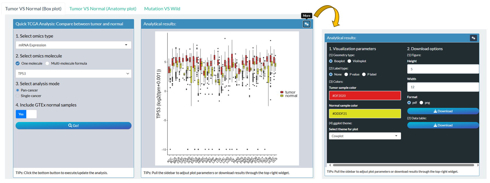
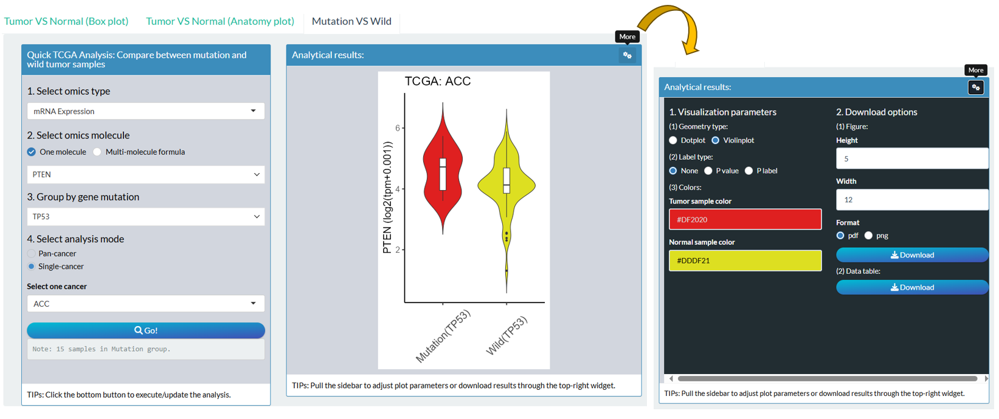

# Custom TPC modules {#custom-tpc}

In the "Custom TPC modules" page, there are totally 10 series of modules to quickly explore TPC (**T**CGA, **P**CAWG, **C**CLE) datasets with easy steps,  based on the functions introduced in Chapter \@ref(data-analysis).


```{r p1101, fig.cap='All Custom TPC modules in shiny app',  fig.align='center', echo = FALSE, out.width="80%"}
knitr::include_graphics('images/p1101.png')
```


## TCGA


```{r custom-tcga-mod, echo = FALSE}
data = readxl::read_excel("images/table_03.xlsx")
data = subset(data, Database == "TCGA")
# data = subset(data, Module !="vis_pancan_anatomy()")
knitr::kable(
  data, caption = 'Custom modules for TCGA analysis',
  align = "l",
  booktabs = TRUE
)
```


### Comparison

#### TCGA Tumor VS Normal (Box plot)

Compare molecular values between tumor and normal samples combing TCGA and GTEx datasets based on [`vis_toil_TvsN()`](#vis-toil-TvsN) and [`vis_toil_TvsN_cancer()`](#vis-toil-TvsN-cancer) functions.

- Left panel

1. Select one of supported multi-omics types;
2. Select an identifier or define a signature;
3. Select the mode: Pan-cancer or Single-Cancer (For the latter, one tumor type needs to be specified);
4. Decide that Whether to include normal samples from GTEx;
5. Click the "Go!" button

- Right panel

1. Observe the visualization plot of analytical result;
2. Pull the sidebar to adjust plot parameters or download results through the top-right widget.


```{r p1104, fig.cap='The layout of module "Tumor VS Normal (Box plot)"',  fig.align='center', echo = FALSE, out.width="100%"}

```

#### TCGA Tumor VS Normal (Anatomy plot)

Observe the difference of molecular values between pan-cancer tumor and normal samples based on [`vis_pancan_anatomy()`](#vis-pancan-anatomy) functions.

- Left panel

1. Select one of supported multi-omics types;
2. Select an identifier or define a signature;
3. Click the "Go!" button

- Right panel

1. Observe the anatomy plot of analytical result;
2. Pull the sidebar to adjust plot parameters or download results through the top-right widget.

```{r p1104n, fig.cap='The layout of module "Tumor VS Normal (Anatomy plot)"',  fig.align='center', echo = FALSE, out.width="100%"}
knitr::include_graphics('images/p1104n.png')
```


#### TCGA Mutation VS Wild {#m-vis-toil-Mut}

Compare molecular values between gene-mutant and gene-wild tumor samples based on [`vis_toil_Mut()`](#vis-toil-Mut) and [`vis_toil_Mut_cancer()`](#vis-toil-Mut-cancer) functions.

- Left panel

1. Select one of supported multi-omics types;
2. Select an identifier or define a signature to be compared;
3. Select one gene and group according to its mutation status;
4. Select the mode: Pan-cancer or Single-Cancer (For the latter, one tumor type needs to be specified);
5. Click the "Go!" button

- Right panel

1. Observe the visualization plot of analytical result;
2. Pull the sidebar to adjust plot parameters or download results through the top-right widget.


```{r p1105, fig.cap='The steps of module "Mutation VS Wild"',  fig.align='center', echo = FALSE, out.width="100%"}

```


### Correlation

#### TCGA Molecule-Molecule  {#m-vis-gene-cor}

Compute and visualize the correlation between two molecules of tumor samples based on [`vis_gene_cor()`](#vis-gene-cor) and [`vis_gene_cor_cancer()`](#m-vis-gene-cor-cancer) functions.

- Left panel

1. Select two respective omics types;
2. Select two specific identifiers as X-axis and Y-axis;
3. Select one or more TCGA types;
4. Select correlation method;
5. Decide that whether the correlation is corrected based on tumor purity;
6. Click the "Go!" button.

- Right panel

1. Observe the scatter plot of analytical result;
2. Pull the sidebar to adjust plot parameters or download results through the top-right widget.


```{r p1106, fig.cap='The steps of module "Molecule-Molecule"',  fig.align='center', echo = FALSE, out.width="100%"}
knitr::include_graphics('images/p1106.png')
```


#### TCGA Molecule-Tumor Immune Infiltration {#m-vis-gene-TIL-cor}

Compute the correlation of pan-cancers between one molecule and tumor immune infiltration of pan-cancer samples based on [`vis_gene_TIL_cor()`](#vis-gene-TIL-cor)  function.

- Left panel

1. Select one of supported multi-omics types;
2. Select an identifier or define a signature;
3. Select multiple TIL estimation;
4. Select correlation method;
5. Click the "Go!" button.

- Right panel

1. Observe the heatmap plot of analytical result;
2. Pull the sidebar to adjust plot parameters or download results through the top-right widget.

```{r p1107, fig.cap='The steps of module "Molecule-Tumor Immune Infiltration"',  fig.align='center', echo = FALSE, out.width="100%"}
knitr::include_graphics('images/p1107.png')
```

#### TCGA Molecule-Immune Signature {#m-vis-gene-immune-cor}

Compute the correlation of pan-cancers between one molecule and tumor Immune Signature based on [`vis_gene_immune_cor()`](#vis-gene-immune-cor) function.

- Left panel

1. Select one of supported multi-omics types;
2. Select an identifier or define a signature;
3. Select one category of immune cell type scores;
4. Select correlation method;
5. Click the "Go!" button.

- Right panel

1. Observe the heatmap plot of analytical result;
2. Pull the sidebar to adjust plot parameters or download results through the top-right widget.

```{r p1108, fig.cap='The steps of module "Molecule-Immune Signature"',  fig.align='center', echo = FALSE, out.width="100%"}
knitr::include_graphics('images/p1108.png')
```

#### TCGA Molecule-TMB/Stemness/MSI {#m-vis-gene-index}

Compute the correlation of pan-cancers between one molecule and TMB/Stemness/MSI index based on [`vis_gene_tmb_cor()`](#vis-gene-tmb-cor), [`vis_gene_msi_cor()`](#vis-gene-msi-cor) and  [`vis_gene_stemness_cor()`](#vis-gene-stemness-cor) functions.

- Left panel

1. Select one of supported multi-omics types;
2. Select an identifier or define a signature;
3. Select one of collected tumor index;
4. Select correlation method;
5. Click the "Go!" button.

- Right panel

1. Observe the radar plot of analytical result;
2. Pull the sidebar to adjust plot parameters or download results through the top-right widget.

```{r p1109, fig.cap='The steps of module "Molecule-TMB/Stemness/MSI"',  fig.align='center', echo = FALSE, out.width="100%"}
knitr::include_graphics('images/p1109.png')
```


#### TCGA Molecule-Pathway {#m-vis-gene-pw-cor}

Compute the correlation of between one molecule and pathway score  of tumor samples based on [`vis_gene_pw_cor()`](#vis-gene-pw-cor) function.

- Left panel

1. Select one of supported multi-omics types;
2. Select an identifier or define a signature;
3. Select one of calculated pathway scores (ssGSEA);
4. Select correlation method;
5. Click the "Go!" button.

- Right panel

1. Observe the scatter plot of analytical result;
2. Pull the sidebar to adjust plot parameters or download results through the top-right widget.

```{r p1110, fig.cap='The steps of module "Molecule-Pathway"',  fig.align='center', echo = FALSE, out.width="100%"}
knitr::include_graphics('images/p1110.png')
```


### Survival analysis

#### TCGA Kaplan-Meier {#m-tcga-surv-plot}

Perform one molecular Log-rank survival analysis based on [`tcga_surv_plot()`](#tcga-surv-plot) function.

- Left panel

1. Select one of supported multi-omics types;
2. Select an identifier or define a signature;
3. Select one TCGA cancer and select one endpoint as survival event;
4. Filter samples by Gender, Age, Stage;
5. Select the grouping method;
6. Click the "Go!" button.

- Right panel

1. Observe the survival curves of analytical result;
2. Pull the sidebar to adjust plot parameters or download results through the top-right widget.

```{r p1111, fig.cap='The steps of module "Kaplan-Meier"',  fig.align='center', echo = FALSE, out.width="100%"}
knitr::include_graphics('images/p1111.png')
```

#### TCGA Cox regression {#m-vis-unicox-tree}

Perform one molecular Log-rank survival analysis across pan-cancers based on [`vis_unicox_tree()`](#vis-unicox-tree) function.

- Left panel

1. Select one of supported multi-omics types;
2. Select an identifier or define a signature;
3. Select one endpoint as survival event;
4. Click the "Go!" button.

- Right panel

1. Observe the forest plot of analytical result;
2. Pull the sidebar to adjust plot parameters or download results through the top-right widget.

```{r p1112, fig.cap='The steps of module "Cox regression"',  fig.align='center', echo = FALSE, out.width="100%"}
knitr::include_graphics('images/p1112.png')
```

### Dimension Reduction

#### TCGA Dimension reduction {#m-vis-dim-dist}

Perform molecular dimension reduction analysis based on [`vis_dim_dist()`](#vis-dim-dist) function.

- Left panel

1. Select one of supported multi-omics types;
2. Select multiple identifiers via one of three ways, then click the "Cache data" button;
   - "Select": One-by-one selection;
   - "Pathway": batch selection under one pathway;
   - "File": Upload of identifier file.
3. Set the sample range and grouping;
   - "Preset Group": select one or more TCGA cancers and one clinical phenotype as grouping criteria.
   - "Custom Group": upload files with custom samples and group columns. See details by downloading example file.
4. Select the algorithm of dimension reduction;
5. Click the "Go!" button.

- Right panel

1. Observe the scatter plot of analytical result;
2. Pull the sidebar to adjust plot parameters or download results through the top-right widget.


```{r p1113, fig.cap='The steps of module "Dimension reduction"',  fig.align='center', echo = FALSE, out.width="100%"}
knitr::include_graphics('images/p1113.png')
```


## PCAWG
```{r custom-pcawg-mod, echo = FALSE}
data = readxl::read_excel("images/table_03.xlsx")
data = subset(data, Database == "PCAWG")
knitr::kable(
  data, caption = 'Custom modules for PCAWG analysis',
  align = "l",
  booktabs = TRUE
)
```

### Comparison analysis

#### PCAWG Tumor VS Normal {#m-vis-pcawg-dist}

Compare molecular values between tumor and normal samples of PCAWG projects based on [`vis_pcawg_dist()`](#vis-pcawg-dist) function.

- Left panel

1. Select one of supported multi-omics types;
2. Select an identifier or define a signature;
3. Click the "Go!" button.

- Right panel

1. Observe the visualization plot of analytical result (Some of projects only have tumor samples);
2. Pull the sidebar to adjust plot parameters or download results through the top-right widget.

```{r p1114, fig.cap='The steps of module "Tumor VS Normal"',  fig.align='center', echo = FALSE, out.width="100%"}
knitr::include_graphics('images/p1114.png')
```

### Correlation analysis

#### PCAWG Molecule-Molecule {#m-vis-pcawg-gene-cor}

Compute and visualize the correlation between two molecules based on [`vis_pcawg_gene_cor()`](#vis-pcawg-gene-cor) function.

- Left panel

1. Select two respective omics types;
2. Select two specific identifiers as X-axis and Y-axis;
3. Select one or more PCAWG projects;
4. Select correlation method;
5. Decide that whether the correlation is corrected based on tumor purity;
6. Click the "Go!" button.

- Right panel

1. Observe the scatter plot of analytical result;
2. Pull the sidebar to adjust plot parameters or download results through the top-right widget.
```{r p1115, fig.cap='The steps of module "Molecule-Molecule"',  fig.align='center', echo = FALSE, out.width="100%"}
knitr::include_graphics('images/p1115.png')
```

### Survival analysis

> Notes: Only OS endpoint for PCAWG samples.

#### PCAWG Kaplan-Meier

Perform one molecular Log-rank survival analysis in one PCAWG project.

- Left panel

1. Select one of supported multi-omics types;
2. Select an identifier or define a signature;
3. Select one PCAWG project;
4. Filter samples by Gender, Age;
5. Select the grouping method;
6. Click the "Go!" button.

- Right panel

1. Observe the survival curves of analytical result;
2. Pull the sidebar to adjust plot parameters or download results through the top-right widget.

```{r p1116, fig.cap='The steps of module "Kaplan-Meier"',  fig.align='center', echo = FALSE, out.width="100%"}
knitr::include_graphics('images/p1116.png')
```

#### PCAWG Cox regression {#m-vis-pcawg-unicox-tree}

Perform one molecular Log-rank survival analysis in All PCAWG  projects based on [`vis_pcawg_unicox_tree()`](#vis-pcawg-unicox-tree) function.

- Left panel

1. Select one of supported multi-omics types;
2. Select an identifier or define a signature;
3. Click the "Go!" button.

- Right panel

1. Observe the forest plot of analytical result;
2. Pull the sidebar to adjust plot parameters or download results through the top-right widget.

```{r p1117, fig.cap='The steps of module "Cox regression"',  fig.align='center', echo = FALSE, out.width="100%"}
knitr::include_graphics('images/p1117.png')
```


## CCLE
```{r custom-ccle-mod, echo = FALSE}
data = readxl::read_excel("images/table_03.xlsx")
data = subset(data, Database == "CCLE")
knitr::kable(
  data, caption = 'Custom modules for CCLE analysis',
  align = "l",
  booktabs = TRUE
)
```

### Comparison analysis

#### CCLE Cancer Primary Sites {#m-vis-ccle-tpm}

Compare molecular values of cancer cell lines from different primary site based on [`vis_ccle_tpm()`](#vis-ccle-tpm) function.

- Left panel

1. Select one of supported multi-omics types;
2. Select an identifier or define a signature;
3. Click the "Go!" button.

- Right panel

1. Observe the visualization plot of analytical result;
2. Pull the sidebar to adjust plot parameters or download results through the top-right widget.

```{r p1118, fig.cap='The steps of module "Cancer Primary Sites"',  fig.align='center', echo = FALSE, out.width="100%"}
knitr::include_graphics('images/p1118.png')
```

### Correlation analysis

#### CCLE Molecule-Molecule {#m-vis-ccle-gene-cor}

Compute and visualize the correlation between two molecules based on CCLE database based on [`vis_ccle_gene_cor()`](#vis-ccle-gene-cor) function.

- Left panel

1. Select two respective omics types;
2. Select two specific identifiers as X-axis and Y-axis;
3. Select one or more primary sites;
4. Select correlation method;
5. Click the "Go!" button.

- Right panel

1. Observe the scatter plot of analytical result;
2. Pull the sidebar to adjust plot parameters or download results through the top-right widget.


```{r p1119, fig.cap='The steps of module "Molecule-Molecule"',  fig.align='center', echo = FALSE, out.width="100%"}

```

