# Personalized TPC pipelines(1) {#per-tpc-1}

## Extensive tumor data

### Compiling types of identifiers

1. For **TCGA** samples, there are **5** main data types and **23** subtypes (except for *Custom metadata*).

```{r p1201, fig.cap='Hierarchical types of TCGA Identifiers',  fig.align='center', echo = FALSE, out.width="100%"}
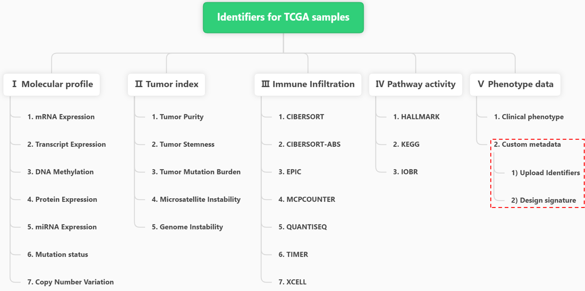
```

2. For **PCAWG** samples, there are **5** main data types and **17** subtypes (except for *Custom metadata*).

3. For **CCLE** samples, there are **3** main data types and **6** subtypes (except for *Custom metadata*).


```{r p1202, fig.cap='Hierarchical types of PCAWG and CCLE Identifiers',  fig.align='center', echo = FALSE, out.width="100%"}
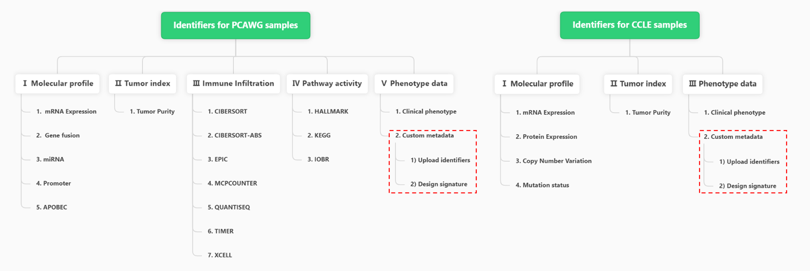
```


###  Reference of full identifiers

- In the "**Help→ID query**" page,  all identifiers for "*Molecular profile*", "*Tumor index*", "*Immune Infiltration*", "*Pathway activity*", "*Phenotype data*" types of TPC samples are compiling for easy query before analysis.
- For example, valid identifiers under the *TCGA mRNA Expression* subtype are shown in the following figure.

```{r p1203, fig.cap='TPC Identifiers Query Page',  fig.align='center', echo = FALSE, out.width="100%"}
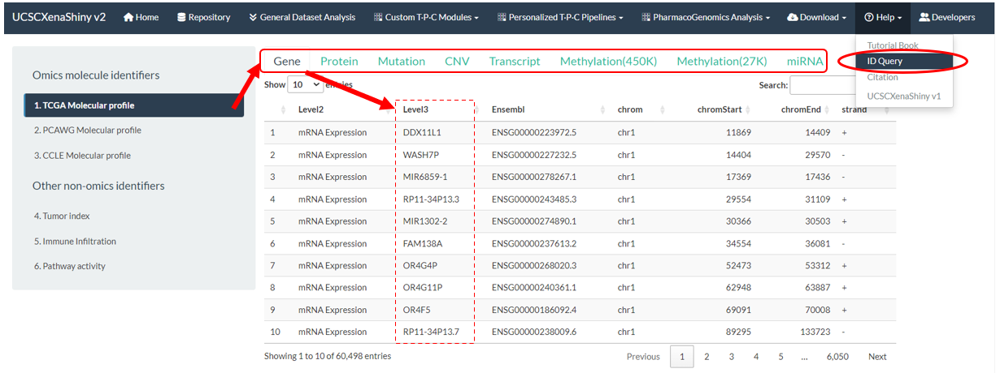
```


### User-defined identifiers

#### Upload of random identifiers

1. Users are enabled to upload random identifiers for joint analysis in the "**Upload metadata**" part of **S1** step.
2. The example file can be downloaded via the right button to see the format requirements.
   - .CSV file;
   - The first column names "Sample" with sample ids (e.g. "TCGA-OR-A5J1-01" for TCGA samples). Only the intersected samples between this column and all TPC samples are considered;
   - The other columns are random identifiers with continuous or categorical values.
3. Upon successful identifiers upload, they will be added into the "Custom metadata" subtype of "Phenotype data".

```{r p1204, fig.cap='Upload of random identifiers',  fig.align='center', echo = FALSE, out.width="80%"}
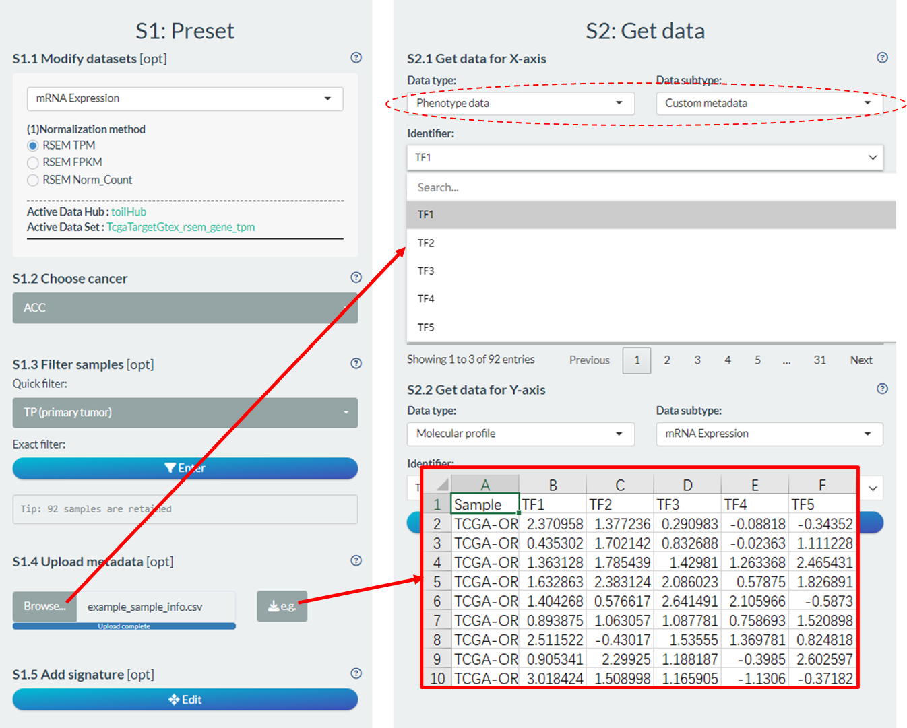
```

#### Design of custom signature

1. Users can also design custom signature score based on self-defined molecular formula in the "**Add signature**" part of **S1** step.
2. Upon successful signature design and score calculation, they will also be added into the "Custom metadata" subtype of "Phenotype data".

```{r p1205, fig.cap='Design of custom signature',  fig.align='center', echo = FALSE, out.width="80%"}
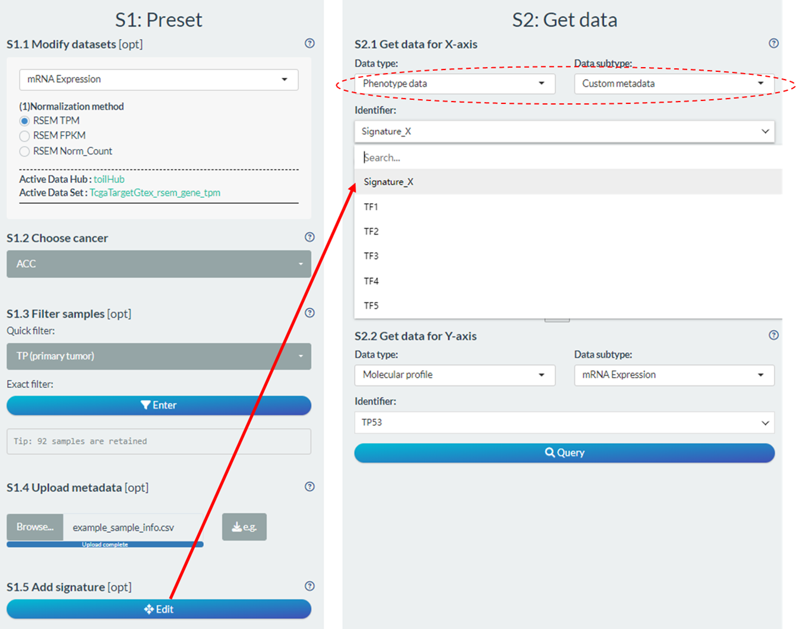
```

3. As shown in the figure below, the signature can be set as following steps after clicking Edit button.

- Firstly, modify the name and select the molecular type;
- Then, design the molecular formula comprised of multiple molecules with respective coefficients;
  - The  coefficient of each molecule is divided into two parts (Directions and Absolute Coef).
  - The "**Del**" button will cancel the last set molecule and the "**Reset**" button will undo all selected molecules.
  - The real-time formula is shown in the bottom.
- Finally, click the "Query data" button to calculate the signature scores and click the right button to add the signature into the "Custom metadata" subtype of "Phenotype data". In addition, user can obtain the result locally via the bottom button.

```{r p1206, fig.cap='3 steps of signature design',  fig.align='center', echo = FALSE, out.width="100%"}
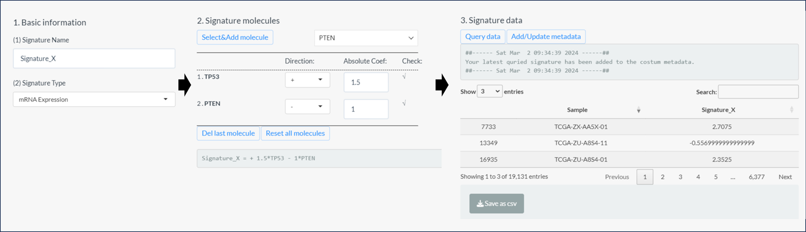
```


## Sample processing

```{r p1207, fig.cap='Sample filtering and grouping modules',  fig.align='center', echo = FALSE, out.width="80%"}
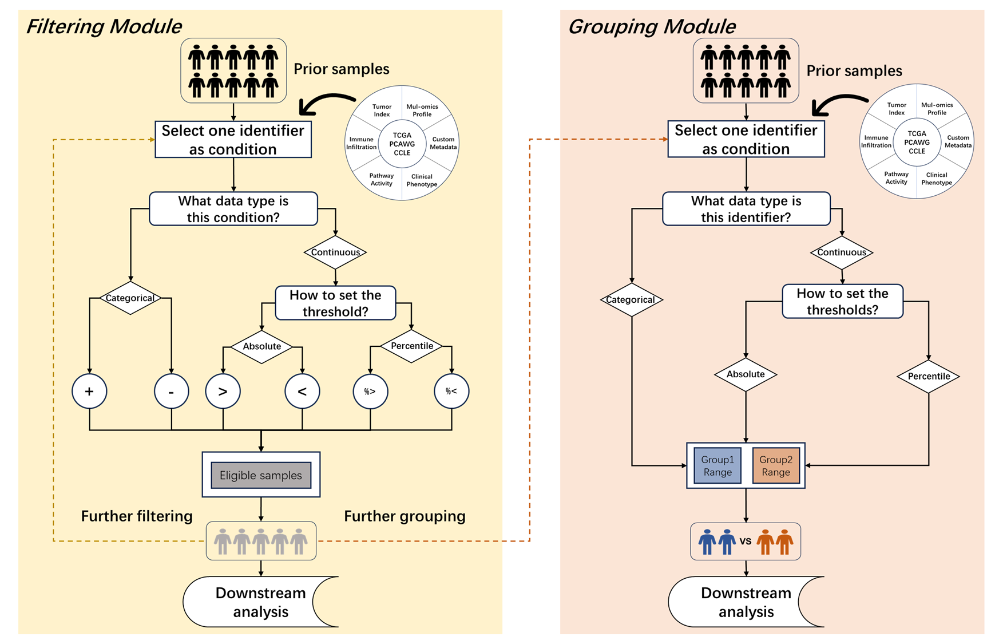
```

### Sample filtering {#sample-filtering}

After selecting one tumor, all its samples will be selected by default. Here, we provide two methods to obtain specific subpopulation  in the "**Filter samples**" part of **S1** step.

```{r p1208, fig.cap='Sample filtering module',  fig.align='center', echo = FALSE, out.width="80%"}
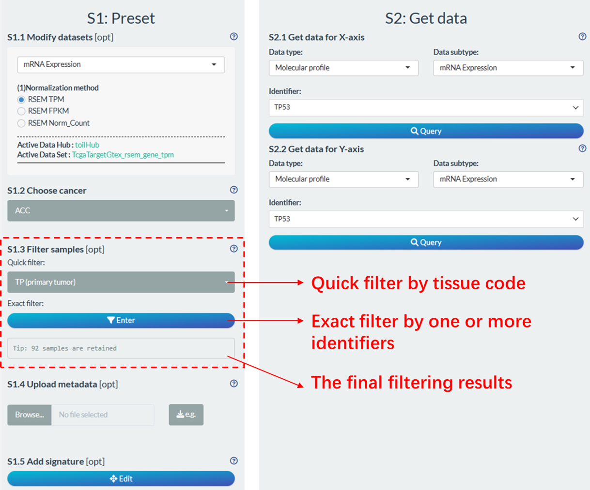
```

#### Quick filter

Users can directly make quick selections based on tissue code (pathological) types of samples. Based on the [14th to 15th characters](https://gdc.cancer.gov/resources-tcga-users/tcga-code-tables/sample-type-codes) of the TCGA sample ID (e.g., TCGA-19-1787-01), samples can be categorized into different types. The common code types involved in UCSCXenaShiny analysis are shown in the following table.

| Code | Definition                                      | Short Letter Code |
| :--- | :---------------------------------------------- | :---------------- |
| 01   | Primary Solid Tumor                             | TP                |
| 02   | Recurrent Solid Tumor                           | TR                |
| 03   | Primary Blood Derived Cancer - Peripheral Blood | TB                |
| 05   | Additional - New Primary                        | TAP               |
| 06   | Metastatic                                      | TM                |
| 07   | Additional Metastatic                           | TAM               |
| 11   | Solid Tissue Normal                             | NT                |

> For PCAWG database, you can perform similar operation to quickly select tumor or normal samples. For CCLE database, there is no quick filter.

#### Exact filter

Through this module, users are enabled to perform personalized sample filtering. This followings are operational steps:

1. Set the candidate conditions from comprehensive identifiers. Each addition will rename the selected identifier as "Condition_Num". 
   - When selecting molecular identifier as condition, it may take some time to download from the USCS Xena, depending on the network.
   - For TPC samples, some basic clinical variables have been selected into the candidate pool. For TCGA samples, they include *Age, Code, Gender, Stage_ajcc, Stage_clinical, Grade*.
2. Get an overview of the distribution of each candidate condition for clear filtering .
   - For continuous variables,  the mean and the distribution of multiple percentiles are displayed.
   - For categorical variables, the frequency of each category is displayed.
3. Perform filtering operation based on one or multiple conditions from the above candidate list. Total 6 operators are devised for versatile filtering give the type of each condition.
   - For categorical variable, "**+**" and "**-**" are used for retain or discard specific categories of samples.
   - For continuous variable, "**>**" and "**<**" are used to set absolute cutoff, while "**%>**" and "**%<**" are used to set percentile cutoff.
   
```{r p1209, fig.cap='3 steps of sample filtering',  fig.align='center', echo = FALSE, out.width="100%"}
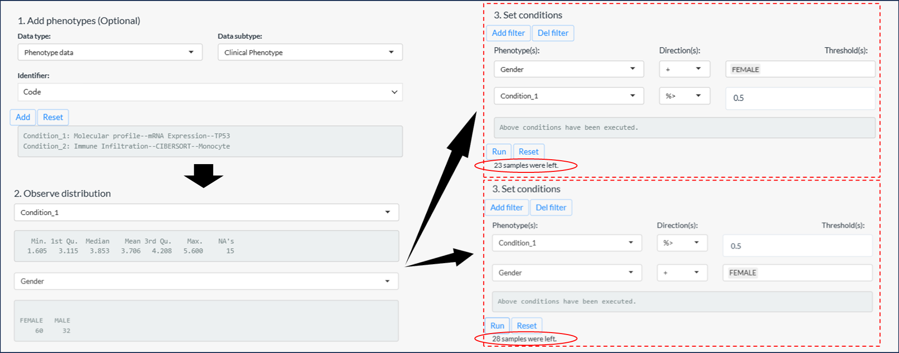
```


> Tips:  If the percentile cutoff is involved, the results may vary based on the order of filtering, as illustrated in the example above figure.
>
> - The first instance: Samples with the top 50% high expression of TP53 in female samples. → **23** samples
> - The second instance: Females from the top 50% of samples with high TP53 expression. → **28** samples


### Sample grouping

For binary comparison or survival analysis, it is necessary to divide the samples into two groups based on one specific condition. Here, we also provide a personalized grouping module to flexibly set two ranges of sample populations. 

Generally, it has the two main steps: 

1. Select one condition and observe its distribution. Similar to the filtering module, it can bring a clear pre-knowledge by observing the distribution of one continuous or categorical condition.

2. Set two non-overlapping sample ranges to group.

- For categorical variable, assign one or more classifications for both groups (**Left figure**)
- For continuous variable, set the minimum and max thresholds for both group. 
  - By default, the first group (Group1) has lower value with **left close** and **right open** range, e.g. [0, 1). If its left range is blank, it will represent the minimum value of the condition. 
  - And, the second group (Group2) has larger value with **left close** and **right close** range, e.g. [0, 1]. If its right range is blank, it will represent the maximum value of the condition. 
  - The thresholds can be percentile values (**Middle figure**) or absolute values (**Right figure**) depending on purposes.

```{r p1210, fig.cap='Sample grouping module',  fig.align='center', echo = FALSE, out.width="100%"}
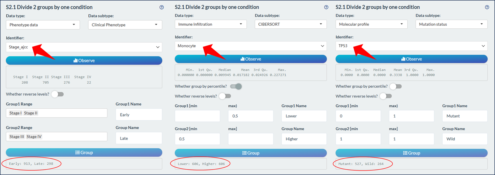
```


> Tips: By default, the Group1 has the prior order during analysis and visualization. You can click the switch "Whether reverse levels" to change the order.


## Data fetch

After sample selection and processing, we usually need to fetch data for downstream analysis. 

### Single data

Most of time, we just need to select one identifier and fetch its values. According to the hierarchical organization (**Data type → Data subtype → Identifier**), select one interesting identifier and then click the "Query button" to fetch data. It's worth noting that, for *Molecular profile* data types, it may take some time to download from the UCSC Xena, depending on the network.


```{r p1211, fig.cap='Fetch single data',  fig.align='center', echo = FALSE, out.width="80%"}
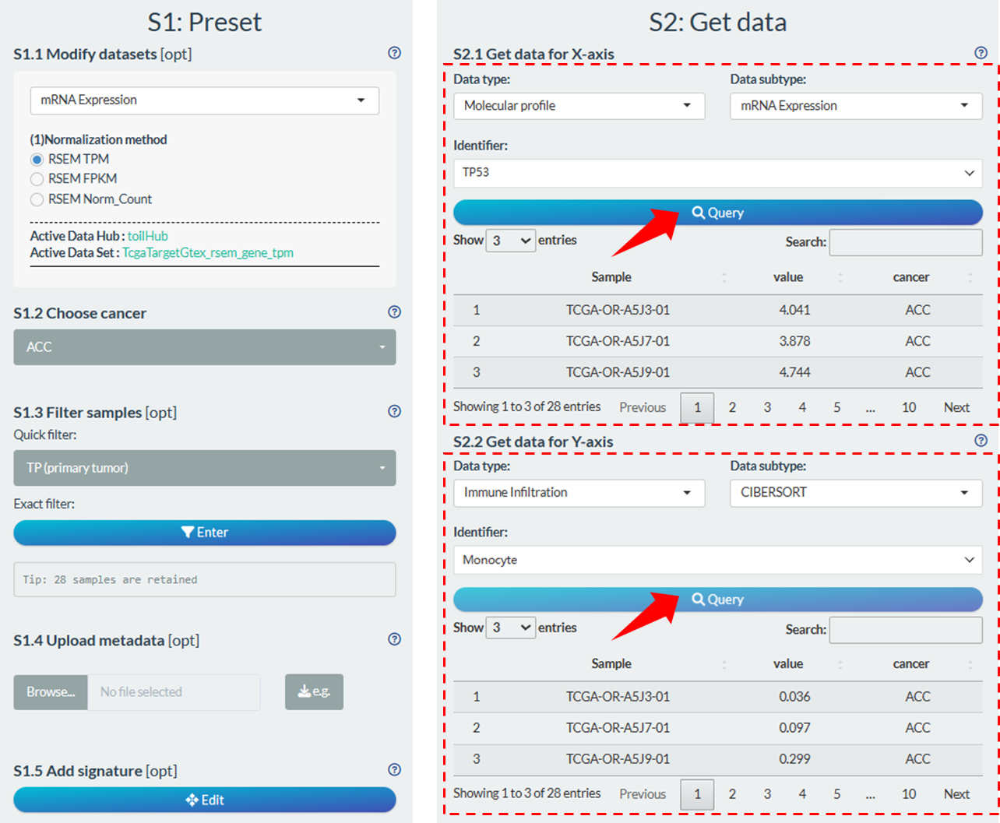
```

### Multiple data {#multiple-data}

For batch analysis, we can select multiple identifiers based on one of three ways.

1. In the first way (**Left figure**), user can select batch identifiers of one specific subtype one by one.
2. In the second way (**Middle figure**), user can select all identifiers of one specific subtype. Notably, for some molecular types with much identifiers, all the identifiers (gene/transcript) belong to one MSigDB signature can be selected.

- These molecular types are "mRNA Expression", "DNA Methylation", "Mutation status", "Copy Number Variation", "Transcript Expression".
- The MSigDB gene signatures are obtained via [`msigdbr` package](https://igordot.github.io/msigdbr/), which can be 9 main categories (bottom table). 
- Two links are available for detailed information of selected signature and MSigDB database.


3. In the third way (**Right figure**), user can directly upload an identifier file with following requirements:

- TXT format; 
- One column without colname;
- Only the valid identifiers that overlapped with the selected data subtype are retained

```{r p1212, fig.cap='Fetch multiple data',  fig.align='center', echo = FALSE, out.width="100%"}
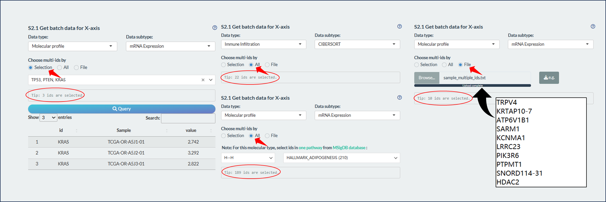
```

---

| Category |              Notes              | Subcategory                                                  |
| :------: | :-----------------------------: | ------------------------------------------------------------ |
|    H     |       hallmark gene sets        | /                                                            |
|    C1    |      positional gene sets       | /                                                            |
|    C2    |        curated gene sets        | CGP, CP, CP:BIOCARTA, CP:KEGG, CP:PID, CP:REACTOME, CP:WIKIPATHWAYS |
|    C3    |   regulatory target gene sets   | MIR:MIRDB, MIR:MIR_Legacy, TFT:GTRD, TFT:TFT_Legacy          |
|    C4    |     computational gene sets     | CGN, CM                                                      |
|    C5    |       ontology gene sets        | GO:BP, GO:CC, GO:MF, HPO                                     |
|    C6    |  oncogenic signature gene sets  | /                                                            |
|    C7    | immunologic signature gene sets | IMMUNESIGDB, VAX                                             |
|    C8    |  cell type signature gene sets  | /                                                            |
