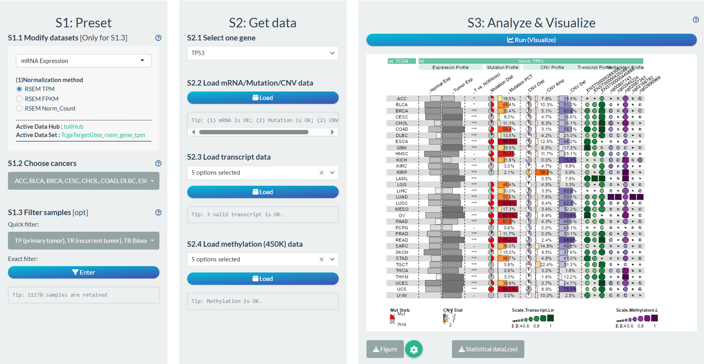
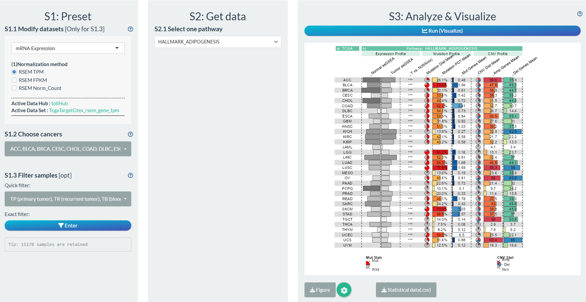

# Personalized TPC pipelines(2) {#per-tpc-2}

## General steps

**S1: Preset** — Set personalized samples and tumor data with following general steps.

- "**Modify datasets**":  View the dataset sources for each molecular type. When there are alternative datasets for the same molecular type, users can switch a suitable one based on purpose (referring to Chapter \@ref(custom-tpc)).
- "**Choose cancer**": Choose one cancer type for downstream association analysis.
- "**Filter samples**": Upon the selection of one tumor, further refine the samples based on tissue codes or personalized filtering module.
- "**Upload metadata**": Upload user-defined tumor data for joint analysis. 
- "**Add signature**": Design custom molecular signature for joint analysis. 

**S2: Get data** — Select and fetch identifier values; set grouping information.

**S3: Analyze & Visualize** — Modify diverse parameters; perform analysis; download results.

- "**Set analyzation parameters**": Select different statistical methods
- "**Set visualization parameters**":  Adjust plot color, title text, etc.
- "**Download results**": Download three types of results, including raw data, detailed statistical results and plot results. (Note: No plot for batch-screen mode).


> Notes: We will introduce various analysis scenarios of TPC using TCGA as example.


## Correlation analysis

```{r p1301, fig.cap='3 modes of correlation analysis',  fig.align='center', echo = FALSE, out.width="100%"}
knitr::include_graphics('images/p1301.png')
```


### Individual Mode

Perform the correlation analysis between any **two identifiers** of samples from **one tumor**.

The following is a simple example. (The steps not mentioned in above figure imply default operations.)

**S1: Preset** 

- "**S1.2 Choose cancer**":  choose the ***CHOL*** (Cholangiocarcinoma) cancer type
- "**S1.3 Filter samples**":  choose the ***primary tumor*** samples via the quick filter.

**S2: Get data** 

- "**S2.1 Get data for X-axis**": Molecular profile→mRNA Expression→***TP53***
- "**S2.2 Get data for Y-axis**": Infiltration→CIBERSORT→ ***Monocyte***

**S3: Analyze & Visualize** 

- "**S3.1 Set analysis parameters**": ***Spearman***
- "**S3.2 Set visualization parameters**": Adjust the main title name.


```{r p1302, fig.cap='Example of correlation analysis in individual mode',  fig.align='center', echo = FALSE, out.width="100%"}
knitr::include_graphics('images/p1302.png')
```


### Pan-cancer Mode

Perform the correlation analysis between any **two identifiers** of samples across **multiple tumors**.

The following is a simple example. (The steps not mentioned in above figure imply default operations.)

**S1: Preset** 

- "**S1.1 Modify datasets**": Select the **Norm_Count** dataset for mRNA Expression dataset. 
- "**S1.2 Choose cancer**":  choose all TCGA cancer types.
- "**S1.3 Filter samples**":  choose the ***non-normal*** samples via the quick filter.

**S2: Get data** 

- "**S2.1 Get data for X-axis**": Molecular profile→mRNA Expression→***HDAC1***
- "**S2.2 Get data for Y-axis**": Molecular profile→mRNA Expression→***APOE***

**S3: Analyze & Visualize** 

- "**S3.1 Set analysis parameters**": ***Pearson***
- "**S3.2 Set visualization parameters**": Adjust the names of main title and axis title.


```{r p1303, fig.cap='Example of correlation analysis in pan-cancer mode',  fig.align='center', echo = FALSE, out.width="100%"}
knitr::include_graphics('images/p1303.png')
```

### Batch Screen Mode

Perform the correlation analysis between **multiple identifiers** and **one identifier** of samples from **one tumor**.

The following is a simple example. (The steps not mentioned in above figure imply default operations.)

**S1: Preset** 

- "**S1.2 Choose cancer**":  choose the ***CHOL*** (Cholangiocarcinoma) cancer type
- "**S1.3 Filter samples**":  choose the ***primary tumor*** samples via the quick filter.

**S2: Get data** 

- "**S2.1 Get batch data for X-axis**": Molecular profile→mRNA Expression→ genes of HALLMARK_APOPTOSIS pathways
- "**S2.2 Get data for Y-axis**": Immune Infiltration→CIBERSORT→ ***Monocyte***

**S3: Analyze** 

- "**S3.1 Set analysis parameters**": ***Spearman***


```{r p1304, fig.cap='Example of correlation analysis in batch screen mode',  fig.align='center', echo = FALSE, out.width="100%"}
knitr::include_graphics('images/p1304.png')
```


## Comparison analysis


```{r p1305, fig.cap='3 modes of comparison analysis',  fig.align='center', echo = FALSE, out.width="100%"}

```

### Individual Mode

Perform the comparison analysis of **one identifier** between two groups of samples from **one tumor**.

The following is a simple example. (The steps not mentioned in above figure imply default operations.)

**S1: Preset** 

- "**S1.2 Choose cancer**":  choose the ***BRCA*** (Breast invasive carcinoma) cancer type
- "**S1.3 Filter samples**":  choose the ***non-normal*** samples via the quick filter.

**S2: Get data** 

- "**S2.1 Divide 2 groups by one condition**": Group1→**Primary** tumor samples; Group2→**Metastatic** tumor samples
- "**S2.2 Get data for comparison**": Molecular profile→mRNA Expression→***POSTN***

**S3: Analyze & Visualize** 

- "**S3.1 Set analysis parameters**": ***Wilcoxon test***
- "**S3.2 Set visualization parameters**": Remove x-axis title.

```{r p1306, fig.cap='Example of comparison analysis in individual mode',  fig.align='center', echo = FALSE, out.width="100%"}

```


### Pan-cancer Mode

Perform the comparison analysis of **one identifier** between two groups of samples across **multiple tumors**.

The following is a simple example. (The steps not mentioned in above figure imply default operations.)

**S1: Preset** 

- "**S1.2 Choose cancer**":  choose the all TCGA cancer types.
- "**S1.3 Filter samples**":  choose the ***primary tumor*** samples via the quick filter. Further choose samples with age above 60 via the exact filter.

**S2: Get data** 

- "**S2.1 Divide 2 groups by one condition**": Group1→ gene PTEN mutation; Group2→ gene PTEN wild-type.
- "**S2.2 Get data for comparison**": Tumor index → Tumor Stemness →***RNAss***

**S3: Analyze & Visualize** 

- "**S3.1 Set analysis parameters**": ***t-test***
- "**S3.2 Set visualization parameters**": adjust x-axis title.


```{r p1307, fig.cap='Example of comparison analysis in pan-cancer mode',  fig.align='center', echo = FALSE, out.width="100%"}
knitr::include_graphics('images/p1307.png')
```


### Batch Screen Mode

Perform the comparison analysis of **multiple identifier** between two groups of samples from **one tumor**.

The following is a simple example. (The steps not mentioned in above figure imply default operations.)

**S1: Preset** 

- "**S1.2 Choose cancer**":  choose the ***BRCA*** (Breast invasive carcinoma) cancer type
- "**S1.3 Filter samples**":  choose the ***non-normal*** samples via the quick filter.

**S2: Get data** 

- "**S2.1 Divide 2 groups by one condition**": Group1→**Primary** tumor samples; Group2→**Metastatic** tumor samples
- "**S2.2 Get data for comparison**": Immune Infiltration→XCELL→ ***Monocyte***

**S3: Analyze** 

- "**S3.1 Set analysis parameters**": ***Wilcoxon test***

```{r p1308, fig.cap='Example of comparison analysis in batch screen mode',  fig.align='center', echo = FALSE, out.width="100%"}
knitr::include_graphics('images/p1308.png')
```

## Survival analysis

By default, both log-rank and cox regression survival analysis are performed for two groups of samples divided according to one condition. Here, we devised a switch "***Whether use initial data before grouping?***" at **S3.1** steps with following function:

- If its status is off , the above default analysis will performed;

- If its status is on and the grouping condition is **continuous**:

  - For log-rank test, it will search the **optimal cutoff** with most significant survival difference;
  - For Cox regression, it will directly build the cox model based on the continuous variable.

```{r p1309, fig.cap='3 modes of survival analysis',  fig.align='center', echo = FALSE, out.width="100%"}
knitr::include_graphics('images/p1309.png')
```

### Individual Mode
Perform the survival analysis between two groups of samples generated by **one identifier** from **one tumor**.

The following is a simple example. (The steps not mentioned in above figure imply default operations.)

**S1: Preset** 

- "**S1.1 Modify datasets**": Select the 27K Methylation datasets; Select the cg15206330 site to represent TP53 methylation
- "**S1.2 Choose cancer**":  choose the ***BRCA*** (Breast invasive carcinoma) cancer type
- "**S1.3 Filter samples**":  choose the ***non-normal*** samples via the quick filter.

**S2: Get data** 

- "**S2.1 Select survival endpoint**": Select the OS event
- "**S2.2 Divide 2 groups by one condition**": Group1: TP53 methylation higher 50%, Group2: TP53 methylation lower 50%

**S3: Analyze & Visualize** 

- "**S3.1 Set analysis parameters**": Log-rank text
- "**S3.2 Set visualization parameters**": Modify color; Set confidence interval.

```{r p1310, fig.cap='Example of survival analysis in individual mode',  fig.align='center', echo = FALSE, out.width="100%"}
knitr::include_graphics('images/p1310.png')
```


### Pan-cancer Mode
Perform the survival analysis between two groups of samples generated by **one identifier** across **multiple tumor**.

The following is a simple example. (The steps not mentioned in above figure imply default operations.)

**S1: Preset** 

- "**S1.2 Choose cancer**":  choose the ***BRCA*** cancer type
- "**S1.3 Filter samples**":  choose the ***non-normal*** samples via the quick filter.

**S2: Get data** 

- "**S2.1 Select survival endpoint**": Select the OS event
- "**S2.2 Divide 2 groups by one condition**": Group1: Signature value higher 10%, Group2: Signature value lower 10%

**S3: Analyze & Visualize** 

- "**S3.1 Set analysis parameters**": Univariate Cox regression; Use the initial data. 
- "**S3.2 Set visualization parameters**": Add main title.


```{r p1311, fig.cap='Example of survival analysis in pan-cancer mode',  fig.align='center', echo = FALSE, out.width="100%"}
knitr::include_graphics('images/p1311.png')
```

### Batch Screen Mode
Perform the survival analysis between two groups of samples generated by **multiple identifiers** from **one tumor**.

The following is a simple example. (The steps not mentioned in above figure imply default operations.)

**S1: Preset** 

- "**S1.2 Choose cancer**":  choose the all TCGA cancer types
- "**S1.3 Filter samples**":  choose the ***primary tumor*** samples via the quick filter.
- "**S1.5 Add signature**":  Design a molecular signature and add to custom metadata.

**S2: Get data** 

- "**S2.1 Select survival endpoint**": Select the PFI event
- "**S2.2 Divide 2 groups by one condition**": Pathway activity→HALLMARK pathways→Group1: score higher 50%, Group2: score  lower 50%

**S3: Analyze** 

- "**S3.1 Set analysis parameters**": Log-rank test

```{r p1312, fig.cap='Example of survival analysis in batch screen mode',  fig.align='center', echo = FALSE, out.width="100%"}
knitr::include_graphics('images/p1312.png')
```


## Cross-Omics analysis
Recently, we have added one pipeline for TCGA cross-omics analysis to simultaneously explore the molecular features of multiple omics across pan-cancers.

### Gene Cross-Omics Analysis
Perform the cross-omics analysis at the gene level, involving Gene expression, Gene Mutation, Gene CNV, Transcript expression, DNA methylation.

The following is a simple example. (The steps not mentioned in above figure imply default operations.)

**S1: Preset** 

- "**S1.2 Choose cancer**":  choose the all TCGA cancer types
- "**S1.3 Filter samples**":  By default, select all normal samples and tumor samples.

**S2: Get data** 

- "**S2.1 Select one gene**": Select gene TP53
- "**S2.2 Load mRNA/Mutation/CNV data**": Preload the mRNA/Mutation/CNV data of gene to save time in S3 step.
- "**S2.3 Load transcript data**": Select and load several transcript of gene, filter invalid transcripts with null value.
- "**S2.4 Load methylation data**": Select several CpG sits of gene and load methyaltion data. 

**S3: Analyze & Visualize** : Analyze multi-omics data and visualize by `funkyheatmap` package.

```{r p1313, fig.cap='Example of Gene Cross-Omics Analysis',  fig.align='center', echo = FALSE, out.width="100%"}

```

**Column-1**: TCGA Names;

**Column-2[Expression Profile]**: 0-1 normalized median expression of gene in normal samples (include GTEx);

**Column-3[Expression Profile]**: 0-1 normalized median expression of gene in tumor samples;

**Column-4[Expression Profile]**: The significance symbol of gene comparison between tumor and normal samples via *Wilcoxon* test (P<0.001, “\*\*\*”; P<0.01, “\*\*”; P<0.05, “*”; P>0.05, “-”).

**Column-5[Mutation Profile]**: The distribution of gene mutation or wild status in tumor samples.

**Column-6[Mutation Profile]**: The percentage of gene mutation status in tumor samples.

**Column-7[CNV Profile]**: The distribution of gene copy number variation status in tumor samples (-2, homozygous deletion; -1, single copy deletion; 0, diploid normal copy; 1: low-level copy number amplification; 2: high-level copy number amplification).

**Column-8[CNV Profile]**: The percentage of gene copy number amplification (1,2) in tumor samples.

**Column-9[CNV Profile]**: The percentage of gene copy number deletion (-1, -2) in tumor samples.

**Column-Selected transcript(s) of one gene[CNV Profile]**: The median transcript expression in tumor samples.

**Column-Selected CpG sites of one gene[Methylation Profile]**: The median beta value of CpG sites in tumor samples.


### Pathway Cross-Omics Analysis
Perform the cross-omics analysis at the pathway level, involving Gene expression, Gene Mutation, Gene CNV.

The following is a simple example. (The steps not mentioned in above figure imply default operations.)

**S1: Preset** 

- "**S1.2 Choose cancer**":  choose the all TCGA cancer types
- "**S1.3 Filter samples**":  By default, select all normal samples and tumor samples.

**S2: Get data** 

- "**S2.1 one pathway**": Select pathway HALLMARK_ADIPOGENESIS

**S3: Analyze & Visualize** : Analyze multi-omics data and visualize by `funkyheatmap` package.


```{r p1314, fig.cap='Example of Pathway Cross-Omics Analysis',  fig.align='center', echo = FALSE, out.width="100%"}

```

**Column-1**: TCGA Names;

**Column-2[Expression Profile]**: 0-1 normalized median ssGSEA score of pathway in normal samples (include GTEx);

**Column-3[Expression Profile]**: 0-1 normalized median ssGSEA score of gene in tumor samples;

**Column-4[Expression Profile]**: The significance symbol of gene comparison between tumor and normal samples via *Wilcoxon* test (P<0.001, “\*\*\*”; P<0.01, “\*\*”; P<0.05, “*”; P>0.05, “-”).

**Column-5[Mutation Profile]**: The distribution of mutation or wild pathway gene status in tumor samples. If one of pathway genes is mutated, it is considered as mutation.

**Column-6[Mutation Profile]**: The percentage of pathway mutation status in tumor samples.

**Column-7[Mutation Profile]**: The mean counts of mutated pathway genes in tumor samples.

**Column-8[CNV Profile]**: The distribution of pathway gene copy number variation status in tumor samples. (Amp, homozygous deletion or single copy deletion; Non, diploid normal copy; Del, Copy number amplification.)

**Column-9[CNV Profile]**:  The copy number amplification percentage of pathway genes  in tumor samples.

**Column-10[CNV Profile]**: The copy number deletion percentage of pathway gene in tumor samples.
