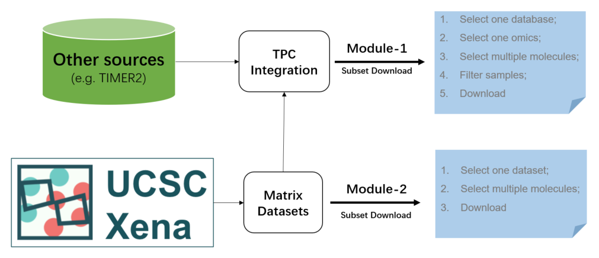

# Download Modules {#download}

Although the full datasets of UCSC Xena can be downloaded in the repository page, it will spend unnecessary time and storage costs if we only want to obtain several molecular data for local analysis.

Therefore, two download modules are designed for the precise acquisition of raw data from TCGA/PCAWG/CCLE analysis (module 1) and UCSC Xena repository datasets (module 2).

- If you want to quickly query and obtain omics values of TPC samples, the module 1 is more suitable. In addition, non-omics annotation data of TPC is also available (e.g. tumor immune infiltration estimation).
- If you want to search one specific UCSC Xena dataset, especially for other hubs (e.g. TCGA GDC), the module 2 is more suitable.

```{r p1401, fig.cap='Two custom download modules',  fig.align='center', echo = FALSE, out.width="100%"}

```


## Download TPC datasets

There are two parts for omics (Left) and non-omics (Right) data, respectively.

### Omics molecular data
Go to Chapter \@ref(intro) if you have little knowledge about the UCSC Xena datasets.

1. Select one database and set the candidate datasets (referring to Chapter \@ref(custom-tpc));
2. Select further samples through the quick or exact filters (referring to Chapter \@ref(sample-filtering));
3. Select one specific molecular type and its multiple identifiers in three ways (referring to Chapter \@ref(multiple-data));
4. Click the "Query" button to fetch the eligible data and display in the right panel;
5. Download the queried data into local CSV or RDA file.

```{r p1402, fig.cap='The steps of TPC omics molecular data fetch',  fig.align='center', echo = FALSE, out.width="100%"}
knitr::include_graphics('images/p1402.png')
```

### Non-omics annotation data

- For each of TPC databases, there are various non-omics annotation data for extensive molecular analysis;
- In the most right panel, users can easily download one specific data via corresponding buttons;

```{r p1403, fig.cap='TPC non-omics annotation data',  fig.align='center', echo = FALSE, out.width="100%"}

```

## Download UCSC Xena datasets
Go to Chapter \@ref(intro) if you have little knowledge about the UCSC Xena datasets.

1. Select one data hub in UCSC Xena;
2. Select one of candidate datasets by limiting the data format type and profile type;
3. Load all available identifiers of the selected dataset. The Primary ID indicates the row names of dataset and the ProbeMap ID is more usable. For instance, among most mRNA dataset, their Primary IDs are usually *Ensembl* names and ProbeMap IDs are *Symbol* names;
4. Select multiple identifiers or directly upload an id file;
5. Click the "Query" button to fetch the eligible data and display in the right panel;
6. Download the queried data into local CSV or RDA file.

```{r p1404, fig.cap='The steps of UCSC Xena dataset fetch',  fig.align='center', echo = FALSE, out.width="100%"}

```
