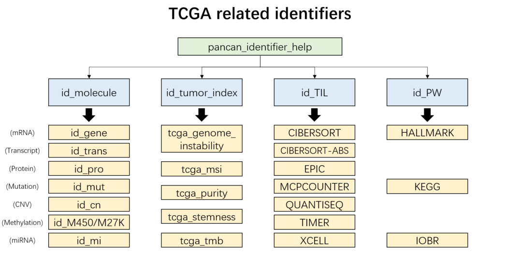
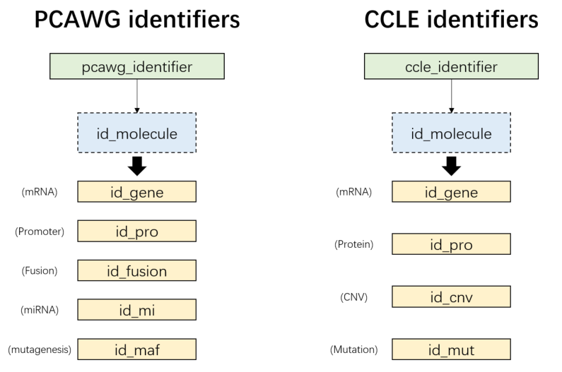
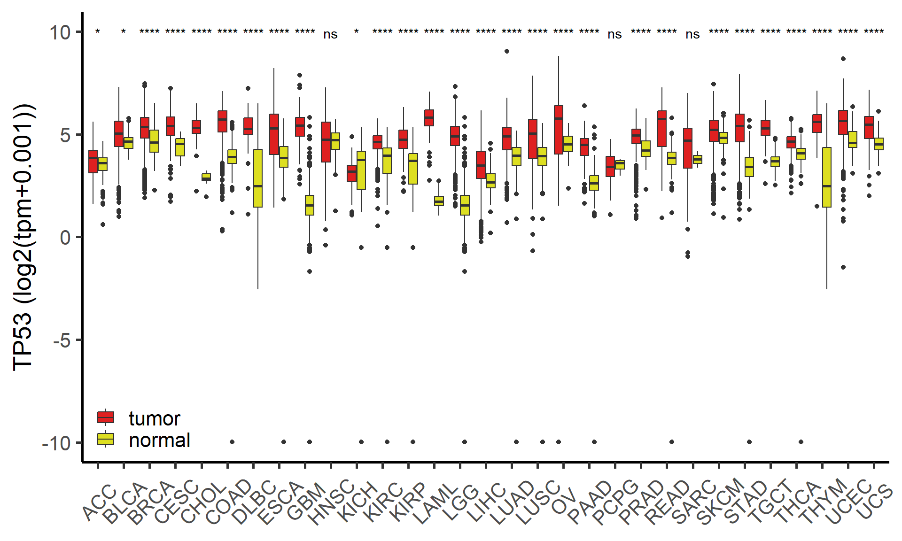
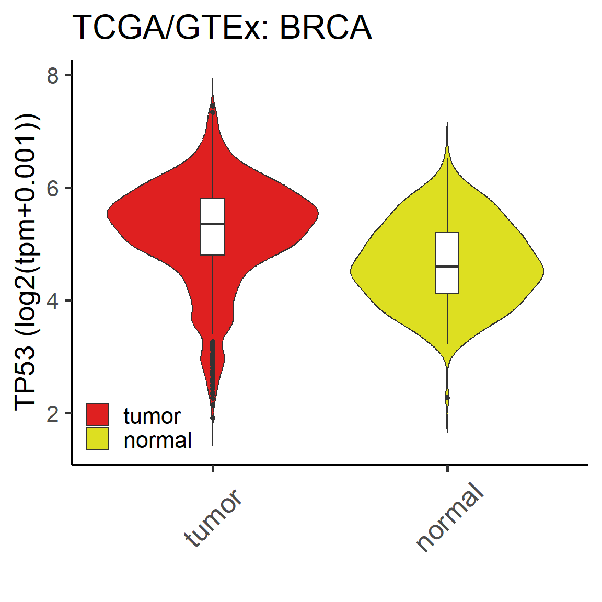
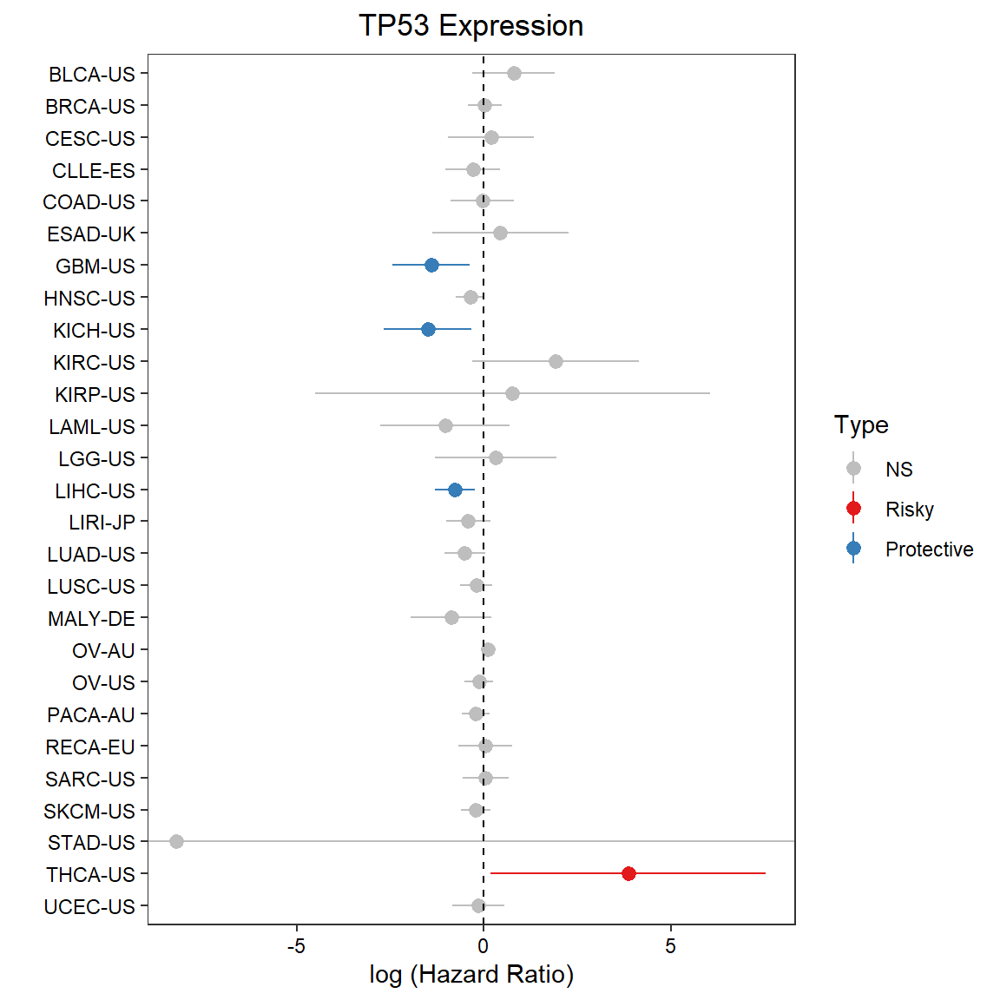
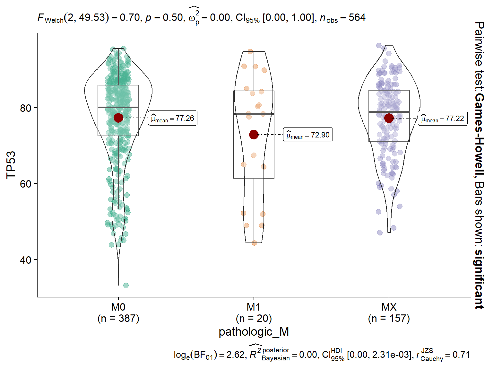
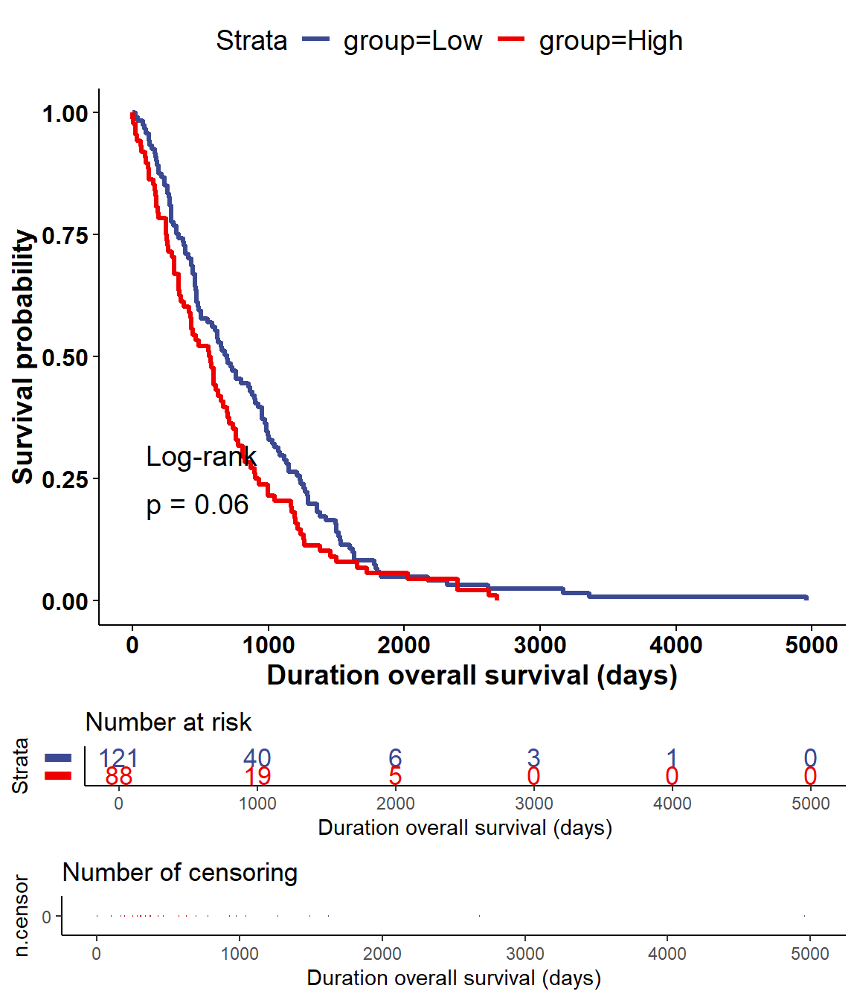

--- 
title: "UCSCXenaShiny v2 Book"
author: "Shixiang Wang, Shensuo Li"
date: "2024-02-22"
site: bookdown::bookdown_site
documentclass: book
bibliography: [book.bib, packages.bib]
# url: your book url like https://bookdown.org/yihui/bookdown
# cover-image: path to the social sharing image like images/cover.jpg
description: |
  This is a minimal example of using the bookdown package to write a book.
  The HTML output format for this example is bookdown::gitbook,
  set in the _output.yml file.
link-citations: yes
github-repo: rstudio/bookdown-demo
---

# About {-}


Here is the summary introduction for UCSCXenaShiny (Maybe the abstract of publication paper)


<!--chapter:end:index.Rmd-->

# Background

## UCSC Xena


## TCGA/PCAWG/CCLE


## Other integrated data

<!--chapter:end:02-background.Rmd-->

# (PART) R package {-}
# Install

How to install and use this package


```r
library(UCSCXenaShiny)
```

<!--chapter:end:03-pkg-1-intro.Rmd-->

# Built-in datasets


<div class="figure" style="text-align: center">

<p class="caption">(\#fig:builtin-datasets)UCSCXenaShiny built-in datasets</p>
</div>

Non-omics supplementary tumor data for extensive analysis.

## TCGA

- `TCGA.organ`: Detailed information of  33 TCGA projects

```r
head(TCGA.organ)
```

```
##   TCGA                              Detail    organ
## 1 BRCA           breast invasive carcinoma   breast
## 2 PRAD             prostate adenocarcinoma prostate
## 3   OV   ovarian serous cystadenocarcinoma    ovary
## 4 PCPG    pheochromocytoma & paraganglioma         
## 5  GBM             glioblastoma multiforme    brain
## 6 HNSC head & neck squamous cell carcinoma
```

- `tcga_gtex`: Merged information of TCGA and GTEx samples

```r
head(tcga_gtex)
```

```
##            sample tissue            type type2
## 1 TCGA-D3-A1QA-07   SKCM SKCM_tumor_TCGA tumor
## 2 TCGA-DE-A4MD-06   THCA THCA_tumor_TCGA tumor
## 3 TCGA-J8-A3O2-06   THCA THCA_tumor_TCGA tumor
## 4 TCGA-J8-A3YH-06   THCA THCA_tumor_TCGA tumor
## 5 TCGA-EM-A2P1-06   THCA THCA_tumor_TCGA tumor
## 6 TCGA-J8-A4HW-06   THCA THCA_tumor_TCGA tumor
```

- `tcga_clinical`: Common phenotypes of TCGA samples
- `tcga_clinical_fine`: Basic phenotypes of TCGA samples

```r
head(tcga_clinical_fine)
```

```
## # A tibble: 6 × 8
##   Sample          Cancer   Age Code  Gender Stage_ajcc Stage_clinical Grade
##   <chr>           <chr>  <dbl> <chr> <chr>  <chr>      <chr>          <chr>
## 1 TCGA-OR-A5J1-01 ACC       58 TP    MALE   Stage II   <NA>           <NA> 
## 2 TCGA-OR-A5J2-01 ACC       44 TP    FEMALE Stage IV   <NA>           <NA> 
## 3 TCGA-OR-A5J3-01 ACC       23 TP    FEMALE Stage III  <NA>           <NA> 
## 4 TCGA-OR-A5J4-01 ACC       23 TP    FEMALE Stage IV   <NA>           <NA> 
## 5 TCGA-OR-A5J5-01 ACC       30 TP    MALE   Stage III  <NA>           <NA> 
## 6 TCGA-OR-A5J6-01 ACC       29 TP    FEMALE Stage II   <NA>           <NA>
```

- `tcga_surv`: Survival data of TCGA samples

```r
head(tcga_surv)
```

```
##            sample OS OS.time DSS DSS.time DFI DFI.time PFI PFI.time
## 1 TCGA-OR-A5J1-01  1    1355   1     1355   1      754   1      754
## 2 TCGA-OR-A5J2-01  1    1677   1     1677  NA       NA   1      289
## 3 TCGA-OR-A5J3-01  0    2091   0     2091   1       53   1       53
## 4 TCGA-OR-A5J5-01  1     365   1      365  NA       NA   1       50
## 5 TCGA-OR-A5J6-01  0    2703   0     2703   0     2703   0     2703
## 6 TCGA-OR-A5J7-01  1     490   1      490  NA       NA   1      162
```

- `tcga_subtypes`: Subtype information of TCGA samples

```r
head(tcga_subtypes)
```

```
##          sampleID Subtype_mRNA Subtype_DNAmeth Subtype_protein Subtype_miRNA
## 1 TCGA-02-0001-01         LGr4            LGm5            <NA>          <NA>
## 2 TCGA-02-0003-01         LGr4            LGm5              K1          <NA>
## 3 TCGA-02-0004-01         LGr4            <NA>              K1          <NA>
## 4 TCGA-02-0006-01         <NA>            LGm5            <NA>          <NA>
## 5 TCGA-02-0007-01 unclassified            LGm4            <NA>          <NA>
## 6 TCGA-02-0009-01         LGr4            LGm4            <NA>          <NA>
##   Subtype_CNA Subtype_Integrative    Subtype_other         Subtype_Selected
## 1        <NA>                <NA> Mesenchymal-like GBM_LGG.Mesenchymal-like
## 2        <NA>                <NA> Mesenchymal-like GBM_LGG.Mesenchymal-like
## 3        <NA>                <NA>             <NA>               GBM_LGG.NA
## 4        <NA>                <NA> Mesenchymal-like GBM_LGG.Mesenchymal-like
## 5        <NA>                <NA>     Classic-like     GBM_LGG.Classic-like
## 6        <NA>                <NA>     Classic-like     GBM_LGG.Classic-like
##   Subtype_Immune_Model_Based
## 1                       <NA>
## 2                       <NA>
## 3                       <NA>
## 4                       <NA>
## 5                       <NA>
## 6                       <NA>
```

- `tcga_purity`: tumor purity related  information of TCGA samples

```r
head(tcga_purity)
```

```
## # A tibble: 6 × 7
##   sample          cancer_type ESTIMATE ABSOLUTE  LUMP   IHC   CPE
##   <chr>           <chr>          <dbl>    <dbl> <dbl> <dbl> <dbl>
## 1 TCGA-OR-A5J1-01 ACC            0.937      NaN 0.977  0.8  0.925
## 2 TCGA-OR-A5J2-01 ACC            0.918      NaN 0.617  0.95 0.898
## 3 TCGA-OR-A5J3-01 ACC            0.967      NaN 0.925  0.8  0.947
## 4 TCGA-OR-A5J4-01 ACC          NaN          NaN 0.920  0.8  0.866
## 5 TCGA-OR-A5J5-01 ACC            0.976      NaN 1      0.8  0.978
## 6 TCGA-OR-A5J6-01 ACC            0.874      NaN 0.744  0.88 0.840
```

- `tcga_genome_instability`: tumor genome instability related  information of TCGA samples

```r
head(tcga_genome_instability)
```

```
##            sample purity ploidy Genome_doublings Cancer_DNA_fraction
## 1 TCGA-OR-A5J1-01   0.90   2.00                0                0.90
## 2 TCGA-OR-A5J2-01   0.89   1.30                0                0.84
## 3 TCGA-OR-A5J3-01   0.93   1.27                0                0.89
## 4 TCGA-OR-A5J4-01   0.87   2.60                1                0.89
## 5 TCGA-OR-A5J5-01   0.93   2.79                1                0.95
## 6 TCGA-OR-A5J6-01   0.69   3.34                1                0.79
##   Subclonal_genome_fraction
## 1                      0.02
## 2                      0.16
## 3                      0.11
## 4                      0.08
## 5                      0.15
## 6                      0.06
```


## PCAWG

- `pcawg_info`: Common phenotypes of TCGA samples
- `pcawg_info_fine`: Basic phenotypes of TCGA samples

```r
head(pcawg_info_fine)
```

```
## # A tibble: 6 × 5
##   Sample   Project   Age Gender Type  
##   <chr>    <chr>   <dbl> <chr>  <chr> 
## 1 SP1003   BLCA-US    53 female tumor 
## 2 SP1007   BLCA-US    53 female normal
## 3 SP10084  BRCA-US    64 female tumor 
## 4 SP1009   BLCA-US    84 male   tumor 
## 5 SP10150  BRCA-US    48 female tumor 
## 6 SP101515 OV-AU      54 female tumor
```
-  `pcawg_purity`:  tumor purity related  information of PCAWG samples


```r
head(pcawg_purity)
```

```
## # A tibble: 6 × 6
##   icgc_specimen_id purity ploidy purity_conf_mad wgd_status wgd_uncertain
##   <chr>             <dbl>  <dbl>           <dbl> <chr>      <lgl>        
## 1 SP101724          0.885   3.36           0.039 wgd        FALSE        
## 2 SP79365           0.774   2.00           0.022 no_wgd     FALSE        
## 3 SP98853           0.8     2.43           0.011 no_wgd     FALSE        
## 4 SP47708           0.837   1.83           0.03  no_wgd     FALSE        
## 5 SP106808          0.92    1.64           0.003 no_wgd     FALSE        
## 6 SP102816          0.596   1.97           0.006 no_wgd     FALSE
```


## CCLE
- `ccle_info`: Common phenotypes of CCLE samples
- `ccle_info_fine`: Basic phenotypes of CCLE samples

```r
head(ccle_info_fine)
```

```
## # A tibble: 6 × 5
##   Sample                        Site_Primary           Gender Histology    Type 
##   <chr>                         <chr>                  <chr>  <chr>        <chr>
## 1 1321N1_CENTRAL_NERVOUS_SYSTEM central_nervous_system "M"    glioma       astr…
## 2 143B_BONE                     bone                   "F"    osteosarcoma oste…
## 3 22RV1_PROSTATE                prostate               "M"    carcinoma    carc…
## 4 2313287_STOMACH               stomach                "M"    carcinoma    aden…
## 5 253JBV_URINARY_TRACT          urinary_tract          "U"    carcinoma    tran…
## 6 253J_URINARY_TRACT            urinary_tract          ""     carcinoma    tran…
```
- `ccle_absolute`: supplementary information of CCLE samples

```r
head(ccle_absolute)
```

```
## # A tibble: 6 × 5
##   `Cell Line`                Lineage   Purity Ploidy `Genome Doublings`
##   <chr>                      <chr>      <dbl>  <dbl>              <dbl>
## 1 SKNSH_AUTONOMIC_GANGLIA    AUTONOMIC   0.99   2.08                  0
## 2 KPNRTBM1_AUTONOMIC_GANGLIA AUTONOMIC   1      1.99                  0
## 3 MHHNB11_AUTONOMIC_GANGLIA  AUTONOMIC   1      2.16                  0
## 4 NH6_AUTONOMIC_GANGLIA      AUTONOMIC   1      2.02                  0
## 5 IMR32_AUTONOMIC_GANGLIA    AUTONOMIC   0.99   2.21                  0
## 6 KPNYN_AUTONOMIC_GANGLIA    AUTONOMIC   1      1.97                  0
```


## Zenodo

Files with large amounts of data are uploaded to Zenodo. They can be loaded via `load_data()` function.

### tumor infiltration estimations

```r
# TCGA samples
dat1 = load_data("tcga_TIL")
# PCAWG samples
dat2 = load_data("pcawg_TIL")

dat1[1:4,1:4]
```

```
## # A tibble: 4 × 4
##   cell_type       `B cell_TIMER` `T cell CD4+_TIMER` `T cell CD8+_TIMER`
##   <chr>                    <dbl>               <dbl>               <dbl>
## 1 TCGA-OR-A5J1-01          0.108               0.117               0.201
## 2 TCGA-OR-A5J2-01          0.114               0.107               0.213
## 3 TCGA-OR-A5J3-01          0.102               0.106               0.203
## 4 TCGA-OR-A5J5-01          0.102               0.111               0.196
```
### ssGSEA pathway activities

```r
# TCGA samples
dat1 = load_data("tcga_PW")
# PCAWG samples
dat2 = load_data("pcawg_PW")

dat1[1:4,1:4]
```

```
##                 IOBR_CD_8_T_effector  IOBR_DDR  IOBR_APM IOBR_Immune_Checkpoint
## TCGA-OR-A5K3-01            0.2172304 0.3805629 0.4639089              0.2421100
## TCGA-OR-A5J2-01            0.2254016 0.3754885 0.4556669              0.2295783
## TCGA-OR-A5LN-01            0.3180517 0.3772690 0.4748932              0.2741952
## TCGA-OR-A5KY-01            0.2024280 0.3891785 0.4398435              0.2200306
```

### other TCGA annotations
- "tcga_stemness": tumor stemness of TCGA samples


```r
head(load_data("tcga_stemness"))
```

```
##            sample     RNAss EREG.EXPss DNAss EREG-METHss DMPss ENHss
## 1 TCGA-02-0047-01 0.2398426  0.5585645    NA          NA    NA    NA
## 2 TCGA-02-0055-01 0.1878304  0.5743873    NA          NA    NA    NA
## 3 TCGA-02-2483-01 0.4087490  0.7067001    NA          NA    NA    NA
## 4 TCGA-02-2485-01 0.3491451  0.5659132    NA          NA    NA    NA
## 5 TCGA-02-2486-01 0.2498411  0.4618031    NA          NA    NA    NA
## 6 TCGA-04-1348-01 0.5741474  0.4998114    NA          NA    NA    NA
```

- "tcga_tmb": tumor mutation burden of TCGA samples


```r
head(load_data("tcga_tmb"))
```

```
##   Cohort   Patient_ID Tumor_Sample_ID Silent_per_Mb Non_silent_per_Mb
## 1    ACC TCGA-OR-A5JR TCGA-OR-A5JR-01    0.05168695        0.05168695
## 2    ACC TCGA-OR-A5JH TCGA-OR-A5JH-01    0.10244018        0.15366028
## 3    ACC TCGA-OR-A5JQ TCGA-OR-A5JQ-01    0.08117102        0.16234204
## 4    ACC TCGA-OR-A5L9 TCGA-OR-A5L9-01    0.05354531        0.16063592
## 5    ACC TCGA-OR-A5LA TCGA-OR-A5LA-01    0.05456403        0.19097410
## 6    ACC TCGA-OR-A5LH TCGA-OR-A5LH-01    0.02618618        0.20948946
```

### identifier repository

Compile available identifiers of data for each of TPC databases.

- "pancan_identifier_help": TCGA samples
<div class="figure" style="text-align: center">

<p class="caption">(\#fig:tcga-ids)TCGA related identifiers</p>
</div>


```r
tcga_ids = load_data("pancan_identifier_help")
names(tcga_ids)
# [1] "id_molecule"    "id_tumor_index" "id_TIL"         "id_PW" 
head(tcga_ids$id_molecule$id_gene)
# the key identifier is ususally under "Level3" column
```

```
##            Level2       Level3           Ensembl chrom chromStart chromEnd
## 1 mRNA Expression      DDX11L1 ENSG00000223972.5  chr1      11869    14409
## 2 mRNA Expression       WASH7P ENSG00000227232.5  chr1      14404    29570
## 3 mRNA Expression    MIR6859-1 ENSG00000278267.1  chr1      17369    17436
## 4 mRNA Expression RP11-34P13.3 ENSG00000243485.3  chr1      29554    31109
## 5 mRNA Expression    MIR1302-2 ENSG00000274890.1  chr1      30366    30503
## 6 mRNA Expression      FAM138A ENSG00000237613.2  chr1      34554    36081
##   strand
## 1      +
## 2      -
## 3      -
## 4      +
## 5      +
## 6      -
```

- "pcawg_identifier": PCAWG samples
- "ccle_identifier": CCLE samples

<div class="figure" style="text-align: center">

<p class="caption">(\#fig:pc-ids)PCAWG/CCLE molecular identifiers</p>
</div>


```r
pcawg_ids = load_data("pcawg_identifier")
names(pcawg_ids)
# [1] "id_gene"   "id_pro"    "id_fusion" "id_mi"     "id_maf" 
head(pcawg_ids$id_pro)
# the key identifier is ususally under "Level3" column
```

```
##              Level2  Level3   gene chrom chromStart  chromEnd strand
## 1 Promoter activity prmtr.1 TSPAN6  chrX   99891803  99891803      -
## 2 Promoter activity prmtr.3   TNMD  chrX   99839799  99839799      +
## 3 Promoter activity prmtr.6   DPM1 chr20   49575087  49575087      -
## 4 Promoter activity prmtr.7  SCYL3  chr1  169858029 169858029      -
## 5 Promoter activity prmtr.8  SCYL3  chr1  169863093 169863093      -
## 6 Promoter activity prmtr.9  SCYL3  chr1  169863408 169863408      -
```

<!--chapter:end:04-pkg-2-data.Rmd-->

# Molecular data query

## TCGA query
- Search molecular identifiers for TCGA samples: Figure \@ref(fig:tcga-ids)


Table: (\#tab:query-tcga-func)Specilized functions to query TCGA molecular data

|Database |Type        |Datasets |Function                       |
|:--------|:-----------|:--------|:------------------------------|
|TCGA     |mRNA        |3        |get_pancan_gene_value()        |
|TCGA     |transcript  |3        |get_pancan_transcript_value()  |
|TCGA     |protein     |1        |get_pancan_protein_value()     |
|TCGA     |mutation    |1        |get_pancan_mutation_status()   |
|TCGA     |cnv         |3        |get_pancan_cn_value()          |
|TCGA     |methylation |2        |get_pancan_methylation_value() |
|TCGA     |miRNA       |1        |get_pancan_miRNA_value()       |

### get_pancan_gene_value()
- `get_pancan_gene_value(identifier, norm = c("tpm", "fpkm", "nc"))`


```r
data.list = get_pancan_gene_value("TP53", norm = "tpm")
data = data.list$expression
head(data.frame(value=data))
```

```
##                         value
## GTEX-S4Q7-0003-SM-3NM8M 4.785
## TCGA-19-1787-01         5.887
## TCGA-S9-A7J2-01         5.517
## GTEX-QV31-1626-SM-2S1QC 4.431
## TCGA-G3-A3CH-11         2.382
## TCGA-B5-A5OE-01         5.765
```

Information of available datasets:

|               Xena Hub               |                        Xena Datasets                         | Sample Size |        Unit        |
| :----------------------------------: | :----------------------------------------------------------: | :---------: | :----------------: |
| [toilHub](https://toil.xenahubs.net) | [TcgaTargetGtex_rsem_gene_tpm](https://xenabrowser.net/datapages/?dataset=TcgaTargetGtex_rsem_gene_tpm&host=https://toil.xenahubs.net) |    19131    |  log2(tpm+0.001)   |
| [toilHub](https://toil.xenahubs.net) | [TcgaTargetGtex_rsem_gene_fpkm](https://xenabrowser.net/datapages/?dataset=TcgaTargetGtex_rsem_gene_fpkm&host=https://toil.xenahubs.net) |    19131    |  log2(fpkm+0.001)  |
| [toilHub](https://toil.xenahubs.net) | [TcgaTargetGtex_RSEM_Hugo_norm_count](https://xenabrowser.net/datapages/?dataset=TcgaTargetGtex_RSEM_Hugo_norm_count&host=https://toil.xenahubs.net) |    19120    | log2(norm_count+1) |


### get_pancan_transcript_value()
- `get_pancan_transcript_value(identifier, norm = c("tpm", "fpkm", "nc"))`


```r
data.list = get_pancan_transcript_value("ENST00000456328", norm = "tpm")
data = data.list$expression
head(data.frame(value=data))
```

```
##                           value
## GTEX-S4Q7-0003-SM-3NM8M  -5.012
## TCGA-19-1787-01          -9.966
## TCGA-S9-A7J2-01          -4.035
## GTEX-QV31-1626-SM-2S1QC  -9.966
## TCGA-G3-A3CH-11          -9.966
## GTEX-13OVI-1026-SM-5L3EM -9.966
```

Information of available datasets:

|               Xena Hub               |                        Xena Datasets                         | Sample Size |       Unit       |
| :----------------------------------: | :----------------------------------------------------------: | :---------: | :--------------: |
| [toilHub](https://toil.xenahubs.net) | [TcgaTargetGtex_rsem_isoform_tpm](https://xenabrowser.net/datapages/?dataset=TcgaTargetGtex_rsem_isoform_tpm&host=https://toil.xenahubs.net) |    19131    | log2(tpm+0.001)  |
| [toilHub](https://toil.xenahubs.net) | [TcgaTargetGtex_RSEM_isoform_fpkm](https://xenabrowser.net/datapages/?dataset=TcgaTargetGtex_RSEM_isoform_fpkm&host=https://toil.xenahubs.net) |    19129    | log2(fpkm+0.001) |
| [toilHub](https://toil.xenahubs.net) | [TcgaTargetGtex_rsem_isopct](https://xenabrowser.net/datapages/?dataset=TcgaTargetGtex_rsem_isopct&host=https://toil.xenahubs.net) |    19131    |      IsoPct      |


### get_pancan_protein_value()
- `get_pancan_protein_value(identifier)`


```r
data.list = get_pancan_protein_value("ACC_pS79")
data = data.list$expression
head(data.frame(value=data))
```

```
##                   value
## TCGA-FI-A2EY-01  2.2170
## TCGA-DF-A2KS-01  0.4139
## TCGA-A5-A1OH-01  0.0000
## TCGA-AX-A2H7-01  0.3248
## TCGA-AX-A2HA-01 -1.2410
## TCGA-A5-A2K4-01 -0.2814
```

Information of available datasets:

|                      Xena Hub                      |                        Xena Datasets                         | Sample Size |    Unit    |
| :------------------------------------------------: | :----------------------------------------------------------: | :---------: | :--------: |
| [pancanAtlasHub](https://pancanatlas.xenahubs.net) | [TCGA-RPPA-pancan-clean.xena](https://xenabrowser.net/datapages/?dataset=TCGA-RPPA-pancan-clean.xena&host=https://pancanatlas.xenahubs.net) |    7744     | norm_value |

### get_pancan_mutation_status()
- `get_pancan_mutation_status(identifier)`


```r
data = get_pancan_mutation_status("TP53")
head(data.frame(value=data))
```

```
##                 value
## TCGA-02-0003-01     1
## TCGA-02-0033-01     1
## TCGA-02-0047-01     0
## TCGA-02-0055-01     1
## TCGA-02-2470-01     0
## TCGA-02-2483-01     1
```
Information of available datasets:

|                      Xena Hub                      |                        Xena Datasets                         | Sample Size | Unit |
| :------------------------------------------------: | :----------------------------------------------------------: | :---------: | :--: |
| [pancanAtlasHub](https://pancanatlas.xenahubs.net) | [mc3.v0.2.8.PUBLIC.nonsilentGene.xena](https://xenabrowser.net/datapages/?dataset=mc3.v0.2.8.PUBLIC.nonsilentGene.xena&host=https://pancanatlas.xenahubs.net) |    9104     |  NA  |

### get_pancan_cn_value()
- `get_pancan_cn_value(identifier, gistic2 = TRUE, use_thresholded_data = FALSE)`


```r
data.list = get_pancan_cn_value("TP53")
data = data.list$data
head(data.frame(value=data))
```

```
##                  value
## TCGA-A5-A0GI-01  0.014
## TCGA-S9-A7J2-01  0.068
## TCGA-06-0150-01  0.015
## TCGA-AR-A1AH-01 -0.761
## TCGA-EK-A2RE-01 -0.024
## TCGA-44-6778-01 -0.317
```
Information of available datasets:

|                      Xena Hub                      |                        Xena Datasets                         | Sample Size |                             Unit                             |
| :------------------------------------------------: | :----------------------------------------------------------: | :---------: | :----------------------------------------------------------: |
|        [tcgaHub](https://tcga.xenahubs.net)        | [..._Gistic2_all_data_by_genes](https://xenabrowser.net/datapages/?dataset=TCGA.PANCAN.sampleMap/Gistic2_CopyNumber_Gistic2_all_data_by_genes&host=https://tcga.xenahubs.net) |    10845    |                     Gistic2 copy number                      |
|        [tcgaHub](https://tcga.xenahubs.net)        | [..._Gistic2_all_thresholded.by_genes](https://xenabrowser.net/datapages/?dataset=TCGA.PANCAN.sampleMap/Gistic2_CopyNumber_Gistic2_all_thresholded.by_genes&host=https://tcga.xenahubs.net) |    10845    | -2,-1,0,1,2: 2 copy  del,1 copy del,no change,amplification,high-amplification |
| [pancanAtlasHub](https://pancanatlas.xenahubs.net) | [..._SNP_6_whitelisted.gene.xena](https://xenabrowser.net/datapages/?dataset=broad.mit.edu_PANCAN_Genome_Wide_SNP_6_whitelisted.gene.xena&host=https://pancanatlas.xenahubs.net) |    10873    |                      log(tumor/normal)                       |

### get_pancan_methylation_value()

```r
get_pancan_methylation_value(
  identifier,
  type = c("450K", "27K"),
  rule_out = NULL,
  aggr = c("NA", "mean", "Q0", "Q25", "Q50", "Q75", "Q100")
)
```


```r
data.list = get_pancan_methylation_value("TP53")
data = data.list$data
head(data.frame(value=data))
```

```
##                   value
## TCGA-S6-A8JX-01 0.07085
## TCGA-SO-A8JP-01 0.08410
## TCGA-YU-A90Q-01 0.08465
## TCGA-2G-AAH8-01 0.09373
## TCGA-2G-AAGY-05 0.09546
## TCGA-XE-AAOL-01 0.09774
```

Information of available datasets:

|              Xena Hub              |                        Xena Datasets                         | Sample Size |    Unit    |
| :--------------------------------: | :----------------------------------------------------------: | :---------: | :--------: |
| [gdcHub](https://gdc.xenahubs.net) | [GDC-PANCAN.methylation450.tsv](https://xenabrowser.net/datapages/?dataset=GDC-PANCAN.methylation450.tsv&host=https://gdc.xenahubs.net) |    9736     | beta value |
| [gdcHub](https://gdc.xenahubs.net) | [GDC-PANCAN.methylation27.tsv](https://xenabrowser.net/datapages/?dataset=GDC-PANCAN.methylation27.tsv&host=https://gdc.xenahubs.net) |    2595     | beta value |


### get_pancan_miRNA_value()
- `get_pancan_miRNA_value(identifier, gistic2 = TRUE, use_thresholded_data = FALSE)`


```r
data.list = get_pancan_miRNA_value("hsa-let-7a-2-3p")
data = data.list$expression
head(data.frame(value=data))
```

```
##                 value
## TCGA-C4-A0F6-01  0.99
## TCGA-CU-A0YO-01  1.91
## TCGA-BT-A0S7-01  3.02
## TCGA-CU-A0YR-01  0.85
## TCGA-BL-A0C8-01  0.85
## TCGA-C4-A0F0-01  2.70
```
Information of available datasets:

|                      Xena Hub                      |                        Xena Datasets                         | Sample Size |        Unit        |
| :------------------------------------------------: | :----------------------------------------------------------: | :---------: | :----------------: |
| [pancanAtlasHub](https://pancanatlas.xenahubs.net) | [pancanMiRs_EBadjOnProtocolPlatformWithoutRepsWithUnCorrectMiRs_08_04_16.xena](https://xenabrowser.net/datapages/?dataset=pancanMiRs_EBadjOnProtocolPlatformWithoutRepsWithUnCorrectMiRs_08_04_16.xena&host=https://pancanatlas.xenahubs.net) |    10818    | log2(norm_value+1) |


## PCAWG query
- Search molecular identifiers for TCGA samples: Figure \@ref(fig:pc-ids)


Table: (\#tab:query-pcawg-func)Specilized functions to query PCAWG molecular data

|Database |Type     |Datasets |Function                             |
|:--------|:--------|:--------|:------------------------------------|
|PCAWG    |mRNA     |1        |get_pcawg_gene_value()               |
|PCAWG    |fusion   |1        |get_pcawg_fusion_value()             |
|PCAWG    |miRNA    |2        |get_pcawg_miRNA_value()              |
|PCAWG    |promoter |3        |get_pcawg_promoter_value()           |
|PCAWG    |APOBEC   |1        |get_pcawg_APOBEC_mutagenesis_value() |
### get_pcawg_gene_value()
- `get_pcawg_gene_value(identifier)`


```r
data.list = get_pcawg_gene_value("TP53")
data = data.list$data
head(data.frame(value=data))
```

```
##          value
## SP89389  1.798
## SP21193  6.542
## SP13206  4.690
## SP103623 4.143
## SP47089  4.846
## SP32742  5.010
```
Information of available datasets:

|                Xena Hub                |                        Xena Datasets                         | Sample Size |        Unit         |
| :------------------------------------: | :----------------------------------------------------------: | :---------: | :-----------------: |
| [pcawgHub](https://pcawg.xenahubs.net) | [tophat_star_fpkm_uq.v2_aliquot_gl.sp.log](https://xenabrowser.net/datapages/?dataset=tophat_star_fpkm_uq.v2_aliquot_gl.sp.log&host=https://pcawg.xenahubs.net) |    1521     | log2(fpkm-uq+0.001) |

### get_pcawg_fusion_value()
- `get_pcawg_fusion_value(identifier)`


```r
data.list = get_pcawg_fusion_value("SAMD11")
data = data.list$data
head(data.frame(value=data))
```

```
##         value
## SP23639     0
## SP23769     0
## SP23925     0
## SP24129     0
## SP24236     0
## SP24565     0
```
Information of available datasets:

|                Xena Hub                |                        Xena Datasets                         | Sample Size |                    Unit                    |
| :------------------------------------: | :----------------------------------------------------------: | :---------: | :----------------------------------------: |
| [pcawgHub](https://pcawg.xenahubs.net) | [pcawg3_fusions_PKU_EBI.gene_centric.sp.xena](https://xenabrowser.net/datapages/?dataset=pcawg3_fusions_PKU_EBI.gene_centric.sp.xena&host=https://pcawg.xenahubs.net) |    1359     | binary fusion call, 1  fusion, 0 otherwise |


### get_pcawg_miRNA_value()
- `get_pcawg_miRNA_value(identifier, norm = c("TMM", "UQ"))`


```r
data.list = get_pcawg_miRNA_value("hsa-let-7a-2-3p")
data = data.list$data
head(data.frame(value=data))
```

```
##          value
## SP1029   2.894
## SP1588   2.286
## SP119599 2.484
## SP1437   1.801
## SP1347   1.529
## SP106899 1.788
```
Information of available datasets:

|                Xena Hub                |                        Xena Datasets                         | Sample Size |       Unit        |
| :------------------------------------: | :----------------------------------------------------------: | :---------: | :---------------: |
| [pcawgHub](https://pcawg.xenahubs.net) | [x3t2m1.mature.TMM.mirna.matrix.log](https://xenabrowser.net/datapages/?dataset=x3t2m1.mature.TMM.mirna.matrix.log&host=https://pcawg.xenahubs.net) |    1524     | log2(cpm-TMM+0.1) |
| [pcawgHub](https://pcawg.xenahubs.net) | [x3t2m1.mature.UQ.mirna.matrix.log](https://xenabrowser.net/datapages/?dataset=x3t2m1.mature.UQ.mirna.matrix.log&host=https://pcawg.xenahubs.net) |    1524     | log2(cpm-uq+0.1)  |

### get_pcawg_promoter_value()
- `get_pcawg_promoter_value(identifier, type = c("raw", "relative", "outlier"))`


```r
data.list = get_pcawg_promoter_value("prmtr.1")
data = data.list$data
head(data.frame(value=data))
```

```
##          value
## SP23639  34.51
## SP23769  35.16
## SP23925  24.63
## SP24129  44.71
## SP24236 172.40
## SP24565  15.51
```
Information of available datasets:

|                Xena Hub                |                        Xena Datasets                         | Sample Size |                             Unit                             |
| :------------------------------------: | :----------------------------------------------------------: | :---------: | :----------------------------------------------------------: |
| [pcawgHub](https://pcawg.xenahubs.net) | [rawPromoterActivity.sp](https://xenabrowser.net/datapages/?dataset=rawPromoterActivity.sp&host=https://pcawg.xenahubs.net) |    1359     |                    raw promoter activity                     |
| [pcawgHub](https://pcawg.xenahubs.net) | [promoterCentricTable_0.2_1.0.sp](https://xenabrowser.net/datapages/?dataset=promoterCentricTable_0.2_1.0.sp&host=https://pcawg.xenahubs.net) |    1359     |    -1 (low expression),  0 (normal), 1 (high expression)     |
| [pcawgHub](https://pcawg.xenahubs.net) | [relativePromoterActivity.sp](https://xenabrowser.net/datapages/?dataset=relativePromoterActivity.sp&host=https://pcawg.xenahubs.net) |    1359     | portion of  transcription activity of the gene driven by the promoter |

### get_pcawg_APOBEC_mutagenesis_value()
- `get_pcawg_APOBEC_mutagenesis_value(identifier)`


```r
data.list = get_pcawg_APOBEC_mutagenesis_value("A3A_or_A3B")
data = data.list$data
head(data.frame(value=data))
```

```
##          value
## SP117425     0
## SP117332     0
## SP117655     1
## SP99293      1
## SP99329      1
## SP99309      1
```
Information of available datasets:

|                Xena Hub                |                        Xena Datasets                         | Sample Size | Unit |
| :------------------------------------: | :----------------------------------------------------------: | :---------: | :--: |
| [pcawgHub](https://pcawg.xenahubs.net) | [MAF_Aug31_2016_sorted_A3A_A3B_comparePlus.sp](https://xenabrowser.net/datapages/?dataset=MAF_Aug31_2016_sorted_A3A_A3B_comparePlus.sp&host=https://pcawg.xenahubs.net) |    2072     |  NA  |


## CCLE query
- Search molecular identifiers for TCGA samples: Figure \@ref(fig:pc-ids)


Table: (\#tab:query-ccle-func)Specilized functions to query CCLE molecular data

|Database |Type     |Datasets |Function                   |
|:--------|:--------|:--------|:--------------------------|
|CCLE     |mRNA     |2        |get_ccle_gene_value()      |
|CCLE     |protein  |1        |get_ccle_protein_value()   |
|CCLE     |mutation |1        |get_ccle_mutation_status() |
|CCLE     |cnv      |1        |get_ccle_cn_value()        |
### get_ccle_gene_value()
- `get_ccle_gene_value(identifier, norm = c("rpkm", "nc"))`


```r
data.list = get_ccle_gene_value("TP53", norm = "rpkm")
data = data.list$expression
head(data.frame(value=data))
```

```
##                                value
## 22RV1_PROSTATE                 7.537
## 2313287_STOMACH               45.590
## 253JBV_URINARY_TRACT          28.510
## 253J_URINARY_TRACT            28.040
## 42MGBA_CENTRAL_NERVOUS_SYSTEM 13.920
## 5637_URINARY_TRACT            33.350
```
Information of available datasets:

|                   Xena Hub                   |                        Xena Datasets                         | Sample Size |     Unit      |
| :------------------------------------------: | :----------------------------------------------------------: | :---------: | :-----------: |
| [publicHub](https://ucscpublic.xenahubs.net) | [ccle/CCLE_DepMap_18Q2_RNAseq_RPKM_20180502](https://xenabrowser.net/datapages/?dataset=ccle/CCLE_DepMap_18Q2_RNAseq_RPKM_20180502&host=https://ucscpublic.xenahubs.net) |    1076     |     RPKM      |
| [publicHub](https://ucscpublic.xenahubs.net) | [ccle/CCLE_DepMap_18Q2_RNAseq_reads_20180502.log2](https://xenabrowser.net/datapages/?dataset=ccle/CCLE_DepMap_18Q2_RNAseq_reads_20180502.log2&host=https://ucscpublic.xenahubs.net) |    1076     | log2(count+1) |

### get_ccle_gene_value()
- `get_ccle_protein_value(identifier)`


```r
data.list = get_ccle_protein_value("14-3-3_beta")
data = data.list$expression
head(data.frame(value=data))
```

```
##                                             value
## DMS53_LUNG                               -0.10490
## SW1116_LARGE_INTESTINE                    0.35850
## NCIH1694_LUNG                             0.02874
## P3HR1_HAEMATOPOIETIC_AND_LYMPHOID_TISSUE  0.12000
## HUT78_HAEMATOPOIETIC_AND_LYMPHOID_TISSUE -0.26900
## UMUC3_URINARY_TRACT                      -0.17120
```
Information of available datasets:

|                   Xena Hub                   |                        Xena Datasets                         | Sample Size | Unit |
| :------------------------------------------: | :----------------------------------------------------------: | :---------: | :--: |
| [publicHub](https://ucscpublic.xenahubs.net) | [ccle/CCLE_RPPA_20180123](https://xenabrowser.net/datapages/?dataset=ccle/CCLE_RPPA_20180123&host=https://ucscpublic.xenahubs.net) |     899     |  NA  |

### get_ccle_mutation_status()
- `get_ccle_mutation_status(identifier)`


```r
data = get_ccle_mutation_status("TP53")
data = data[data$genes=="TP53",c("sampleID", "genes")]
head(na.omit(data))
```

```
## # A tibble: 6 × 2
##   sampleID                                 genes
##   <chr>                                    <chr>
## 1 22RV1_PROSTATE                           TP53 
## 2 22RV1_PROSTATE                           TP53 
## 3 A253_SALIVARY_GLAND                      TP53 
## 4 A431_SKIN                                TP53 
## 5 A4FUK_HAEMATOPOIETIC_AND_LYMPHOID_TISSUE TP53 
## 6 A673_BONE                                TP53
```
Information of available datasets:

|                   Xena Hub                   |                        Xena Datasets                         | Sample Size | Unit |
| :------------------------------------------: | :----------------------------------------------------------: | :---------: | :--: |
| [publicHub](https://ucscpublic.xenahubs.net) | [ccle/CCLE_DepMap_18Q2_maf_20180502](https://xenabrowser.net/datapages/?dataset=ccle/CCLE_DepMap_18Q2_maf_20180502&host=https://ucscpublic.xenahubs.net) |    1549     |  NA  |

### get_ccle_cn_value()
- `get_ccle_cn_value(identifier)`


```r
data.list = get_ccle_cn_value("TP53")
data = data.list$data
head(data.frame(value=data))
```

```
##                                               value
## LOUNH91_LUNG                                -0.0709
## T98G_CENTRAL_NERVOUS_SYSTEM                  0.2473
## IPC298_SKIN                                 -0.7917
## RPMI8226_HAEMATOPOIETIC_AND_LYMPHOID_TISSUE -0.5341
## MIAPACA2_PANCREAS                            0.1259
## HS695T_SKIN                                  0.2196
```
Information of available datasets:

|                   Xena Hub                   |                        Xena Datasets                         | Sample Size |        Unit        |
| :------------------------------------------: | :----------------------------------------------------------: | :---------: | :----------------: |
| [publicHub](https://ucscpublic.xenahubs.net) | [ccle/CCLE_copynumber_byGene_2013-12-03](https://xenabrowser.net/datapages/?dataset=ccle/CCLE_copynumber_byGene_2013-12-03&host=https://ucscpublic.xenahubs.net) |    1043     | log(copy number/2) |

## General query

### query_pancan_value()
General TPC query

```r
query_pancan_value(
  molecule,
  data_type = c("mRNA", "transcript", "protein", "mutation", "cnv", "methylation",
    "miRNA", "fusion", "promoter", "APOBEC"),
  database = c("toil", "ccle", "pcawg"),
  reset_id = NULL,
  opt_pancan = .opt_pancan
)
```


```r
.opt_pancan
```

```
## $toil_mRNA
## $toil_mRNA$norm
## [1] "tpm"
## 
## 
## $toil_transcript
## list()
## 
## $toil_protein
## list()
## 
## $toil_mutation
## list()
## 
## $toil_cnv
## $toil_cnv$gistic2
## [1] TRUE
## 
## $toil_cnv$use_thresholded_data
## [1] FALSE
## 
## 
## $toil_methylation
## $toil_methylation$type
## [1] "450K"
## 
## $toil_methylation$rule_out
## NULL
## 
## $toil_methylation$aggr
## [1] "NA"
## 
## 
## $toil_miRNA
## list()
## 
## $pcawg_mRNA
## list()
## 
## $pcawg_fusion
## list()
## 
## $pcawg_miRNA
## $pcawg_miRNA$norm
## [1] "TMM"
## 
## 
## $pcawg_promoter
## $pcawg_promoter$type
## [1] "relative"
## 
## 
## $pcawg_APOBEC
## list()
## 
## $ccle_mRNA
## $ccle_mRNA$norm
## [1] "rpkm"
## 
## 
## $ccle_protein
## list()
## 
## $ccle_mutation
## list()
## 
## $ccle_cnv
## list()
```

- Single molecule query with modified opt_pancan

```r
opt_pancan = .opt_pancan
opt_pancan$toil_mRNA$norm = "nc"
data.list = query_pancan_value(
  molecule = "TP53",
  data_type = "mRNA",
  database = "toil",
  opt_pancan = opt_pancan
)
data = data.list$expression
head(data.frame(value=data))
```

```
##                           value
## GTEX-S4Q7-0003-SM-3NM8M  11.130
## TCGA-S9-A7J2-01          11.350
## GTEX-QV31-1626-SM-2S1QC  10.160
## TCGA-G3-A3CH-11           9.632
## GTEX-13OVI-1026-SM-5L3EM  9.761
## GTEX-13OW5-0626-SM-5J2N2  9.609
```

- Molecular signature query

```r
# a space must exist in the signature string
signature <- "TP53 + 2*KRAS - 1.3*PTEN" 
data.list = query_pancan_value(
  molecule = signature,
  data_type = "mRNA",
  database = "toil",
  opt_pancan = opt_pancan
)
data = data.list$value
head(data.frame(value=data))
```

```
##                           value
## GTEX-S4Q7-0003-SM-3NM8M  15.756
## TCGA-S9-A7J2-01          18.465
## GTEX-QV31-1626-SM-2S1QC  15.402
## TCGA-G3-A3CH-11          13.944
## GTEX-13OVI-1026-SM-5L3EM 13.439
## GTEX-13OW5-0626-SM-5J2N2 13.699
```


### query_molecule_value()
General UCSCXena Matrix dataset

- Genomic matrix repository

```r
data_meta = UCSCXenaTools::XenaData
data_meta_gm = subset(data_meta, Type=="genomicMatrix")
# see the 'XenaDatasets' column
head(data_meta_gm[,c("XenaHostNames","XenaCohorts","XenaDatasets","DataSubtype")])
```

```
## # A tibble: 6 × 4
##   XenaHostNames XenaCohorts                            XenaDatasets  DataSubtype
##   <chr>         <chr>                                  <chr>         <chr>      
## 1 publicHub     Breast Cancer Cell Lines (Neve 2006)   ucsfNeve_pub… gene expre…
## 2 publicHub     Glioma (Kotliarov 2006)                kotliarov200… copy number
## 3 publicHub     Lung Cancer CGH (Weir 2007)            weir2007_pub… copy number
## 4 publicHub     Cancer Cell Line Encyclopedia (Breast) ccle/CCLE_co… copy number
## 5 publicHub     Breast Cancer (Chin 2006)              chin2006_pub… gene expre…
## 6 publicHub     Breast Cancer (Chin 2006)              chin2006_pub… copy number
```

- `query_molecule_value(dataset, molecule)`

```r
dataset <- "TCGA-BRCA.htseq_fpkm.tsv"
data <- query_molecule_value(dataset, "TP53") # also support signature 
head(data.frame(value=data))
```

```
##                  value
## TCGA-E9-A1NI-01A 4.854
## TCGA-A1-A0SP-01A 2.554
## TCGA-BH-A1EU-11A 4.515
## TCGA-A8-A06X-01A 3.844
## TCGA-E2-A14T-01A 4.255
## TCGA-AC-A8OS-01A 3.655
```


<!--chapter:end:05-pkg-3-query.Rmd-->

# Molecular data analysis

1. For each function, we introduce its basic use and example output. Users can check all analysis or visualization parameters available by clicking the corresponding title link.

2. Among most functions, their first parameter is molecular identifier of one data type. Users can also design a molecular signature comprised of multiple molecules (e.g. `TP53 + 2 * KRAS - 1.3 * PTEN`).

3. During TPC related analysis, users can modified alternative datasets for one molecular type through the `opt_pancan` parameter. (see more via `str(.opt_pancan)`)


## TCGA analysis

Table: (\#tab:analyze-tcga-func)Specilized functions to analyze TCGA molecular data

|Database |Type                |Function                |
|:--------|:-------------------|:-----------------------|
|TCGA     |Comparison          |vis_toil_TvsN()         |
|TCGA     |Comparison          |vis_toil_TvsN_cancer()  |
|TCGA     |Comparison          |vis_toil_Mut()          |
|TCGA     |Comparison          |vis_toil_Mut_cancer()   |
|TCGA     |Correlation         |vis_gene_cor()          |
|TCGA     |Correlation         |vis_gene_cor_cancer()   |
|TCGA     |Correlation         |vis_gene_TIL_cor()      |
|TCGA     |Correlation         |vis_gene_immune_cor()   |
|TCGA     |Correlation         |vis_gene_tmb_cor()      |
|TCGA     |Correlation         |vis_gene_msi_cor()      |
|TCGA     |Correlation         |vis_gene_stemness_cor() |
|TCGA     |Correlation         |vis_gene_pw_cor()       |
|TCGA     |Survival            |tcga_surv_plot()        |
|TCGA     |Survival            |vis_unicox_tree()       |
|TCGA     |Dimension Reduction |vis_dim_dist()          |

### Comparison analysis

#### [vis_toil_TvsN()](https://openbiox.github.io/UCSCXenaShiny/reference/vis_toil_TvsN.html)
Compare molecular value between tumor and normal samples across pan-cancer.

- Basic use: `vis_toil_TvsN(Gene=, data_type=)`


```r
vis_toil_TvsN(Gene="TP53", data_type = "mRNA")
```

<div class="figure" style="text-align: center">

<p class="caption">(\#fig:vis-toil-TvsN)The difference of mRNA TP53 across pan-cancer</p>
</div>
> **Tips**: For parameter `data_type`, one of 4 molelcuar types c("mRNA", "transcript", "methylation", "miRNA") are supported.

#### [vis_toil_TvsN_cancer()](https://openbiox.github.io/UCSCXenaShiny/reference/vis_toil_TvsN_cancer.html)
Compare molecular value between tumor and normal samples in one cancer.

- Basic use: `vis_toil_TvsN_cancer(Gene=, data_type=, Cancer=)`


```r
vis_toil_TvsN_cancer(Gene="TP53", data_type = "mRNA", Cancer = "BRCA")
```

<div class="figure" style="text-align: center">

<p class="caption">(\#fig:vis-toil-TvsN-cancer)The difference of mRNA TP53 in ACC cancer</p>
</div>
> **Tips**: For parameter `data_type`, all molelcuar types supported in function `query_pancan_value()` are applicable.


#### [vis_toil_Mut()](https://openbiox.github.io/UCSCXenaShiny/reference/vis_toil_Mut.html)
Compare molecular value between mutation and wild tumor samples across pan-cancer.

- Basic use: `vis_toil_Mut(mut_Gene=, Gene=, data_type=)`


```r
vis_toil_Mut(mut_Gene = "TP53", Gene = "TNF", data_type = "mRNA")
```

<div class="figure" style="text-align: center">

<p class="caption">(\#fig:vis-toil-Mut)The difference of mRNA TNF between TP53-mut and TP53-wild tumor samples across pan-cancer</p>
</div>
> **Tips**: For parameter `data_type`, one of 4 molelcuar types c("mRNA", "transcript", "methylation", "miRNA") are supported.

#### [vis_toil_Mut_cancer()](https://openbiox.github.io/UCSCXenaShiny/reference/vis_toil_Mut_cancer.html)
Compare molecular value between mutation and wild tumor samples in one cancer.

- Basic use: `vis_toil_Mut_cancer(Gene=, data_type=, Cancer=)`


```r
vis_toil_Mut_cancer(mut_Gene = "TP53", Gene = "TNF", data_type = "mRNA", Cancer = "BRCA")
```

<div class="figure" style="text-align: center">

<p class="caption">(\#fig:vis-toil-Mut-cancer)The difference of mRNA TNF between TP53-mut and TP53-wild tumor samples in BRCA cancer</p>
</div>
> **Tips**: For parameter `data_type`, all molelcuar types supported in function `query_pancan_value()` are applicable.


### Correlation analysis
#### [vis_gene_cor()](https://openbiox.github.io/UCSCXenaShiny/reference/vis_gene_cor.html)
Calculate the correlation between two molecules value in tumor samples of pan-cancers.

- Basic use: `vis_gene_cor(Gene1=, data_type1=, Gene2=, data_type2=)`


```r
vis_gene_cor(Gene1 = "CSF1R", data_type1 = "mRNA", Gene2 = "JAK3", data_type2 = "mRNA")
```

<div class="figure" style="text-align: center">

<p class="caption">(\#fig:vis-gene-cor)The correlation between mRNA CSF1R and mRNA JAK3 in tumor samples of pan-cancers</p>
</div>

#### [vis_gene_cor_cancer()](https://openbiox.github.io/UCSCXenaShiny/reference/vis_gene_cor_cancer.html)
Calculate the correlation between two molecules value in tumor samples of one cancer.

- Basic use: `vis_gene_cor_cancer(Gene1=, data_type1=, Gene2=, data_type2=, cancer_choose=)`


```r
vis_gene_cor_cancer(Gene1 = "CSF1R", data_type1 = "mRNA", 
                    Gene2 = "JAK3", data_type2 = "mRNA", 
                    cancer_choose = "ACC")
```

<div class="figure" style="text-align: center">

<p class="caption">(\#fig:vis-gene-cor-cancer)The correlation between mRNA CSF1R and mRNA JAK3 in tumor samples of ACC cancer</p>
</div>


#### [vis_gene_TIL_cor()](https://openbiox.github.io/UCSCXenaShiny/reference/vis_gene_TIL_cor.html)
Calculate the correlation between one molecule and one type of TIL in tumor samples across pan-cancers.

- Basic use: `vis_gene_TIL_cor(Gene= ,data_type= ,sig=)`


```r
tcga_ids = load_data("pancan_identifier_help")
names(tcga_ids$id_TIL)
```

```
## [1] "CIBERSORT"     "CIBERSORT-ABS" "EPIC"          "MCPCOUNTER"   
## [5] "QUANTISEQ"     "TIMER"         "XCELL"
```


```r
sig = paste(tcga_ids$id_TIL$TIMER$Level3,
            tcga_ids$id_TIL$TIMER$Level2, sep = "_")
vis_gene_TIL_cor(Gene = "TP53", data_type = "mRNA",
                 sig = sig)
```

<div class="figure" style="text-align: center">

<p class="caption">(\#fig:vis-gene-TIL-cor)The correlation between mRNA TP53 and TIMER TIL in tumor samples across pan-cancers</p>
</div>


#### [vis_gene_immune_cor()](https://openbiox.github.io/UCSCXenaShiny/reference/vis_gene_immune_cor.html)
Calculate the correlation between one molecule and one type of Immune signature in tumor samples across pan-cancers.

- Basic use: `vis_gene_immune_cor(Gene= ,data_type= ,sig=)`


```r
tcga_pan_immune_signature <- load_data("tcga_pan_immune_signature")
```

```
## Loading data from remote: https://zenodo.org/record/10554197/files/tcga_pan_immune_signature.rda, please wait...
```

```
## Data has been saved to C:/Users/xiaoxin/AppData/Local/R/win-library/4.2/UCSCXenaShiny/extdata/tcga_pan_immune_signature.rda
```

```r
table(tcga_pan_immune_signature$Source)
```

```
## 
## Attractors     Bindea    c7atoms  Cibersort        ICR       Wolf      Yasin 
##          9         25         32         20          3         68          3
```


```r
vis_gene_immune_cor(Gene = "TP53", data_type = "mRNA",
                    Immune_sig_type = "Cibersort")
```

<div class="figure" style="text-align: center">

<p class="caption">(\#fig:vis-gene-immune-cor)The correlation between mRNA TP53 and Cibersort signature in tumor samples across pan-cancers</p>
</div>


#### [vis_gene_tmb_cor()](https://openbiox.github.io/UCSCXenaShiny/reference/vis_gene_tmb_cor.html)
Calculate the correlation between one molecule and TMB score in tumor samples across pan-cancers.

- Basic use: `vis_gene_tmb_cor(Gene= , data_type= )`


```r
vis_gene_tmb_cor(Gene = "TP53", data_type = "mRNA")
```

<div class="figure" style="text-align: center">

<p class="caption">(\#fig:vis-gene-tmb-cor)The correlation between mRNA TP53 and TMB score in tumor samples across pan-cancers</p>
</div>

#### [vis_gene_msi_cor()](https://openbiox.github.io/UCSCXenaShiny/reference/vis_gene_msi_cor.html)
Calculate the correlation between one molecule and MSI score in tumor samples across pan-cancers.

- Basic use: `vis_gene_msi_cor(Gene= , data_type= )`


```r
vis_gene_msi_cor(Gene = "TP53", data_type = "mRNA")
```

<div class="figure" style="text-align: center">

<p class="caption">(\#fig:vis-gene-msi-cor)The correlation between mRNA TP53 and MSI score in tumor samples across pan-cancers</p>
</div>


#### [vis_gene_stemness_cor()](https://openbiox.github.io/UCSCXenaShiny/reference/vis_gene_stemness_cor.html)
Calculate the correlation between one molecule and stemness score in tumor samples across pan-cancers.

- Basic use: `vis_gene_stemness_cor(Gene= , data_type= )`


```r
vis_gene_stemness_cor(Gene = "TP53", data_type = "mRNA")
```

<div class="figure" style="text-align: center">

<p class="caption">(\#fig:vis-gene-stemness-cor)The correlation between mRNA TP53 and stemness score in tumor samples across pan-cancers</p>
</div>


#### [vis_gene_pw_cor()](https://openbiox.github.io/UCSCXenaShiny/reference/vis_gene_pw_cor.html)
Calculate the correlation between one molecule and pathway score in tumor samples of one cancer.

- Basic use: `vis_gene_pw_cor(Gene= , data_type= )`


```r
vis_gene_pw_cor(Gene = "TP53", data_type = "mRNA", 
                pw_name = "HALLMARK_ADIPOGENESIS",
                cancer_choose = "ACC")
```

<div class="figure" style="text-align: center">

<p class="caption">(\#fig:vis-gene-pw-cor)The correlation between mRNA TP53 and pathway score in tumor samples in ACC cancer</p>
</div>

### Survival analysis
#### [tcga_surv_plot()](https://openbiox.github.io/UCSCXenaShiny/reference/tcga_surv_plot.html)
Perform the log-rank test of one molecule for one cancer.

- Basic use: `tcga_surv_plot(data=, time= , status= )`


```r
# Firstly, prepare the molecular value as well as survival data
data <- tcga_surv_get(item = "TP53",profile = "mRNA",
                      TCGA_cohort = "LUAD")
head(data)
```

```
## # A tibble: 6 × 13
##   sampleID      value    OS OS.time   DSS DSS.time   DFI DFI.time   PFI PFI.time
##   <chr>         <dbl> <dbl>   <dbl> <dbl>    <dbl> <dbl>    <dbl> <dbl>    <dbl>
## 1 TCGA-05-4420…  4.51     0     912     0      912     0      912     0      912
## 2 TCGA-91-6840…  5.90     0     372     0      372     0      372     0      372
## 3 TCGA-44-6778…  5.30     0    1864     0     1864     0     1864     0     1864
## 4 TCGA-67-3774…  5.22     0     385     0      385    NA       NA     0      385
## 5 TCGA-64-1679…  5.46     0    2488     0     2488     0     2488     0     2488
## 6 TCGA-55-6982…  4.54     1     995     1      995    NA       NA     1      183
## # ℹ 3 more variables: gender <chr>, age <dbl>, stage <chr>
```


```r
tcga_surv_plot(data, time = "DSS.time", status = "DSS") # OS/DSS/DFI/PFI
```

```
## Warning in do_once((if (is_R_CMD_check()) stop else warning)("The function
## xfun::isFALSE() will be deprecated in the future. Please ", : The function
## xfun::isFALSE() will be deprecated in the future. Please consider using
## base::isFALSE(x) or identical(x, FALSE) instead.
```

<div class="figure" style="text-align: center">

<p class="caption">(\#fig:tcga-surv-plot)The log-rank test (DSS) of mRNA TP53 for LUAD cancer</p>
</div>

> By default, the median data of molecular data is used to divided into two groups for log-rank test. It can be modified in corresponding paramters.


#### [vis_unicox_tree()](https://openbiox.github.io/UCSCXenaShiny/reference/vis_unicox_tree.html)
Perform the Cox regression analysis of one molecule across pan-cancers.

- Basic use: `vis_unicox_tree(Gene= , data_type= , measure=)`


```r
vis_unicox_tree(Gene = "PTEN", data_type = "mRNA", measure = "OS")
```

<div class="figure" style="text-align: center">

<p class="caption">(\#fig:vis-unicox-tree)The Cox regression analysis (OS) of mRNA PTEN across pan-cancers</p>
</div>

> By default, the median data of molecular data is used to divided into two groups for Cox regression analysis. It can be modified in corresponding paramters.

### Dimension reduction
#### [vis_dim_dist()](https://openbiox.github.io/UCSCXenaShiny/reference/vis_dim_dist.html)
Perform dimension reduction analysis of multiple molecules for samples in groups.

- Basic use: `vis_dim_dist(ids=, data_type= ,group_info= )`


```r
# Firstly, prepare the grouping information of samples 
group_info = tcga_clinical_fine %>% 
  dplyr::filter(Cancer=="BRCA") %>% 
  dplyr::select(Sample, Code) %>% 
  dplyr::rename(Group=Code)
head(group_info)
```

```
## # A tibble: 6 × 2
##   Sample          Group
##   <chr>           <chr>
## 1 TCGA-3C-AAAU-01 TP   
## 2 TCGA-3C-AALI-01 TP   
## 3 TCGA-3C-AALJ-01 TP   
## 4 TCGA-3C-AALK-01 TP   
## 5 TCGA-4H-AAAK-01 TP   
## 6 TCGA-5L-AAT0-01 TP
```


```r
ids = c("TP53", "KRAS", "PTEN", "MDM2", "CDKN1A")
vis_dim_dist(ids = ids, data_type = "mRNA", 
             group_info= group_info)
```

<div class="figure" style="text-align: center">

<p class="caption">(\#fig:vis-dim-dist)The dimension reduction analysis (PCA) of 5 mRNA molcules in BRCA cancer samples grouped by tissue codes</p>
</div>


## PCAWG analysis

Table: (\#tab:analyze-pcawg-func)Specilized functions to analyze PCAWG molecular data

|Database |Type        |Function                |
|:--------|:-----------|:-----------------------|
|PCAWG    |Comparison  |vis_pcawg_dist()        |
|PCAWG    |Correlation |vis_pcawg_gene_cor()    |
|PCAWG    |Survival    |vis_pcawg_unicox_tree() |

### Comparsion analysis
#### [vis_pcawg_dist()](https://openbiox.github.io/UCSCXenaShiny/reference/vis_pcawg_dist.html)
Compare molecular value between tumor and normal samples across pan-cancer.

- Basic use: `vis_pcawg_dist(Gene= ,data_type= )`


```r
vis_pcawg_dist(Gene = "TP53", data_type = "mRNA")
```


### Correlation analysis
#### [vis_pcawg_gene_cor()](https://openbiox.github.io/UCSCXenaShiny/reference/vis_pcawg_gene_cor.html)
Calculate the correlation between two molecules value in tumor samples of one cancer.

- Basic use: `vis_pcawg_gene_cor(Gene1= ,data_type1 = ,Gene2 = ,data_type2 = ,dcc_project_code_choose=)`


```r
vis_pcawg_gene_cor(Gene1 = "CSF1R", data_type1 = "mRNA",
                   Gene2 = "JAK3", data_type2 = "mRNA",
                   dcc_project_code_choose = "BLCA-US")
```


### Survival analysis
#### [vis_pcawg_unicox_tree()](https://openbiox.github.io/UCSCXenaShiny/reference/vis_pcawg_unicox_tree.html)
Perform the Cox regression analysis (OS) of one molecule across pan-cancers.

- Basic use: `vis_pcawg_unicox_tree(Gene= , data_type= )`


```r
vis_pcawg_unicox_tree(Gene = "TP53", data_type = "mRNA")
```

<div class="figure" style="text-align: center">

<p class="caption">(\#fig:vis-pcawg-unicox-tree)The Cox regression analysis (OS) of mRNA TP53 across pan-cancers</p>
</div>
> By default, the median data of molecular data is used to divided into two groups for Cox regression analysis. It can be modified in corresponding paramters.


## CCLE analysis

Table: (\#tab:analyze-ccle-func)Specilized functions to analyze CCLE molecular data

|Database |Type        |Function                      |
|:--------|:-----------|:-----------------------------|
|CCLE     |Comparison  |vis_ccle_tpm()                |
|CCLE     |Comparison  |vis_gene_drug_response_diff() |
|CCLE     |Correlation |vis_ccle_gene_cor()           |
|CCLE     |Correlation |vis_gene_drug_response_asso() |

### Comparsion analysis
#### [vis_ccle_tpm()](https://openbiox.github.io/UCSCXenaShiny/reference/vis_ccle_tpm.html)
Compare molecular value among different tissues of cancer cell lines.

- Basic use: `vis_ccle_tpm(Gene= ,data_type= )`


```r
vis_ccle_tpm(Gene = "TP53", data_type = "mRNA")
```


### Correlation analysis
#### [vis_ccle_gene_cor()](https://openbiox.github.io/UCSCXenaShiny/reference/vis_ccle_gene_cor.html)
Calculate the correlation between two molecules value in one tissue type of cancer cell lines.

- Basic use: `vis_ccle_gene_cor(Gene1= ,data_type1= ,Gene2= ,data_type2= ,SitePrimary= )`


```r
vis_ccle_gene_cor(Gene1 = "CSF1R", data_type1 = "mRNA", 
                  Gene2 = "JAK3", data_type2 = "mRNA", 
                  SitePrimary = "prostate")
```


> `vis_gene_drug_response_diff()` and `vis_gene_drug_response_asso()` are initially designed for drug pharmacogenomics analysis. In the updated shiny application, we have provided more comprehensive pharmacogenomics analysis.


## General analysis

Table: (\#tab:analyze-general-func)Specilized functions to analyze General molecular data

|Database |Type                |Function                        |
|:--------|:-------------------|:-------------------------------|
|General  |Comparison          |vis_identifier_grp_comparison() |
|General  |Correlation         |vis_identifier_cor()            |
|General  |Correlation         |vis_identifier_multi_cor()      |
|General  |Survival            |vis_identifier_grp_surv()       |
|General  |Dimension Reduction |vis_identifier_dim_dist()       |

### Comparison analysis
#### [vis_identifier_grp_comparison()](https://openbiox.github.io/UCSCXenaShiny/reference/vis_identifier_grp_comparison.html)
Compare molecular value between custom groups based on one genomics matrix UCSC Xena dataset.

- Basic use: `vis_identifier_grp_comparison(dataset= , id= ,grp_df= )`


```r
# Firstly, prepare custom groups of samples
library(UCSCXenaTools)
cli_df <- XenaGenerate(
  subset = XenaDatasets == "TCGA.LUAD.sampleMap/LUAD_clinicalMatrix"
) %>%
  XenaQuery() %>%
  XenaDownload() %>%
  XenaPrepare()
grp_df = cli_df[, c("sampleID", "pathologic_M")] %>%
  dplyr::filter(pathologic_M %in% c("M0", "M1", "MX"))
head(grp_df) # col-1: sample; col-2: grouping info
```

```
## # A tibble: 6 × 2
##   sampleID        pathologic_M
##   <chr>           <chr>       
## 1 TCGA-05-4244-01 M1          
## 2 TCGA-05-4249-01 M0          
## 3 TCGA-05-4250-01 M0          
## 4 TCGA-05-4382-01 M0          
## 5 TCGA-05-4384-01 M0          
## 6 TCGA-05-4389-01 M0
```


```r
mol_dataset <- "TCGA.LUAD.sampleMap/HiSeqV2_percentile"
vis_identifier_grp_comparison(dataset = mol_dataset, id = "TP53", 
                              grp_df = grp_df)
```




### Correlation analysis
#### [vis_identifier_cor()](https://openbiox.github.io/UCSCXenaShiny/reference/vis_identifier_cor.html)

Calculate the correlation between two molecules value from genomics matrix UCSC Xena datasets.

- Basic use: `vis_identifier_cor(dataset= ,id1= ,dataset= ,id2= )`

```r
dataset <- "TcgaTargetGtex_rsem_isoform_tpm"
vis_identifier_cor(dataset1 = dataset, id1 = "TP53",
                   dataset2 = dataset, id2 = "KRAS")
```

```
## Warning: package 'ggplot2' was built under R version 4.2.3
```


#### [vis_identifier_multi_cor()](https://openbiox.github.io/UCSCXenaShiny/reference/vis_identifier_multi_cor.html)

Calculate the pairwise correlation among multiple molecules value from one genomics matrix UCSC Xena dataset.

- Basic use: `vis_identifier_multi_cor(dataset= ,ids= )`

```r
dataset <- "TcgaTargetGtex_rsem_isoform_tpm"
vis_identifier_multi_cor(dataset = dataset,
                         ids = c("TP53", "KRAS", "PTEN"))
```


### Survival analysis


#### [vis_identifier_grp_surv()](https://openbiox.github.io/UCSCXenaShiny/reference/vis_identifier_grp_surv.html)

Perform the log-rank test of one molecule for one genomics matrix UCSC Xena dataset.

- Basic use: `vis_identifier_grp_surv(dataset= , id= , surv_df= )`


```r
# Firstly, prepare survival data of samples
library(UCSCXenaTools)
cli_df <- XenaGenerate(
  subset = XenaDatasets == "TCGA.LUAD.sampleMap/LUAD_clinicalMatrix"
) %>%
  XenaQuery() %>%
  XenaDownload() %>%
  XenaPrepare()
surv_df <- cli_df[, c("sampleID", "days_to_death", "vital_status")]
surv_df$vital_status <- ifelse(surv_df$vital_status == "DECEASED", 1, 0)
surv_df = na.omit(surv_df)
head(surv_df)  # col-1: sample; col-2: survival time; col-3: survival status
```

```
## # A tibble: 6 × 3
##   sampleID        days_to_death vital_status
##   <chr>                   <dbl>        <dbl>
## 1 TCGA-05-4250-01           121            1
## 2 TCGA-05-4395-01             0            1
## 3 TCGA-05-4396-01           303            1
## 4 TCGA-05-4397-01           731            1
## 5 TCGA-05-4402-01           244            1
## 6 TCGA-05-4415-01            91            1
```


```r
mol_dataset <- "TCGA.LUAD.sampleMap/HiSeqV2_percentile"
vis_identifier_grp_surv(dataset = mol_dataset, id = "KRAS", 
                        surv_df = surv_df)
```

<div class="figure" style="text-align: center">

<p class="caption">(\#fig:vis-identifier-grp-surv)The log-rank test (DSS) of mRNA KRAS for ne specific dataset</p>
</div>

> By default, the best cutoff is decided. User can change it through the `cutoff_mode` parameter.

### Dimension reduction
#### [vis_identifier_dim_dist()](https://openbiox.github.io/UCSCXenaShiny/reference/vis_identifier_dim_dist.html)
Perform dimension reduction analysis of multiple molecules for samples in groups.

- Basic use: `vis_identifier_dim_dist(dataset= ,ids= , grp_df= )`


```r
# Firstly, prepare the grouping information of samples 
library(UCSCXenaTools)
cli_dataset <- "TCGA.LUAD.sampleMap/LUAD_clinicalMatrix"
cli_df <- XenaGenerate(
  subset = XenaDatasets == cli_dataset
) %>%
  XenaQuery() %>%
  XenaDownload() %>%
  XenaPrepare()
grp_df = cli_df[, c("sampleID", "gender")]
head(grp_df) # col-1: sample; col-2: grouping info
```

```
## # A tibble: 6 × 2
##   sampleID        gender
##   <chr>           <chr> 
## 1 TCGA-05-4244-01 MALE  
## 2 TCGA-05-4249-01 MALE  
## 3 TCGA-05-4250-01 FEMALE
## 4 TCGA-05-4382-01 MALE  
## 5 TCGA-05-4384-01 MALE  
## 6 TCGA-05-4389-01 MALE
```


```r
mol_dataset <- "TCGA.LUAD.sampleMap/HiSeqV2_percentile"
ids = c("TP53", "KRAS", "PTEN", "MDM2", "CDKN1A")
vis_identifier_dim_dist(dataset = mol_dataset,
                        ids = ids, 
                        grp_df = grp_df)
```

<div class="figure" style="text-align: center">

<p class="caption">(\#fig:vis-identifier-dim-dist)The dimension reduction analysis (PCA) of 5 mRNA molcules in BRCA cancer samples grouped by tissue codes</p>
</div>


<!--chapter:end:06-pkg-4-analyze.Rmd-->

# (PART) Shiny App {-}
# Visit

Basic introduction;
How to visit;

<!--chapter:end:07-shiny-web.Rmd-->

# Functions for CCLE

## Query data


## Analysis and visualization

<!--chapter:end:08-function-set4.Rmd-->

# Page: Repository

the layout and usage of Repository Shiny  Page

<!--chapter:end:09-page1.Rmd-->

# Page: Quick TCGA Analysis

the layout and usage of Quick TCGA Analysis Shiny Page (PCAWG, CCLE)


<!--chapter:end:10-page3.Rmd-->

# Page: Personalized TCGA Analysis

the layout and usage of Personalized TCGA Analysis Shiny Page (PCAWG, CCLE)

<!--chapter:end:11-page4.Rmd-->

# Page: Download

the layout and usage of Download Shiny Page

<!--chapter:end:12-page5.Rmd-->

# Page: Help

the layout and usage of Help Shiny Page

<!--chapter:end:13-page6.Rmd-->

# Page: Developers

the layout and usage of Developers Shiny Page

<!--chapter:end:14-page7.Rmd-->

# Page: General Dataset Analysis

the layout and usage of General Dataset Analysis Shiny Page

<!--chapter:end:19-page2.Rmd-->

# References {-}


here are the reference mentioned above.

<!--chapter:end:20-reference.Rmd-->

