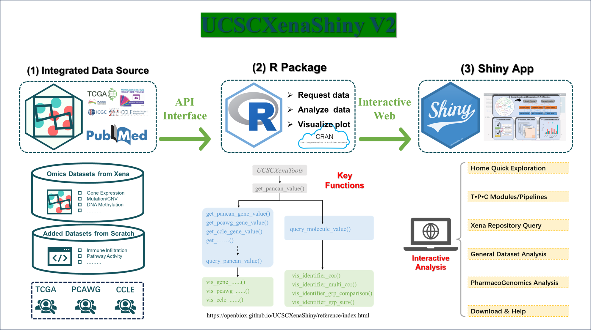
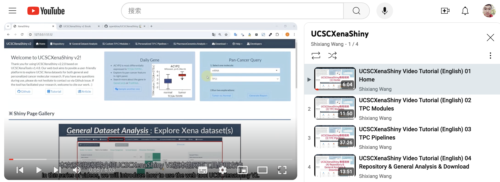

# About {-}

**UCSCXenaShiny** is an R package for interactively exploring UCSC Xena datasets. It is mainly designed to provide a web app (built on the top of [`{shiny}`](https://shiny.rstudio.com/) framework and [`{UCSCXenaTools}`](https://github.com/ropensci/UCSCXenaTools/) package) for downloading, analyzing and visualizing datasets from [UCSC Xena](https://xenabrowser.net/datapages/). In the latest version, the application can support both general and personalized  tumor molecular analysis with versatile functional modules and user-friendly interface layouts. Overall, our tool aims to make best use of public omics data from UCSC Xena and assist broad user community with precision oncology research.  

```{r p0000_1,  fig.align='center', echo = FALSE, out.width="100%"}

```

Here, we have prepared the tutorial book to introduce the detailed usage of UCSCXenaShiny based on R Markdown and [bookdown](https://github.com/rstudio/bookdown). Firstly, we will start with the basic knowledge of UCSC Xena repository and its data hubs in **Chapter \@ref(intro)**. Then, the following chapters can be generally divided into two parts for the usage of R package and Shiny App:

#### Part Ⅰ {-} 

- **Chapter \@ref(install)**：The ways to install UCSCXenaShiny package.
- **Chapter \@ref(build-in)**：Avalilable built-in datasets of package, e.g. clinical or survival data.
- **Chapter \@ref(data-query)**：The functions to query molecular data of TPC datasets.
- **Chapter \@ref(data-analysis)**：The functions to perform various analyses based on TPC datasets.

#### Part Ⅱ  {-} 

- **Chapter \@ref(visit)**：The ways to visit UCSCXenaShiny application.
- **Chapter \@ref(home)**：The intuitive widgets and quick exploration modules in homepage.
- **Chapter \@ref(repo)**：The query for all datasets of UCSC Xena repository.
- **Chapter \@ref(general-da)**：General analysis modules for any matrix datasets.
- **Chapter \@ref(custom-tpc)**：Custom analysis modules for TPC datasets.
- **Chapter \@ref(per-tpc-1)**：The key preprocesses of personalized TPC pipelines. 
- **Chapter \@ref(per-tpc-2)**：The versatile analyses of personalized TPC pipelines. 
- **Chapter \@ref(download)**：Two download modules for the custom data subset. 


#### Part Ⅲ {-} 

We have recorded a series of tutorial videos with step-by-step instructions:

**1. English version**

- Episode 1-4: https://www.youtube.com/watch?v=VnIlzcVB1Ow&list=PLN1jxcOQONG6pH8zvHr-qhI3MMtvluITf


```{r p0000_2,  fig.align='center', echo = FALSE, out.width="90%"}

```

**2. Chinese version**

- Episode 1: https://www.bilibili.com/video/BV1rT421k7Zv
- Episode 2: https://www.bilibili.com/video/BV1E14218779
- Episode 3: https://www.bilibili.com/video/BV141421t71g
- Episode 4: https://www.bilibili.com/video/BV1TZ421K7VH

___

 Welcome to cite the following articles when **UCSCXenaShiny** has facilitated your study:

1. **UCSCXenaShiny** **v2** —

   Li S, et al. UCSCXenaShiny v2: Facilitating Integrative and Personalized Oncology Omics Analysis. 2024 (In preparation)

2. **UCSCXenaShiny** **v1** —

   Wang S, Xiong Y, Zhao L, Gu K, Li Y, Zhao F, et al. UCSCXenaShiny: an R/CRAN package for interactive analysis of UCSC Xena data. Bioinformatics. 2022;38 2:527-9. doi:10.1093/bioinformatics/btab561.

3. **UCSCXenaTools** —

   Wang S and Liu X. The UCSCXenaTools R package: a toolkit for accessing genomics data from UCSC Xena platform, from cancer multi-omics to single-cell RNA-seq. Journal of Open Source Software. 2019;4 40:1627.


> If  you have any question, please report to the [Github issues page](https://github.com/openbiox/UCSCXenaShiny/issues) or email to lishensuo@163.com
